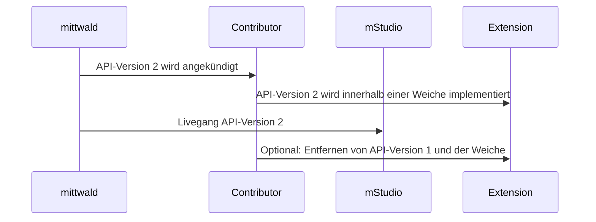

Um flexibel auf nicht abwärtskompatible Änderungen (Breaking Changes) eingehen zu können, wird an verschiedenen Stellen eine Versionierung von APIs vorgenommen.
Als Beispiele können hier die Webhook Datenschemas oder Templates für Konfigurationswerte genannt werden.

Grundsätzlich wird versucht, Breaking Changes zu vermeiden. Wenn jedoch ein Breaking Change eingeführt werden muss, wird mittwald dies mit ausreichend Vorlauf ankündigen und die nötigen Änderungen dokumentieren.
Mit dem Livegang eines Breaking Change wird die neue API-Version wie angekündigt verwendet.

Bis zu diesem Zeitpunkt kann die Extension anhand des Migrationsguides in der Dokumentation auf das neue Verhalten umgestellt werden.
Dabei kann die mitgeschickte API-Version als Weiche betrachtet werden, um das alternative Verhalten zu implementieren.
So kann die Extension auf die neue API-Version vorbereitet werden, ohne dass das alte Verhalten verloren geht oder seitens des Contributors ein zeitlich abgestimmter Livegang notwendig ist.

Der Ablauf kann somit wie folgt aussehen:

