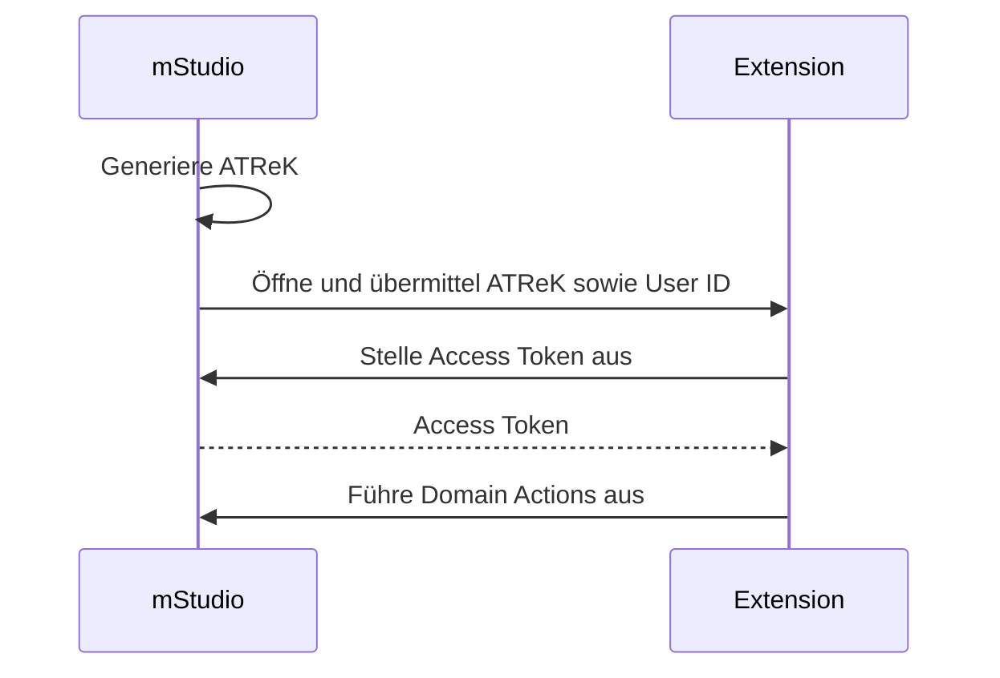

## Nutzung von Access Tokens zur Authentifizierung

TODO

## Authentifizierung mittels Extension Instance Secret

TODO

## OAuth2

TODO

## Verwendung eines Access Token Retrieval Keys

Um den ATReK und die User ID in einer Extension verwenden zu können, muss ein Template für das Extension Frontend verwendet werden.
Das mStudio fügt diese Informationen beim Navigieren zur Extension in das Template ein.

Ein solches Template kann bspw. so aussehen:

```
https://example.com?atrek=:accessTokenRetrievalKey&userId=:userId
```

Für weitere Informationen über die Verwendung von Templates siehe [Templating von Konfigurationswerten](../templating)

Hier wird der ATReK und die User ID als Query-Parameter übergeben.
Prinzipiell kann auch jeder andere URI-Bestandteil verwendet werden, um die Informationen zu übergeben.
Query-Parameter eignen sich jedoch am besten, weil diese meist nicht in Access Logs auftauchen.

Die Extension kann den ATReK verwenden, indem die [user-authenticate-with-access-token-retrieval-key](../../../reference/user/user-authenticate-with-access-token-retrieval-key/) Route aufgerufen wird.

Die Route benötigt als Parameter den ATReK und die User ID und antwortet bei Erfolg mit einem Access Token.
Das resultierende Access Token ist automatisch mit den Scopes der Extension eingeschränkt.

Der Ablauf ist in folgendem Diagram visualisiert:



## Abruf von Webhook Signatur Public Keys

TODO
