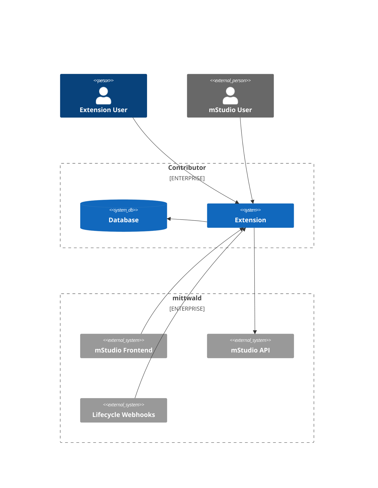
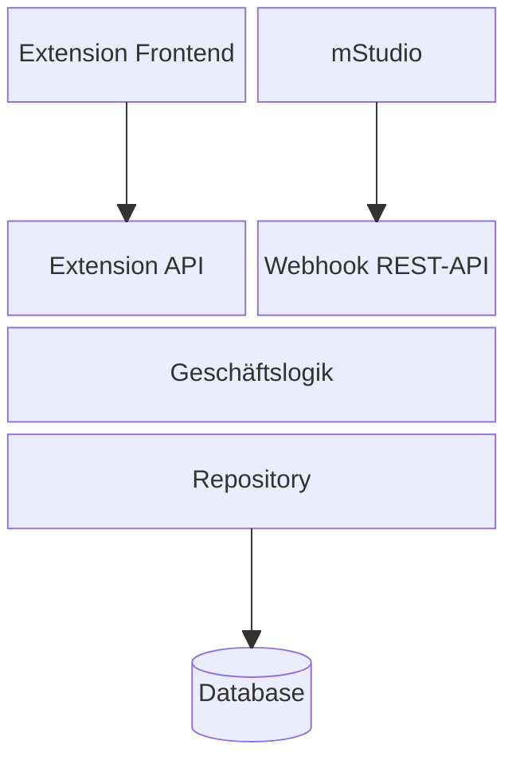
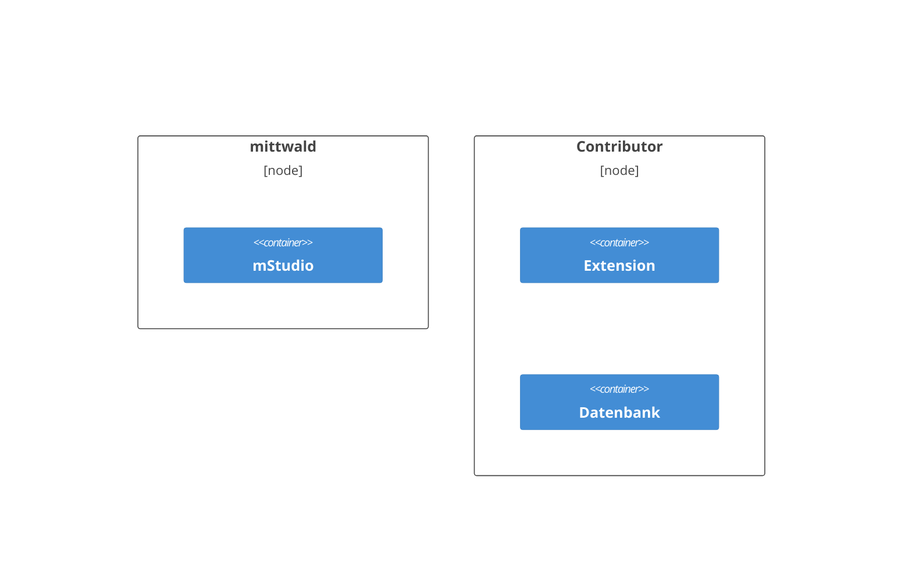
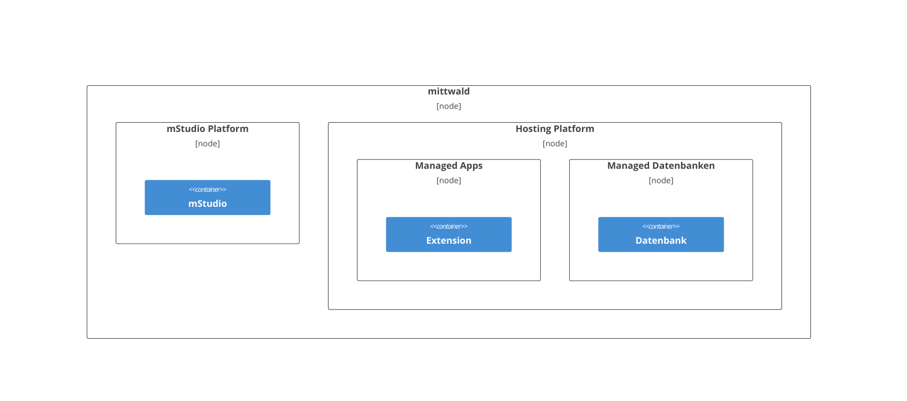

## System Context from the Perspective of an Extension

An extension is an independent application operated separately from the mStudio.
In most cases, it needs a persistence mechanism to store and manage data, such as a database.

Different actors may interact with an extension:

- mStudio users: mStudio users that are directed to the extension via the mStudio.
- Extension users: Users that are not known to the mStudio and interact with the extension via its separate user management.

If an extension has a frontend, users can access it via different methods:

- Via the mStudio: Users can navigate to the extension via the mStudio.
- Direktzugriff: Users can navigate to the extension via a bookmark or a direct link.

An extension must provide an API endpoint the mStudio can access for [lifecycle webhooks](../concepts/lifecycle-webhooks).
Otherwise, it can not be integrated into the mStudio.
The extension may use the mStudio API to provide functionality and facilitate the integration into the mStudio.

## Prototypische Architektur einer Extension

Eine Extension muss zwingend eine REST-API für Lifecycle Webhooks bereitstellen, um funktionsfähig zu sein.
Diese wird genutzt, um die Extension über erstellte Extension Instances zu informieren und deren Lebenszyklus zu steuern.

Davon abgesehen ist der Aufbau einer Extension flexibel und kann je nach Anforderungen des Contributors variieren.
Eine typische Architektur könnte wie folgt aussehen:

Diese Architektur ist typisch für eine Extension, die Zusatzfunktionalität für das mStudio bereitstellen soll
und dessen Daseinsberechtigung in der Integration mit dem mStudio liegt.
Sie sieht eine klare Trennung von Frontend, API-Schicht, Geschäftslogik und Datenbank vor.
Eine Single-Page-Applikation kommuniziert über eine REST-API mit der Geschäftslogik, die wiederum auf eine Datenbank zugreift.

Dieser Ansatz stellt nur einen Vorschlag dar.
Beispielsweise können die APIs für die Geschäftslogik der Extension und die Lifecycle Webhooks in einem gemeinsamen API-Service konsolidiert werden.
Außerdem kann die Extension statt einer Single-Page-Applikation
auch ein Server-Side gerendertes Frontend, eine CLI oder gar kein Frontend verwenden.

## Deployment Model einer Extension

Eine Extension wird nicht durch mittwald betrieben, sondern durch den Contributor.
Das ist dadurch bedingt, dass eine Extension eine eigenständige Applikation ist, die unabhängig vom mStudio betrieben wird.

Support und Betrieb liegen in der Verantwortung des Contributors.
Der Vorteil liegt darin, dass der Contributor die volle Kontrolle über die Extension hat
und diese nach seinen eigenen Anforderungen, wie dem Technologie-Stack oder der Deployment-Strategie betreiben kann.
Außerdem ist der Contributor so nicht gezwungen, mittwald den Code der Extension oder eingesetzter privater Libraries offenzulegen.

Es ist jedoch durchaus denkbar, die Extension auf einem Produkt der mittwald Plattform zu betreiben.
Der Unterschied liegt darin, dass nun das Deployment, der Betrieb und das Operating weiterhin durch den Contributor erfolgen kann.

