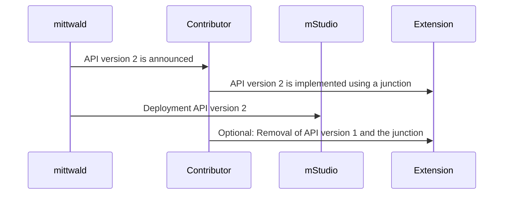

We implement API versioning at various points to act flexibly in the face of breaking changes.
The webhook data schemas or templates for configuration values are examples where we implement this.

We generally try to avoid breaking changes.
However, if we have to release a breaking change, we will announce this sufficiently ahead of time and document the required changes.
When we deploy a breaking change, the new API version is used from that point in time as announced.

Until that point, you can update the extension for the new behaviour with the help of the migration guide in the documentation.
You can use the transmitted API version as junction to implement the new behavior.
This way, you can prepare the extension for the new API version without losing the old behavior or the need to deploy the new version of the extension synchronously with our deployment of the new API version.

The procedure can therefore be as follows:

