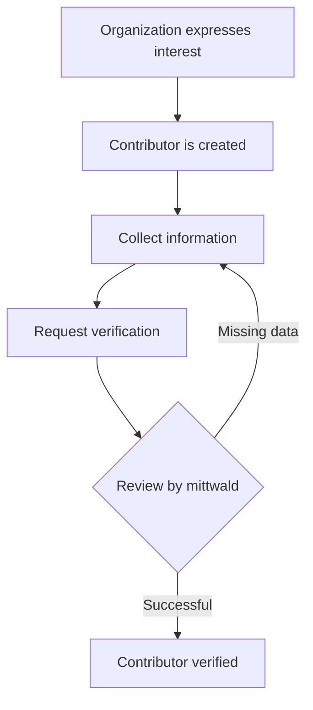

## What is a Contributor?

A Contributor is an organization that can develop and provide [Extensions](../extensions) for the mStudio.
To become a Contributor, your [organization has to express interest in contributing](../../how-to/become-contributor#listing-as-a-contributor).
This will create a Contributor for your organization, and you can start developing Extensions.

:::note
Without verification, your Extensions can only be used within your own organization and projects.
:::

## Contributor Verification

In order to publish Extensions, your Contributor must be verified.
For this, some information is required, which you can find in the section [What information is required for verifying a Contributor?](#what-information-is-required-for-verifying-a-contributor).
Once all required information is available, you can request verification.
We will review the details and provide feedback once your organization has been verified.

## What information is required for verifying a Contributor?

Once your organization becomes a Contributor, some information will automatically be inherited from your organization.
Even if the information is later changed at the organization level, these changes will automatically be applied to the Contributor.
However, you can also provide deviating values for some of the information.
Other Information must be provided specifically for the Contributor and cannot be inherited from the organization.

The following table provides an overview of the information, whether it can be inherited from the organization, and whether it is required for verification:

| Field                   | Inheritable | Required |
| ----------------------- | ----------- | -------- |
| Name                    | ✅          | ✅       |
| Logo                    | ✅          | ❌       |
| Description             | ❌          | ❌       |
| Homepage                | ❌          | ❌       |
| Contract Partner        | ✅          | ✅       |
| Support Information     | ✅          | ✅       |
| Contact Person          | ❌          | ✅       |
| Provider Identification | ❌          | ✅       |

### Name

To be listed as a Contributor in the mStudio Marketplace, your organization needs a name.
By default, this will be inherited from your organization.
However, you can also provide a deviating name for your Contributor.

### Logo

You can **optionally** provide a logo for your Contributor.
By default, this will be inherited from your organization.
However, you can also provide a deviating logo for your Contributor.

### Description

You can **optionally** provide a description for your Contributor, which will be displayed in the mStudio Marketplace.

### Homepage

To direct customers of your Extensions to a landing page about your Contributor, you can **optionally** provide a homepage for your Contributor.

### Contract Partner

Your organization must have a valid contract partner.
By default, your organization’s contract partner will be used for billing your customers.
If necessary, you can define a deviating contract partner for the Contributor.

### Support Information

Your organization must provide valid support contact information for the users of your extension.
This currently consists of at least an email address and an optional phone number.
By default, the email address and phone number of your organization’s contract partner will be used for support.
You can provide deviating support information for your Contributor.

### Contact Person

In case we need to reach your organization, a contact person must be specified.
In the event of technical issues or important information regarding the Contribution, we will contact this person.
By default, this is the user who expressed interest to contribute.
However, you can also specify another user from your organization.

### Provider Identification

To be able to offer your Extension as a product in the mStudio Marketplace, we require provider identification.
Your provider identification **must** comply with [§5 DDG](https://gesetz-digitale-dienste.de/5-ddg/).

- Provider identification is **mandatory** and cannot be inherited from the organization.
- You can either link to your existing provider identification in the form of a URL or provide a new one.
- For creating one, you can use an online generator for legal notices, e.g., the Extension [Dieter macht den Datenschutz](https://mstudio.mittwald.de/app/marketplace/marketplace/62cfdf0b-9e64-4d48-ae3d-dfa3ba433df4).
