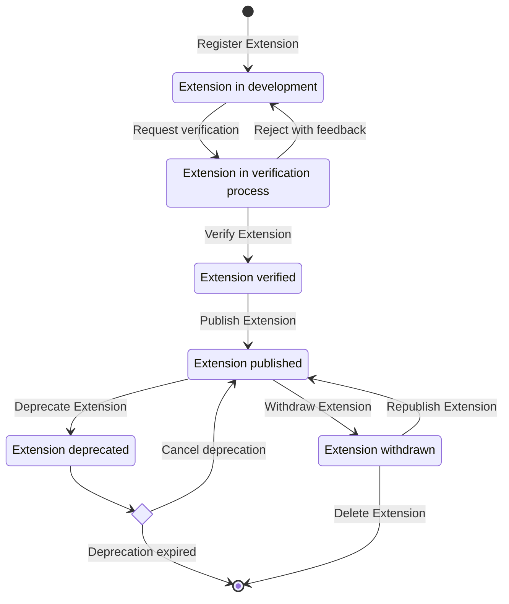

## What is an Extension?

From a domain perspective, an Extension is an expansion of the mStudio providing additional functionality.
It is [made available](../../how-to/manage-extensions) in the mStudio and can be added to an [Extension context](../../glossary/#extension-context) by potential users.
When a user adds an Extension to an Extension context (for example, a project or organization), the mStudio creates an [Extension Instance](../../glossary#extension-instance).
Therefore, the Extension describes an expansion that can be added to an Extension context.
The Extension Instance is a concrete manifestation of an Extension in an Extension context.

From a technical perspective, an Extension is a separate and independent application that communicates with the mStudio via REST APIs.
An Extension must provide a public backend and may provide a frontend if it makes sense for its usage.
If Extension Instances are created or deleted, for example, the mStudio notifies the Extension backend via a [lifecycle webhook](../concepts/lifecycle-webhooks).

The Extensions also provide various [authentication and authorization strategies](../concepts/authentication) to perform authenticated [domain actions](../../glossary#domain-action) in the mStudio.
These domain actions can occur in the name of the mStudio user using the Extension or in the name of the Extension itself.

## Lifecycle of an Extension

An Extension must first be registered with mStudio before it can be used.
It goes through several stages, which are explained below.
Each step is either performed by the contributor or by mittwald by calling specific API operations, explained in the [How to manage Extensions documentation](../../how-to/manage-extensions).

### Extension in Development

After registration, the Extension is not publicly visible.
It can only be added to an Extension Context by the contributor, and only if an Extension Context has been defined.
During development, details such as required scopes, descriptions, and other metadata can be added to the Extension.

If the Extension is added to an Extension Context and the Extension Context is modified,
all Extension Instances will be removed.
This is only possible while the Extension is still in development.

### Extension in Verification Process

Once the Extension is fully developed, deployed, and configured, the verification process can begin.
To request verification, all required fields must be completed.
mittwald will review the Extension for quality and compliance with the guidelines.
You may receive feedback to improve your Extension.

### Extension Verified

If all requirements are met, the Extension will be verified by mittwald.
However, this does not mean it is published yet.
You retain control over when the Extension is published.

### Extension Published

The Extension is now publicly visible and can be installed by other mStudio users.

At this stage, changes to the Extension are still possible.
However, the Extension Context can no longer be modified.
Other potentially security-relevant changes, such as required scopes or webhook URLs, require approval from mittwald.

### Extension Deprecated

When deprecating an Extension, you set a date after which it will no longer be supported.
Until that date, the Extension can still be installed and used.
Users will be notified that the Extension will no longer be supported after the specified date.

Once the date has passed, all Extension Instances are automatically deleted, and the Extension is removed from the marketplace.
The deprecation phase can be canceled at any time as long as the deprecation date has not yet passed.

### Extension Withdrawn

Extensions may be withdrawn by mittwald at any time
if they violate the guidelines or stop functioning, and the contributor is not reachable.

In this state, all Extension Instances are deactivated and can no longer be used.
The Extension is no longer visible in the marketplace.

If the issues are resolved, the Extension may be re-published by mittwald.
If the contributor does not respond or refuses to fix the issues, the Extension will be deleted by mittwald.

## Which information does an Extension consist of?

An Extension consists of various pieces of information described in detail in the [Extension reference](../../reference/extensions).
The following is an overview.

### Name and Descriptions

An Extension has four different description fields.

The first elements visible to the user are the Name and the SubTitle.
The Name can be creative and engaging – it does not have to be descriptive.
The SubTitle provides a brief and concise way to highlight the main selling point of the Extension.

For a slightly more detailed explanation, the Description can be used.
Additionally, there is a Detailed Description, which contains even more information and allows formatting.
Here, you can explain features, provide instructions, share links for further reading, include a changelog, and much more.

### State

The **state** of an Extension defines whether the Extension should be visible or usable in the mStudio.
This includes, for example, whether it is generally active, displayed in the marketplace, and can be added to an Extension context.

### Tags

Tags provide a way to categorize Extensions.
The mStudio uses them to group Extensions based on their use case.
You should ensure the tags are meaningful and allow an unambiguous mapping to the Extension features.
You also should ensure the tags match terms potential users might use to search for the Extension.
A category with only one Extension does not provide value when searching for Extensions.
It reduces the ability to find and compare Extensions.

### Support

It is the responsibility of the contributor to support the users of their Extensions.
Therefore, the Extension users need information about how to request support.
You have to provide at least an E-Mail address where users can contact you.

### Scopes

An Extension needs permissions to access the REST API of the mStudio and execute domain actions.
These have to be accepted by the user when installing the Extension.

These permissions are defined by [scopes](../concepts/scopes).
The Extension definition contains a list of scopes describing the Extensions permissions.

### Extension Context

Users can add an Extension either to a project or an organization.
As a contributor, you must decide which Extension context makes sense for your Extension.
This decision depends on multiple factors, such as the target audience, use case, or business model.
The Context can be changed during development, before verification but doing so leads to deletion of all instances, after verification the context cannot be changed.

### Lifecycle Webhook Endpoints

An Extension must define which URLs should be used by the mStudio to send lifecycle webhooks.
The mStudio uses these webhooks to notify the Extension of the existence and state of its Extension Instances.
You can configure a separate webhook endpoint for each lifecycle event.
For more information, see [lifecycle webhook concept](../concepts/lifecycle-webhooks).

### Frontend

Optionally, an Extension may define external frontends that function as an entry point to the Extension or frontend fragments to embed frontend directly into mStudio.
Either way, your frontend is a separate application.
For more information, see [frontend development](../concepts/frontend-development).

### Requested Changes

Once an Extension has been verified, a contributor can submit a request to modify the Extension’s scopes or webhook URLs. 
The request will be revied by a Mittwald employee within 2–3 business days.  
 
If the request is approved, the Extension continues to function for all existing users, but the newly added scopes remain unavailable until each user explicitly accepts the updated permission set. 
Users who have already installed the Extension will receive a prompt to grant the new scopes. Only after a user accepts the changes can the Extension access the newly added capabilities.

### Assets

Assets are media files (photos or videos) that are displayed in the marketplace listing to showcase the Extension’s features, UI, or demo footage.  
They are optional but strongly recommended because a rich visual presentation increases discoverability and user trust.
They can be uploaded using the File Service and ordered using the index property.

### Statistics

The exact number of Extension Instances is available to the contributor in the Entwickeln tab. For the public, the number is rounded down to the next lower hundred.

## Versioning of Extensions

The mStudio does not provide a concept for the versioning of Extensions.
Extensions are separate applications the corresponding contributor is responsible for, integrated with the mStudio only via the public REST API.
Therefore, mittwald can not reliably manage the versioning and stability of versions of Extensions.

The use case of an Extension may require providing functionality in different versions.
You can implement this versioning independently of the mStudio.
You are responsible for versioning your Extensions and may introduce individual rules and conventions.

If the Extension provides an API used by external applications, you should ensure its stability.
To this end, you may use commonplace conventions and best practices for API versioning.
