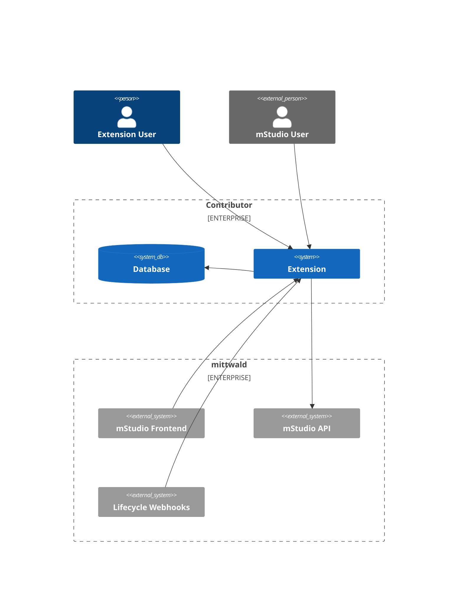
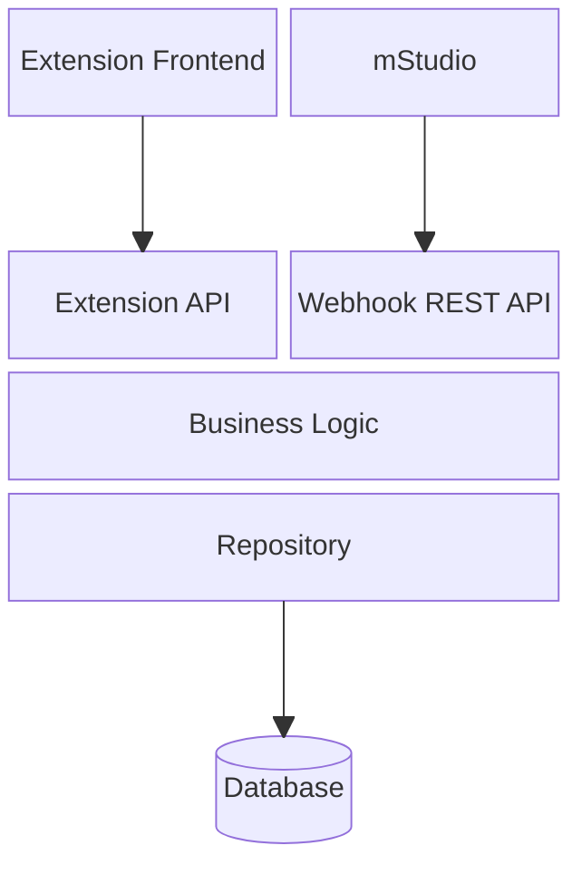
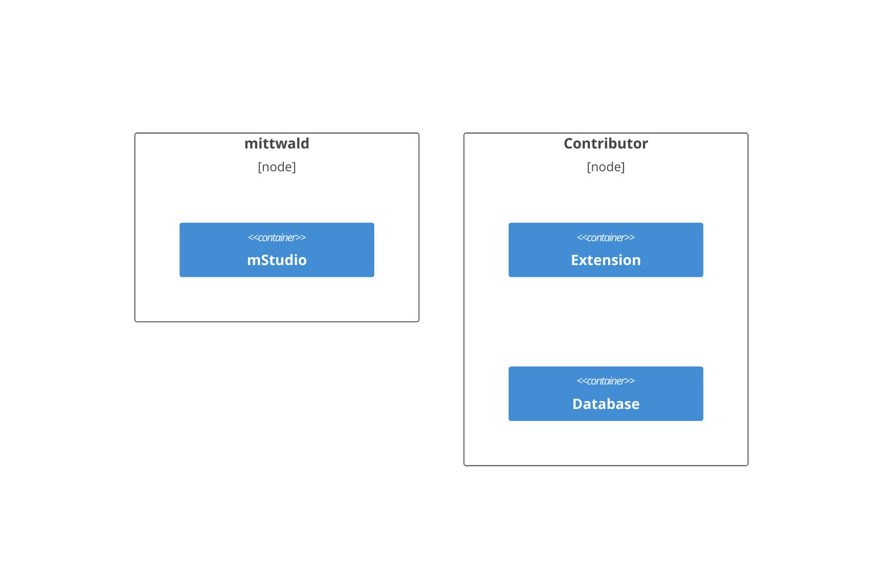
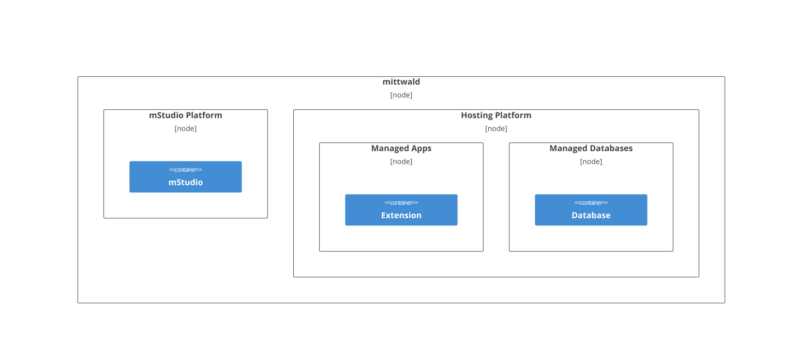

## System Context from the Perspective of an Extension

An Extension is an independent application operated separately from the mStudio.
In most cases, it needs a persistence mechanism to store and manage data, such as a database.

Different actors may interact with an Extension:

- mStudio users: mStudio users that are directed to the Extension via the mStudio.
- Extension users: Users that are not known to the mStudio and interact with the Extension via its separate user management.

If an Extension has a frontend, users can access it via different methods:

- Via the mStudio: Users can navigate to the Extension via the mStudio.
- Direktzugriff: Users can navigate to the Extension via a bookmark or a direct link.

An Extension must provide an API endpoint the mStudio can access for [lifecycle webhooks](../concepts/lifecycle-webhooks).
Otherwise, it can not be integrated into the mStudio.
The Extension may use the mStudio API to provide functionality and facilitate the integration into the mStudio.

## Prototypical Architecture of an Extension

An Extension must provide a REST API for lifecycle webhooks to function.
The mStudio uses this to inform the Extension about created Extension Instances and their lifecycle.

Besides this hard requirement, the Extension architecture is flexible and can vary based on your requirements.
A typical architecture may look as follows:

This architecture is typical for an Extension that provides additional functionality for the mStudio.
It has a clear separation of the frontend, API layer, business logic, and database.
A single-page application communicates with the business logic via a REST API.
The business logic then accesses a database.

This approach is just a suggestion.
It is also viable to consolidate the APIs for the business logic of the Extension and the lifecycle webhooks together in an API service, for example.
Also, the Extension may use a server-side rendered frontend, a CLI, or no frontend instead of a single-page application.

## Deployment Model of an Extension

An Extension is operated by the contributor, not by mittwald.
This is because an Extension is a separate application that runs independently of the mStudio.

The contributor is responsible for the operation and support of his Extension.
This is advantageous for the contributor because they have complete control over the Extension.
Therefore, the contributor can operate the Extension according to their requirements, such as the technology stack or deployment strategy.
In addition, the contributor is not forced to disclose the code of their Extension or any private libraries used.

However, it is conceivable that an Extension runs on a product of the mittwald Plattform.
In that case, the contributor still manages the deployment and operation.

