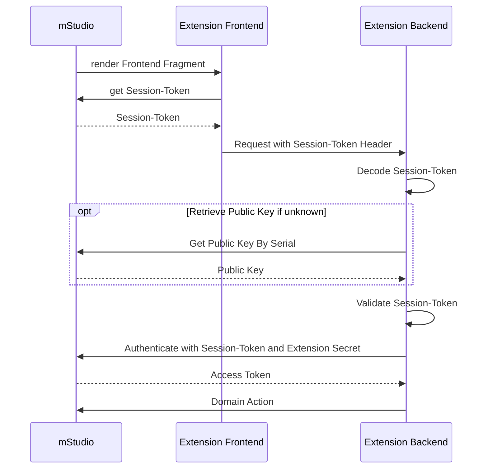

In general, extensions don't necessarily have to provide a frontend as they are optional.
Most times though, Extensions should provide a frontend for configuration or interaction with the business logic.

## External Frontend vs. Frontend Fragment

In mStudio, there are two main ways to implement and connect a web based frontend for your extension.
External frontends operate independently of mStudio by being opened in a new tab.
Frontend Fragments offer a way to integrate chunks of frontend directly into mStudio.
In general, these two approaches are not mutually exclusive.
An Extension can use both at the same time.

Here is a brief comparison of them, showing the main differences:

|                       | External Frontend                                             | Frontend Fragment                                                                       |
| --------------------- | ------------------------------------------------------------- | --------------------------------------------------------------------------------------- |
| How it works          | Opens in a new tab or window                                  | Directly embedded inside mStudio using an iframe                                        |
| Technology and design | freedom to choose any technology stack and design you like    | Built using the same UI components as mStudio, creating a seamless user experience      |
| When to use           | You need full control of your extension's design and behavior | You aim for tight integration into mStudio while maintaining a consistent look and feel |

## External Frontends

An external frontend creates an entry point from the mStudio into the extension, opening as a new tab.
Using an external frontend, you have complete freedom to choose any technology stack and design you like for your extension.

You should use an external frontend, if your extension's frontend can't be built using flow components, or the user should be able to open the extension without opening the mStudio.

Defining an external frontend enables the use of single sign-on via [Access Token Retrieval Key (ATReK)](./authentication#access-token-retrieval-key).

### Configuration

The external frontend is configured as a URL, pointing to the frontend that should be opened in a new tab.
This configuration supports templating.
For more information, see [templating of configuration values](../templating).
The external frontend is configured in the extension definition under `externalComponents.frontends`.
For more information, see [extension reference](../../../reference/extensions).

### Using the ATReK

You have to define the following placeholders in the URL to use the single sign-on feature via ATReK:

- `accessTokenRetrievalKey`
- `userId`

The extension then can extract the ATReK and the user ID from the HTTP call and exchange it for an access token.
For more information, see [using an Access Token Retrieval Key](../../../reference/api#using-an-access-token-retrieval-key).

### Using the context of the user inside mStudio

You can also use the external frontend to use the current user context of the mStudio in the extension.
This can make sense if a user enters the extension from a specific project, and the extension should display said project.

Useful placeholders in the URL for internal routing are:

- `apiVersion` - API version of the external frontend url template. In the beginning always `v1`. For more information, see [API versioning](../api-versioning)
- `contributorId` - The ID of the contributor in UUID format
- `extensionId` - The ID of the extension in UUID format
- `extensionInstanceId` - The ID of the extension instance in UUID format
- `context` - The kind of extension context, the extension instance was added to
- `contextId` - The ID of the extension context, the extension instance was added to
- `userId` - The ID of the user that is currently using the extension
- `accessTokenRetrievalKey` - The AccessTokenRetrievalKey, commonly called ATReK, of the user. Can be used by the extension instance to perform [Authentication via ATRek](../authentication#access-token-retrieval-key)

## Frontend Fragments

The configuration of frontend fragments serves to integrate an extension’s frontend directly into predefined [anchors](#anchors) within the mStudio.
This is particularly useful when the extension’s frontend should be seamlessly integrated into mStudio to provide the feel of a native feature.

Frontend fragments are configured on an extension.
More detailed information can be found in the [Extension reference](../../../reference/extensions).

Frontend Fragments are embedded into mStudio via an iframe.
This iframe is not rendered directly in the visible area of the page.
Instead, a **remote architecture** that mirrors web components rendered inside an iFrame as React components into mStudio is used.
Therefore, development cannot happen entirely locally, yet - you must use an mStudio instance with an installed extension as the entry point.
This approach ensures a consistent user experience and enables features such as overlays.

Custom components and CSS cannot be used.
To develop a frontend fragment, [Flow Remote Components](#flow-remote-components) must be used.

Since frontend fragments are embedded via an iframe and Safari in particular is restrictive with third-party cookies, frontend fragments must not rely on cookies.
Authentication and session handling are done using [Session-Tokens](#authentifizierung-und-session-handling-mittels-session-token) and Access Tokens obtained via the Session Token.

### Anchors

The mStudio provides clearly defined locations where frontend fragments can be integrated.
These locations, called anchors, have a unique identifier and are configured in the extension.
Currently, an extension can only integrate one frontend fragment per anchor.

An extension that can be added to projects can only use anchors defined at the project detail page level or below.
Extensions added to organizations can use anchors on or below the organization detail page level.

Currently, anchors are being developed for the following locations:

- Additional menu items on each navigation level with associated custom (sub)pages
- Additional tabs on all tabbed pages
- Additional sections on all pages divided into sections

Additionally, a feature is being developed to locate anchors directly in the mStudio and to view which additional properties are provided or required for an anchor.
At present, mittwald supports the configuration of frontend fragments through the known communication channels.

## Flow Remote Components

The mStudio only renders components that it knows about.
To develop frontend fragments, it is recommended to use [Flow Remote Elements](https://github.com/mittwald/flow/tree/main/packages/remote-elements).

While using React/Next.js is not mandatory, it is recommended for developing frontend fragments, as this enables the use of [Remote React Components](https://github.com/mittwald/flow/tree/main/packages/remote-react-components).
These provide the exact same API as the regular [Flow Components](https://github.com/mittwald/flow/tree/main/packages/components), but are designed specifically for use in remote DOMs (frontend fragments).

## Authentifizierung und Session Handling mittels Session-Token

A so-called Session-Token is used for authentication and session handling within a frontend fragments.
This Session-Token can be requested from the mStudio via window messages at any time.
It is a JWT containing information about the current user and the extension instance.
The token is an online token valid for only 60 seconds and should therefore not be persisted.

The mStudio ensures that a frontend fragment does not create a new Session-Token with every request, but reuses tokens within the first 40 seconds of their validity.

Session-Tokens always include a session ID that is stable for the current session.
This ID can be used to identify a user’s session and, for example, to map backend sessions.
Session cookies cannot be used, as this does not work in WebKit-based browsers like Safari.

A frontend fragment must always include the Session-Token when making requests to its backend.
The JWT claims in the Session-Token include a key called `publicKeySerial`, which refers to the serial number of the mStudio public key used to sign the token.
The Ed25519 public key can be retrieved from the mStudio API using the operation <OperationLink tag="Marketplace" operation="extension-get-public-key" />.
To do this, use the publicKeySerial from the session token as the serial and the purpose `session_token`.

To simplify signature verification, the public key can be retrieved in SPKI format, ASN.1 serialized, and PEM encoded via the `format` query parameter.

The backend must validate the session token against the mStudio public key indicated in the token with every request,
since the token serves as the user’s authentication credential.
This involves decoding the JWT, retrieving the public key via the API, and validating the JWT against the key.
A public key with a specific serial is stable and can be cached or persisted.

The session token can also be used in combination with an extension secret to obtain an access token.
For this, the operation <OperationLink tag="Marketplace" operation="extension-authenticate-with-session-token" /> can be used.
The resulting access token is also only valid for 60 seconds and should not be persisted.

The entire authentication process is illustrated in the following sequence diagram:

## Kontext Parameter

## Extension Bridge

The Extension Bridge is a JavaScript library that can be used in frontend fragments to communicate with mStudio. It provides functions to retrieve context parameters and to obtain, decode, and validate session tokens.

For more information, see the [Extension Bridge documentation](https://github.com/mittwald/flow/tree/main/packages/ext-bridge)
