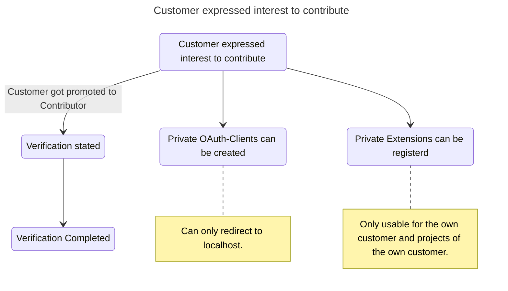
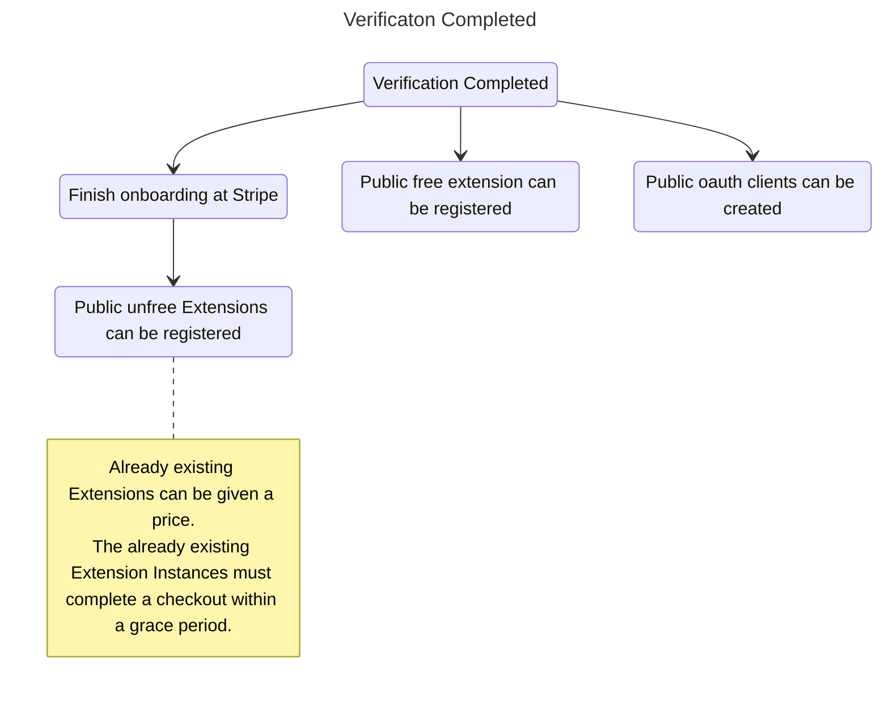

## Contributor State

```mermaid
---
title: Customer expressed interest to contribute
---

stateDiagram-v2
    C1: Customer expressed interest to contribute
    C2: Verification stated
    C3: Verification Completed
    E1: Private Extensions can be registerd
    O1: Private OAuth-Clients can be created

    note right of O1
        Can only redirect to localhost.
    end note
    note right of E1
        Only usable for the own customer and projects of the own customer.
    end note

    C1 --> C2: Customer got promoted to Contributor
    C2 --> C3
    C1 --> E1
    C1 --> O1
```

```mermaid
---
title: Verificaton Completed
---

stateDiagram-v2
    C3: Verification Completed
    C4: Finish onboarding at Stripe
    E2: Public free extension can be registered
    E3: Public unfree Extensions can be registered
    O2: Public oauth clients can be created

    note right of E3
        Already existing Extensions can be given a price.
        The already existing Extension Instances must complete a checkout within a grace period.
    end note

    C3 --> E2
    C3 --> C4
    C3 --> O2
    C4 --> E3
```
