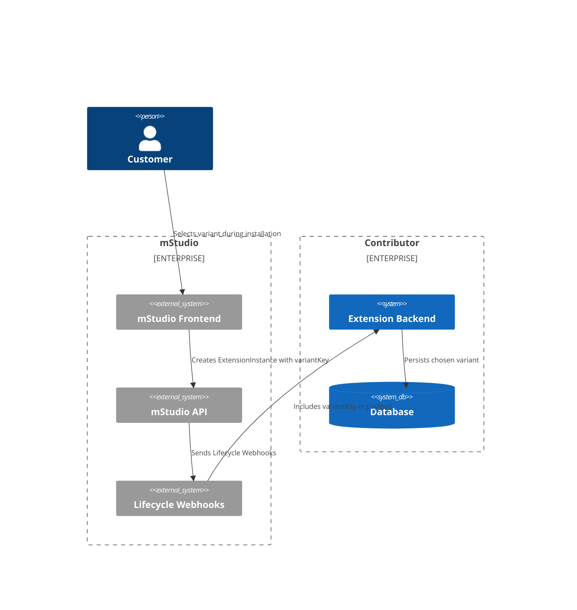
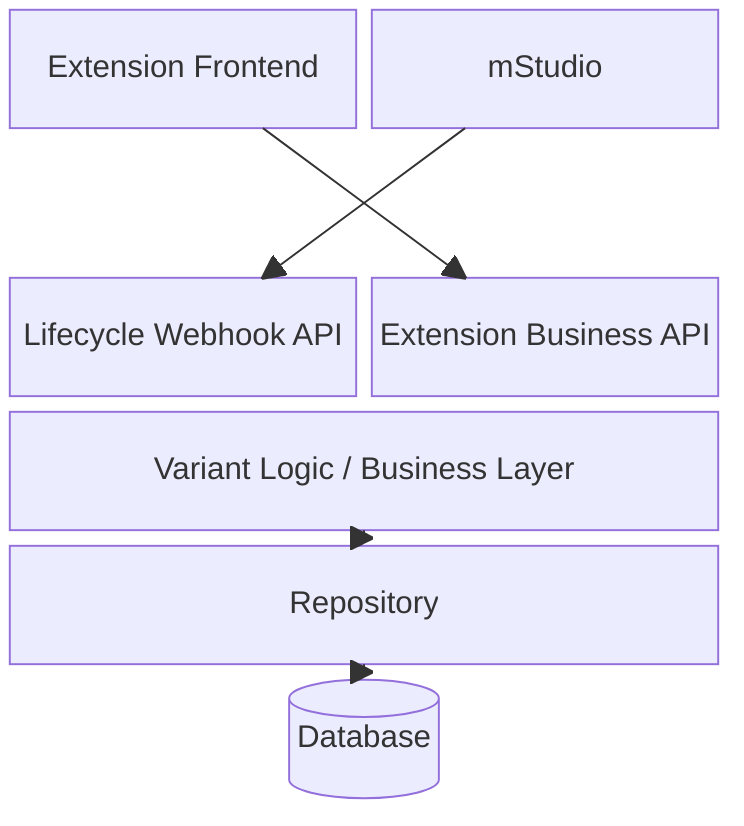

## Concept of Pricing Variants

Extensions in the mStudio can be offered under different pricing models.
A contributor can decide whether an Extension is:

- **Free of charge**
- Offered with a **single fixed price**
- Offered with **multiple pricing variants**

A pricing variant allows contributors to define different **feature levels** or **service scopes** of an Extension under distinct price points.

Each variant consists of the following properties:

| Property | Description |
|-----------|--------------|
| **Name** | Human-readable name of the variant (e.g., "Basic", "Pro", "Enterprise") |
| **Price** | Monthly or yearly price that will be charged to the customer |
| **Description** | Description of the functional scope or included services |
| **variantKey** | Technical identifier for the variant (must be unique and cannot be changed after creation) |

When customers install an Extension, they can select one of the available variants.  
The chosen variant determines both the price and the available functionality.



---

## Managing Pricing Variants in the mStudio

Pricing variants are configured via the **Extension Management** section in the mStudio:

```
Organisation -> Contribution -> Entwicklung -> Extension auswählen oder anlegen -> Details -> Preisdetails
```

In the **Preisdetails** section, contributors can:

1. **Add new variants** by providing:
   - A **name**
   - A **price**
   - A **description**
   - A unique **variantKey**

2. **Edit existing variants**, provided the Extension is **not within the 30-day post-publication lock period** (see below).

### Rules for variant management

- The **variantKey** is assigned by the contributor and uniquely identifies the variant **within the scope of one Extension**.
- Once the variant is created, the **variantKey cannot be changed**.
- If the Extension previously had a single fixed price, the **first variant created** replaces that price plan.

### UI Behavior

The mStudio interface provides separate input fields for each variant property.  
Mandatory fields are marked with `*`. The system validates unique `variantKey`s and price formats automatically.  
If applicable, contributors can also mark whether a modification **changes the feature scope** of the variant.

---

## Restrictions After Publication

Once an Extension has been published, **no changes to pricing or variants are allowed for 30 days**.

This restriction applies to:

- Adding or removing variants  
- Changing the **name**, **description**, or **price** of existing variants  
- Switching between **free**, **single price**, or **variant** models  

After the 30-day period has passed, contributors can modify pricing data again.  
If a change affects the **scope of functionality**, this must be explicitly indicated during editing.

---

## Impact on Existing Installations

When pricing or variant definitions are changed, the system ensures that existing customers are informed and must **confirm** or **reject** the new conditions.

### Customer interaction is required when:

- The Extension changes from **Free → Single Price** or **Free → Variants**
- A **single price** is changed
- The **selected variant** of a user changes
- The **feature scope** of a variant changes

### Process flow

1. The affected customer receives a **notification within the mStudio** and an **email**.
2. The customer must confirm or react to this change within **30 days**.
3. If the customer does not interact within this period, the corresponding **ExtensionInstance is automatically deleted**.

Contributors are informed about such lifecycle events via **webhooks**.

---

## Technical Integration

Each Extension receives lifecycle notifications from the mStudio through the **Lifecycle Webhooks**.
These webhook payloads include the `variantKey` to identify which variant a customer has chosen.

### Example: Lifecycle Webhook payload

```json
{
  "event": "extensionInstance.created",
  "data": {
    "instanceId": "abc123",
    "extensionId": "my-extension",
    "variantKey": "pro",
    "customerId": "cust789",
    "status": "active"
  }
}
```

The Extension must expose an endpoint to receive such webhook calls.  
It should store and process the `variantKey` to ensure that the correct feature level or configuration is applied for the customer.

> **Important:**  
> The `variantKey` is the reference identifier for variant management.  
> It must be consistently mapped to the corresponding internal configuration in the contributor’s backend.

### Access via Extension Bridge

During the active session in the mStudio, an Extension can access the selected variant through the **Extension Bridge** session data:

```js
const variant = window.mittwald.session.variantKey;
```

This allows the Extension frontend to adjust UI elements or functionality dynamically depending on the selected variant.

---

## Example Architecture with Variant Handling



In this setup:

- The **Lifecycle Webhook API** receives notifications from mStudio, including `variantKey`.
- The **Business API** provides user-specific functionality depending on the stored variant.
- The **Frontend** adjusts the interface and available actions based on the current variant.
- The **Database** persists all variant assignments and pricing history.

---

## Contributor Responsibilities

Contributors are responsible for:

- Defining and maintaining their variants in mStudio.  
- Implementing correct variant handling in their backend using `variantKey`.  
- Processing lifecycle webhook events.  
- Ensuring that the selected variant is reflected in their pricing and functionality logic.  
- Respecting the **30-day modification restriction** after publication.

---

## Best Practices

- Use **semantic keys** for variants (e.g., `basic`, `pro`, `enterprise`) for clarity.  
- Clearly describe the **scope and included features** of each variant to avoid user confusion.  
- Implement internal logging for all variant-related lifecycle events.  
- Test variant switching scenarios before publishing.  
- Avoid removing variants that are actively in use by customers.

---

## Troubleshooting

| Problem | Possible Cause | Solution |
|----------|----------------|-----------|
| Variant not recognized in backend | Missing or mismatched `variantKey` | Ensure webhook payloads are parsed and mapped correctly |
| Changes not possible after publishing | 30-day modification lock active | Wait until lock period expires |
| Customer lost access to Extension | Customer did not respond to pricing change within 30 days | Instance was deleted automatically by the system |
| Wrong feature level displayed | Variant not correctly processed by business logic | Verify mapping between `variantKey` and internal product configuration |

---

## Summary

Pricing variants enable flexible monetization of Extensions within the mStudio ecosystem.  
By following the described setup and lifecycle requirements, contributors can offer differentiated plans safely and transparently.  
Proper webhook handling and consistent variant management are mandatory for correct pricing and billing operations.
