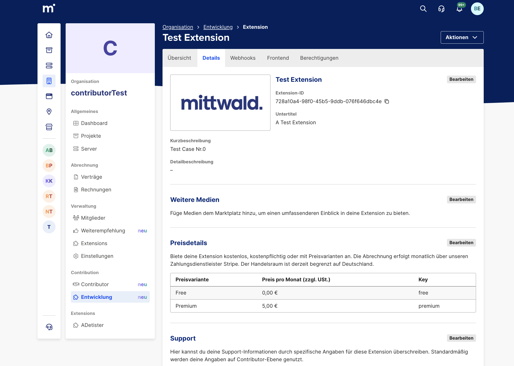

## Concept of Price Variants

Extensions in mStudio can be offered with different pricing models.  
A contributor can decide whether an extension is:

- **Free of charge**  
- Has a **single fixed price**  
- Or offers **multiple price variants**  

A price variant makes it possible to offer different **feature scopes** of an extension at different prices.

Each variant consists of the following properties:

| Property | Description |
|--------------|---------------|
| **Name** | Display name of the variant (e.g. "Basic", "Pro", "Enterprise") |
| **Price** | Monthly price charged to the customer |
| **Features** | Description of the feature scope of the variant. This is more specific than the extension description |
| **variantKey** | Technical key of the variant (must be unique and cannot be changed after creation) |

When customers install an extension, they can choose one of the available variants.  
The selected variant determines both the price and the feature scope.

---

## Managing Price Variants in mStudio

Price variants are configured in the **Extension Management** section of mStudio:

Organisation -> Contribution -> Development -> Select or create Extension -> Details -> Price Details

> :warning: Note that **any** change to the price details (including adding variants) results in a 30-day lockout for further edits.

In the **Price Details** section, contributors can:

1. **Create new variants** by providing the following information:
   - A **Name**
   - A **Price**
   - **Features**
   - A unique **variantKey**

2. **Edit existing variants**, provided the extension is **not within the 30-day lockout period after publication** (see below).

### Rules for Variant Management

- The **variantKey** is assigned by the contributor and uniquely identifies the variant **within an extension**.  
- After creation, the **variantKey cannot be changed**.  
- If the extension previously had a single price, the **first created price** can be continued as a variant with the **"default" key**. This variant must now also include a description of its features.

### User Interface Behavior

The mStudio interface provides separate input fields for each property of a variant.  
The system automatically checks for unique `variantKey`s and names.  
There can only be one free variant.  
If applicable, contributors can specify whether changes represent a **feature modification**.

---

## Restrictions After Publication

After an extension has been published, any modification of price data triggers a **30-day lockout for price or variant changes**.

This lockout affects:

- Adding new variants  
- Changing **Name**, **Features**, or **Price** of existing variants  
- Switching between **free**, **single price**, or **price variants**  
- Changing the single price

After 30 days, changes can be made again.  
If a change affects the **feature scope**, this must be explicitly marked in mStudio.

---

## Impact on Existing Installations

When price or feature scope changes are made, the system ensures that existing customers are informed and must **accept** or **decline** the new terms.  
If the customer declines or does not respond within 30 days, their instance will be removed.

### Customer interaction is required when:

- An extension changes from **free → single price** or **free → variants**  
- A **single price** is changed  
- The user’s selected **variant** is changed. This only applies to changes in price or feature scope. If only cosmetic changes (e.g., typo corrections) are made, the contributor can choose not to announce a feature change.

### Process

1. The affected customer receives a **notification in mStudio** as well as an **email**.  
2. On the extension detail page and in their instance list, the customer will see a notice prompting interaction.  
3. The customer must respond within **30 days**.  
4. If no response is received within this period, the corresponding **extension instance is automatically deleted**.

Contributors are informed about these events via **Lifecycle Webhooks**.

---

## Technical Integration

Each extension receives notifications from mStudio via [**Lifecycle Webhooks**](https://developer.mittwald.de/docs/v2/contribution/reference/webhooks/), if configured.  
These webhook payloads contain the `variantKey` to identify which variant a customer has selected.

> **Important:**  
> The `variantKey` is the technical reference value for variant management.  
> It must be mapped correctly to the corresponding variant in the contributor’s backend if such differentiation is necessary there.

### Access via the Extension Bridge

During an active session in mStudio, an extension can access the selected variant through the **Extension Bridge and current session**: [Session Handling](https://developer.mittwald.de/docs/v2/contribution/how-to/develop-frontend-fragment/#session-handling-and-configuration-values-via-ext-bridge)

This allows the extension’s frontend to dynamically adjust its display or functionality according to the selected variant.

---

## Responsibilities of Contributors

Contributors are responsible for:

- Creating and maintaining their variants in mStudio  
- Properly handling the `variantKey` in their backend, if necessary  
- Handling lifecycle webhooks  
- Technically mapping the selected variant in their feature or billing system  
- Complying with the **30-day lockout** after a price change  

---

## Best Practices

- Use **descriptive keys** for variants (e.g., `basic`, `pro`, `enterprise`).  
- Clearly and transparently describe the **feature scope** of each variant.  
- Log all events related to variant changes internally.  
- Thoroughly test all variant switches and feature scopes before publication.  

---

## Troubleshooting

| Problem | Possible Cause | Solution |
|----------|------------------|--------|
| Variant not recognized in backend | Missing or incorrect `variantKey` | Correctly process webhook payload (if used) and verify mapping |
| Changes not possible | 30-day lockout active | Wait until the lockout period expires |
| Customer loses access to extension | No response to price change within 30 days | Extension instance was automatically deleted |
| Incorrect feature scope active | Variant not correctly handled in business logic | Check `variantKey` mapping in backend |

---

## Summary

Price variants enable flexible monetization of extensions in mStudio.  
By adhering to the described processes and lifecycle requirements, contributors can safely and transparently offer their extensions with different pricing and feature levels.  
Proper webhook processing or using the `variantKey` from the session token, along with consistent variant management, is crucial for correct billing and a good customer experience.
