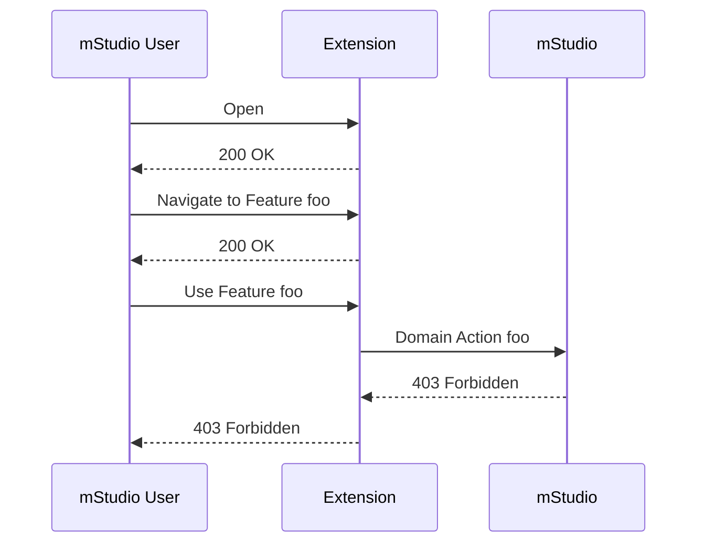
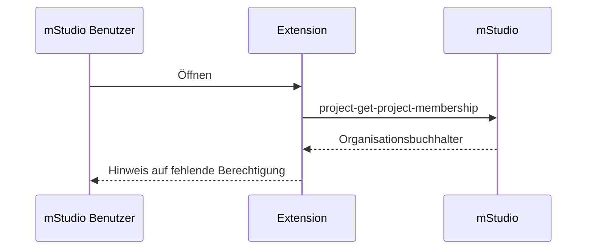
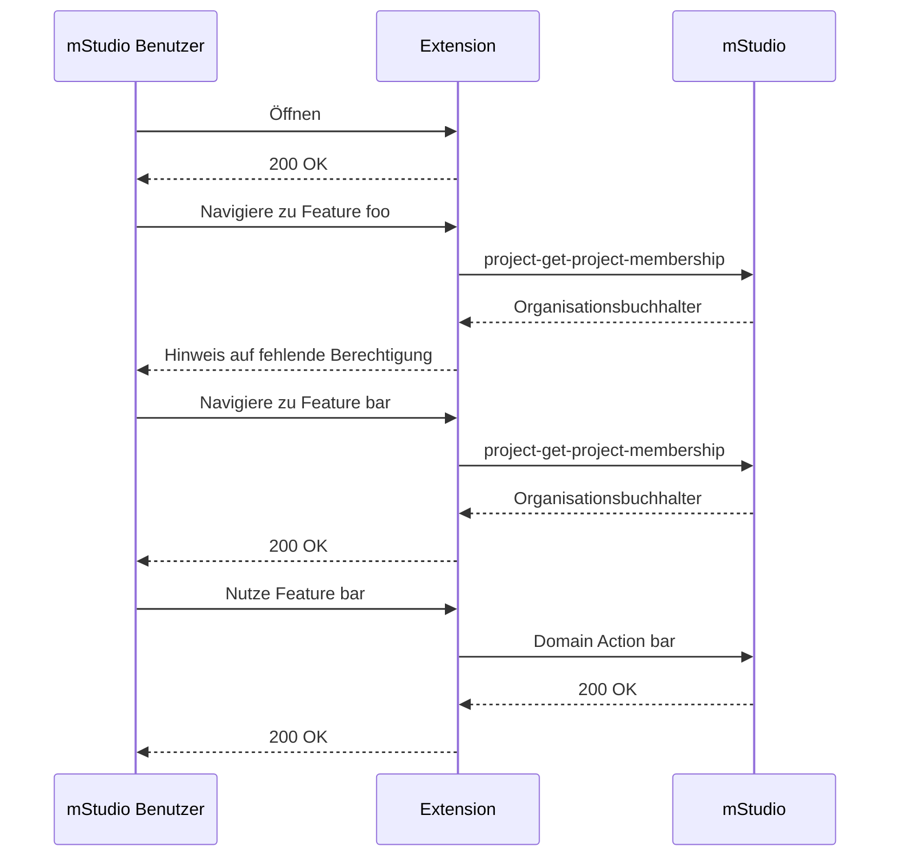

If the extension interacts with the mStudio API on behalf of a mStudio user, this may lead to insufficient permissions.
An extension acts on behalf of a mStudio user, if it uses the [access token retrieval key](../../overview/concepts/authentication#access-token-retrieval-key)
or [OAuth2](../../overview/concepts/authentication#oauth2) for the authentication.

The mStudio ensures that a mStudio user never has more permissions using an extension than they have using the mStudio directly.
Additionally, it ensures that a mStudio user using an extension only has the permissions they accepted when installing the extension.

However, it does not ensure that the mStudio user using an extension has all the permissions required for executing the domain actions necessary for the extension.
This is due to the system of rights and roles of the mStudio that defines different roles for organizations and projects.
Therefore, an extension may execute a domain action the user is not permitted to perform.
This leads to an error message.

So for example, if an extension should create projects via the [project-create-project](../../../reference/project/project-create-project) operation
and the user only has the role "Organization accountant", they will encounter an error message when using the extension because the role does not permit creating projects.

Um eine gute User-Experience zu gewährleisten, sollte die Extension die benötigten Rechte im Vorfeld prüfen.
Dazu kann die Extension die [project-get-project-membership](../../../reference/project/project-get-project-membership)-Operation,
bzw. die [customer-get-customer-membership](../../../reference/customer/customer-get-customer-membership)-Operation verwenden.

Diese Routen geben die aktuelle Mitgliedschaft des Benutzers zu einem Extension Context zurück.
Unter anderem enthält sie, welche Rolle der Benutzer in dem Context hat.

Indem die Rolle des Benutzers geprüft wird, kann nun vor dem eintretenden Fehlerfall ein entsprechender Hinweis an den Benutzer gegeben werden,
dass er nicht die notwendigen Rechte hat, um die Domain Action auszuführen und den Context Administrator kontaktieren muss,
um die Rechte zu erhalten.

Dem Contributor bleibt dabei die Flexibilität, ob er die Extension für mStudio Benutzer mit eingeschränkten Rechten vollständig sperrt, wie im Beispiel oben,
oder nur für die entsprechenden Features.

Rein technisch stellt es eine Alternative dar, die Domain Actions im Namen der Extension auszuführen.
Dafür muss die Extension das [Extension Instance Secret](../../overview/concepts/authentication#extension-instance-secret) verwenden,
um ein Access Token zu beziehen.
In diesem Fall wird die Domain Action mit den Rechten der Extension ausgeführt.
Dies hat jedoch den Nachteil, dass Organisationsinhaber und Project Administratoren nicht mehr über die Vergabe von Rollen steuern können,
welche Benutzer welche Domain Actions ausführen dürfen, was eine Sicherheitslücke darstellen
und zu einer Verschlechterung der User-Experience führen kann.

