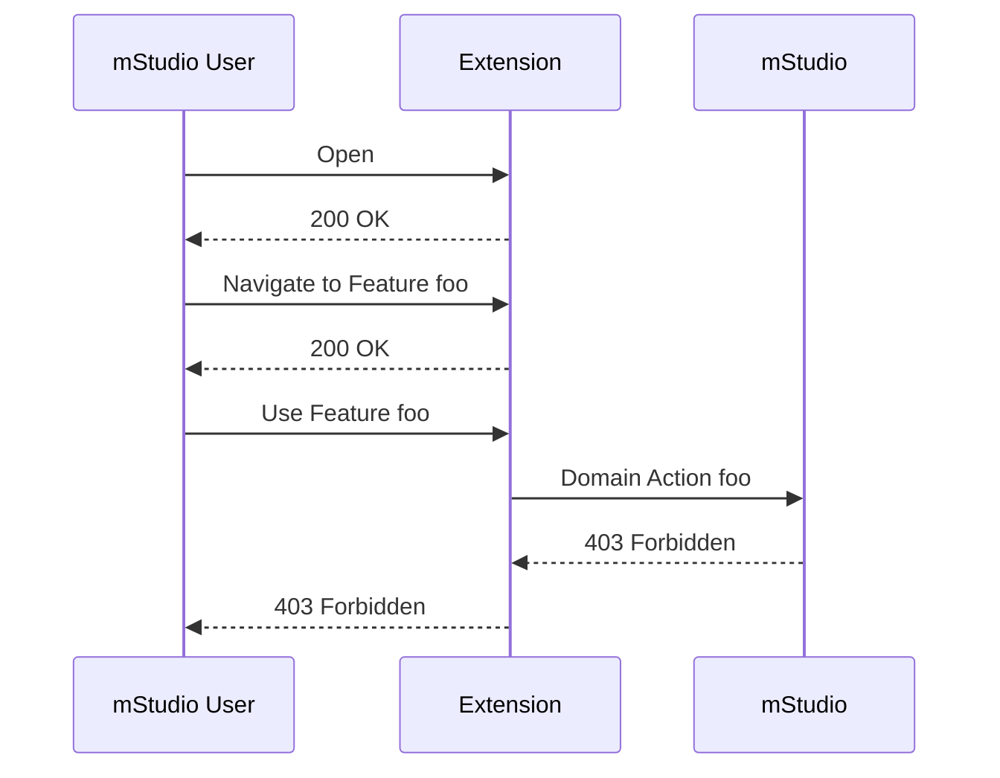
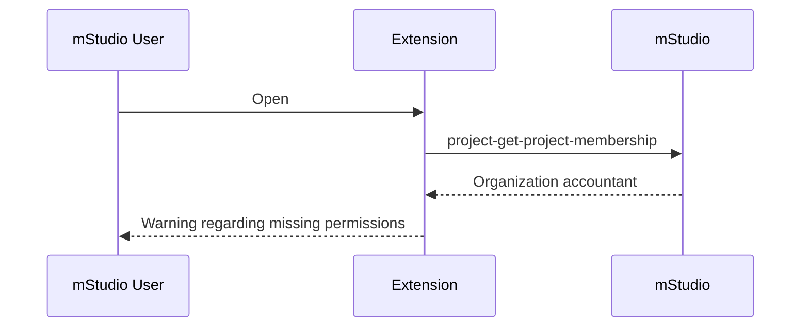
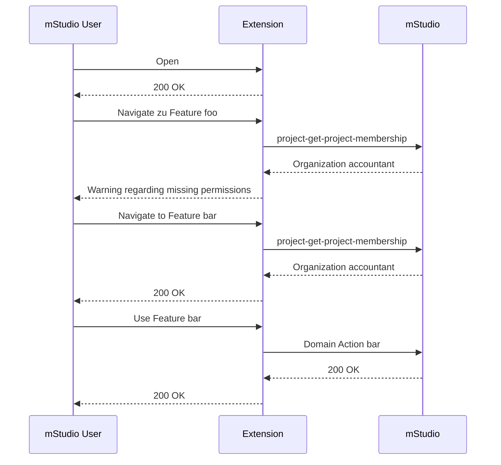

If the Extension interacts with the mStudio API on behalf of an mStudio user, this may lead to insufficient permissions.
An Extension acts on behalf of an mStudio User, if it uses the [access token retrieval key](../../overview/concepts/authentication#access-token-retrieval-key)
or [OAuth2](../../overview/concepts/authentication#oauth2) for the authentication.

The mStudio ensures that an mStudio User never has more permissions using an Extension than they have using the mStudio directly.
Additionally, it ensures that an mStudio User using an Extension only has the permissions they accepted when installing the Extension.

However, it does not ensure that the mStudio user using an Extension has all the permissions required for executing the domain actions necessary for the Extension.
This is due to the system of rights and roles of the mStudio that defines different roles for organizations and projects.
Therefore, an Extension may execute a domain action the user is not permitted to perform.
This leads to an error message.

So for example, if an Extension should create projects via the [project-create-project](../../../reference/project/project-create-project) operation
and the user only has the role "Organization accountant", they will encounter an error message when using the Extension because the role does not permit creating projects.

The Extension should validate the required permissions in advance to provide a good user experience.
For this, it can use the operations [project-get-project-membership](../../../reference/project/project-get-project-membership) or [customer-get-customer-membership](../../../reference/customer/customer-get-customer-membership).

Those routes return the current membership to an Extension context of the user.
This contains the roles of the user in that context, among other things.

By validating the users role, the Extension can display a warning to the user, that they do not have the required permissions to execute the domain action and should contact the context administrator to get the missing permissions.

The contributor still has the flexibility to decide whether to block the Extension for users with insufficient permissions completely, as in the above example, or only specific features.

Alternatively, you can execute the domain actions on behalf of the Extension.
For this, the Extension has to use the [Extension Instance secret](../../overview/concepts/authentication#extension-instance-secret) to request an access token.
Then, the domain action is executed with the permissions of the Extension.
However, this has a downside.
Organization owners and project administrators can no longer manage which domain actions users can perform by distributing roles.
This can lead to a worse user experience.
