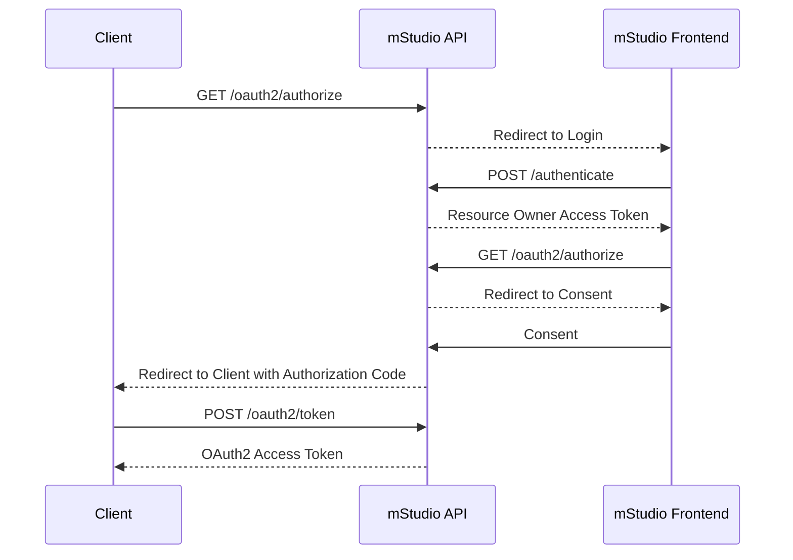
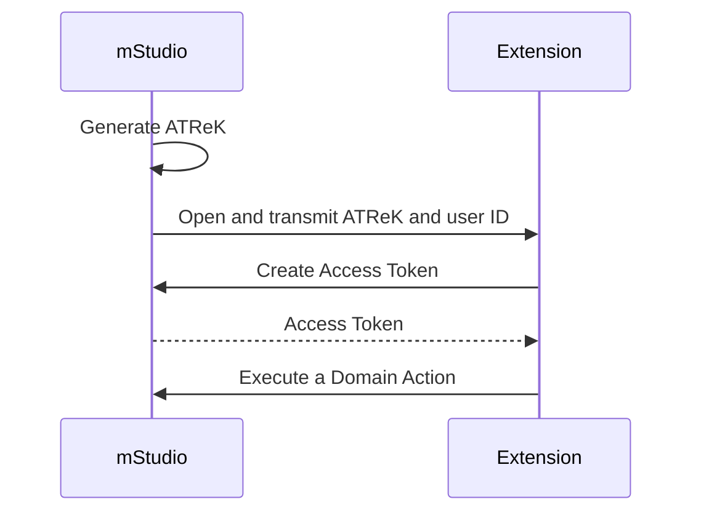

import OperationLink from "@site/src/components/OperationLink";

## Using Access Tokens to Authenticate

You can use access tokens to authenticate against the mStudio API.
[Authenticating API requests](../../../api/intro#authenticating-requests) describes the use of access tokens.

You can consult the operations in the [API reference](../../../reference/) to determine whether you need to be authenticated to execute those routes.

Note, that the mStudio API is only accessible via an external **backend** because of CORS limitations.

## Authenticating with the Extension Instance Secret

Every Extension receives an Extension Instance Secret via lifecycle webhooks.
The Extension can then use this secret to authenticate against the mStudio API.
Initially, the mStudio transmits the secret via the `ExtensionAddedToContext` webhook.
Periodically, it rotates the secret and then sends the new secret via the `ExtensionsInstanceSecretRotated` webhook.
At that point, the old secret is no longer valid.

For more information about the webhooks, see [Lifecycle Webhooks](../webhooks).

You can extract the secret from the `secret` property of the webhook request body.
Use the operation <OperationLink operation="extension-authenticate-instance" /> to request an access token.
Additionally to the secret, this operation needs the Extension Instance id, which is the property `id` in the webhook request body.
The `extensionInstanceId` is a path parameter, and the secret is the request body property `extensionInstanceSecret`.

The mStudio API returns a `publicToken` that can be used to authenticate against the mStudio API.
Additionally, it returns an `expiry` property, which defines the date the token expires.
An Extension access token is short-lived and cannot be extended.
If a token expires, you have to request a new token.
When an Extension is removed from a context or an Extension Instance is deactivated, all access tokens are invalidated automatically.

Additionally, the access token is not bound to a user.
It only authorizes the Extension to access resources of the Extension Context.

:::warning Limitations of user-unbound access tokens
The mStudio API offers GET routes that return all resources of a certain entity that a user has access to.
For example, <OperationLink operation="project-list-projects" /> returns a list of all projects a user has access to.

These types of routes do not work with user-unbound access tokens, as they do not authenticate an mStudio user,
but only authorize access to resources of the Extension Context.
:::

## OAuth2

The mStudio implements OAuth2 as an authentication mechanism for the public API according to [RFC 6749](https://tools.ietf.org/html/rfc6749).
Currently, we only support the authorization code flow (with PKCE).

The required API endpoints for the OAuth2 flow are:

- <OperationLink operation="user-oauth-get-authorization" />
- <OperationLink operation="user-oauth-retrieve-access-token" />

mittwald recommends using a OAuth2 Client library that conforms to [RFC 6749](https://tools.ietf.org/html/rfc6749) to implement OAuth2 Clients.

The following is a rough sketch of the authorization code flow process:



## Using an Access Token Retrieval Key

To use the ATReK and the user ID in an Extension, you must define a template for the Extension frontend.
The mSudio inserts this information when redirecting to the Extension frontend.

The following is an example of how such a template may look:

```
https://example.com?atrek=:accessTokenRetrievalKey&userId=:userId
```

For more information about the use of templates, see [templating of configuration values](../../overview/concepts/templating).

Here, the mStudio passes the ATReK and the user ID as query parameters.
In principle, you can also use any other part of the URI to pass this information.
Query parameters are the best option since they often are not included in access logs.

The Extension can use the ATReK by calling the route <OperationLink operation="user-authenticate-with-access-token-retrieval-key" />.

This route requires the ATReK and the user ID as parameters and responds with an access token on success.
The returned access token is automatically limited by the scopes of the Extension.

The following diagram visualizes this process:



## Getting Webhook Signature Public Keys

If you want to [verify the signature of a lifecycle webhook](../webhooks#validation-of-lifecycle-webhooks), you must know the public key of the mStudio.
You can request this key with the operation <OperationLink operation="extension-get-public-key" />.
For this, you must pass the identifier of the public key as a path parameter to the operation.
The header field `X-Marketplace-Signature-Serial` of the webhook request contains the identifier of the public key.
The mStudio returns the public key in the response body encoded in base64.

We guarantee a stable public key for a signature serial.
Therefore, the Extension may cache or persist the public keys.
The Extension must only request a new public key when the mStudio uses a new signature serial.
We announce this in advance.
The Extension should check the signature serial for every lifecycle webhook and perhaps automatically request the new public key.
