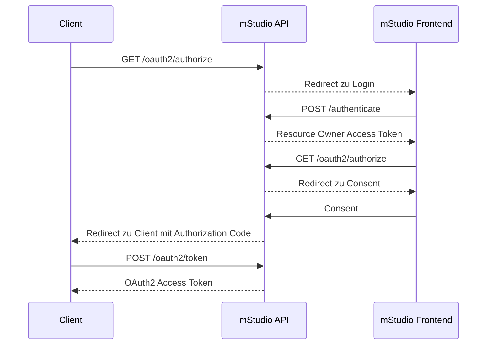
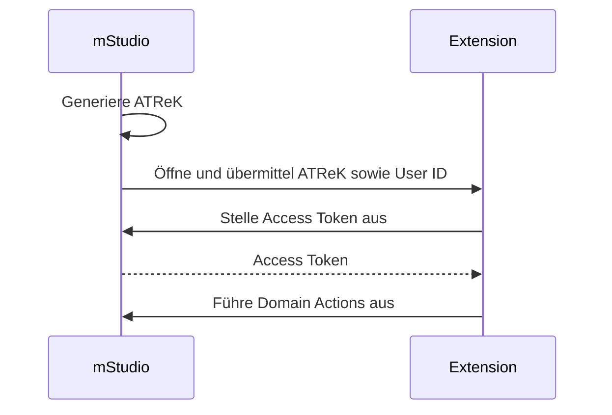

import OperationLink from "@site/src/components/OperationLink";

## Using Access Tokens to Authenticate

Access Tokens können verwendet werden, um sich gegenüber der mStudio API zu authentifizieren.
Die Verwendung von Access Tokens ist in [API-Anfragen authentifizieren](../../../api/intro#authenticating-requests) beschrieben.

Um in Erfahrung zu bringen, welche Routen authentifiziert ausgeführt werden müssen,
kann die jeweilige Operation in der [API Referenz](../../../reference/) aufgesucht werden.

Beachte, dass, aufgrund von CORS-Einschränkungen, das Aufrufen der mStudio API aus einer externen Applikation heraus
derzeit nur über ein externes **Backend** möglich ist.

## Authenticating with the Extension Instance Secret

Jede Extension erhält über Lifecycle Webhooks ein Secret, das für die Authentifizierung gegenüber der mStudio API verwendet werden kann.
Initial wird das Secret über den `ExtensionAddedToContext`-Webhook übermittelt.
Das mStudio rotiert automatisiert regelmäßig das Secret.
über den `ExtensionInstanceSecretRotated`-Webhook wird das neue Secret dann übermittelt.
Das alte Secret ist in diesem Moment invalidiert.

Für weitere Informationen über die Webhooks siehe [Lifecycle Webhooks](../webhooks).

Das Secret kann aus der `secret` Property des Webhook Request Bodies entnommen werden.
Dieses kann dann in Kombination mit der Extension Instance ID, die unter der Property `id` zu finden ist, verwendet werden, um ein Access Token zu beziehen.
Dafür muss die <OperationLink operation="extension-authenticate-instance" />-Operation verwendet werden.
Die `extensionInstanceId` wird als Pfad-Parameter übergeben und das Secret im Request Body als `extensionInstanceSecret`-Property.

Als Response wird der `publicToken`, der für die Authentifizierung gegenüber der mStudio API verwendet werden kann, zurückgegeben.
Außerdem wird eine `expiry` Property zurückgegeben, die den Zeitpunkt angibt, an dem das Token abläuft.
Ein Extension Access Token ist kurzlebig und kann nicht verlängert werden.
Wenn das Token abgelaufen ist, muss ein neues Token bezogen werden.
Wenn eine Extension von einem Context entfernt wird oder eine Extension Instance deaktiviert wird,
werden alle Access Tokens automatisch invalidiert.

## OAuth2

Das mStudio implementiert konform zu [RFC 6749](https://tools.ietf.org/html/rfc6749) OAuth2 als Authentifizierungsmechanismus für die öffentliche API.
Unterstützt wird derzeit nur der Authorization Code Flow (mit PKCE).

Die benötigten API-Endpunkte für den OAuth2 Flow sind:

- <OperationLink operation="user-oauth-get-authorization" />
- <OperationLink operation="user-oauth-retrieve-access-token" />

Für die Implementierung des OAuth2 Clients empfiehlt mittwald die Verwendung einer OAuth2 Client Library,
die mit [RFC 6749](https://tools.ietf.org/html/rfc6749) konform ist.

Im Folgenden ist der Ablauf des Authorization Code Flows grob skizziert:



## Using an Access Token Retrieval Key

Um den ATReK und die User ID in einer Extension verwenden zu können, muss ein Template für das Extension Frontend verwendet werden.
Das mStudio fügt diese Informationen beim Navigieren zur Extension in das Template ein.

Ein solches Template kann bspw. so aussehen:

```
https://example.com?atrek=:accessTokenRetrievalKey&userId=:userId
```

Für weitere Informationen über die Verwendung von Templates siehe [Templating von Konfigurationswerten](../../overview/concepts/templating)

Hier wird der ATReK und die User ID als Query-Parameter übergeben.
Prinzipiell kann auch jeder andere URI-Bestandteil verwendet werden, um die Informationen zu übergeben.
Query-Parameter eignen sich jedoch am besten, weil diese meist nicht in Access Logs auftauchen.

Die Extension kann den ATReK verwenden, indem die <OperationLink operation="user-authenticate-with-access-token-retrieval-key" />-Route aufgerufen wird.

Die Route benötigt als Parameter den ATReK und die User ID und antwortet bei Erfolg mit einem Access Token.
Das resultierende Access Token ist automatisch mit den Scopes der Extension eingeschränkt.

Der Ablauf ist in folgendem Diagram visualisiert:



## Abruf von Webhook Signatur Public Keys

Zur [Prüfung der Signatur eines Lifecycle Webhooks](../webhooks#validierung-von-lifecycle-webhooks) muss der öffentliche Schlüssel des mStudio bekannt sein.
Dieser kann über die <OperationLink operation="extension-get-public-key" />-Route abgerufen werden.
Dazu muss der Identifier des Public Keys, der sich hinter dem `X-Marketplace-Signature-Serial`-Header verbirgt als Pfad-Parameter übergeben werden.
Der Public Key wird base64 kodiert im Response Body zurückgegeben.

Für eine bestimmte Signature-Serial wird ein stabiler Public Key garantiert.
Das bedeutet, dass der Public Key gecacht oder persistiert werden kann.
Erst wenn sich die Signature-Serial ändert, muss der neue Public Key abgerufen werden.
Dies wird nicht im Voraus angekündigt.
Es sollte also bei jedem Lifecycle-Webhook die Signature-Serial geprüft und ggf. automatisiert der neue Public Key abgerufen werden.
