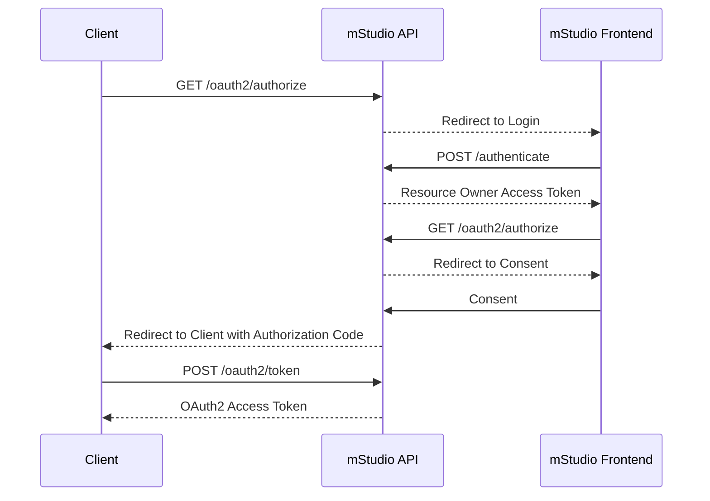
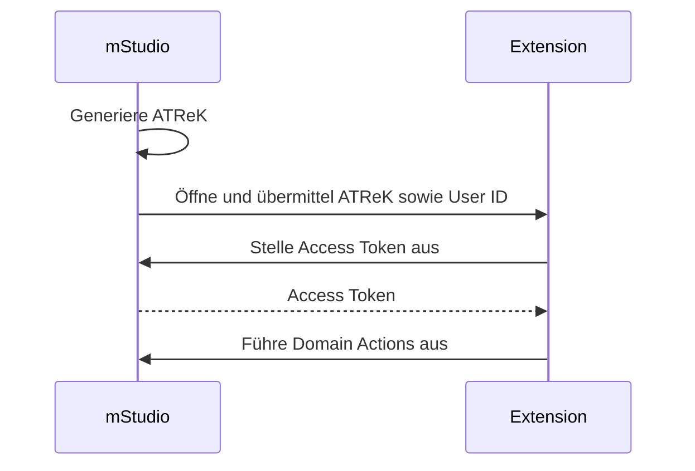

import OperationLink from "@site/src/components/OperationLink";

## Using Access Tokens to Authenticate

You can use access tokens to authenticate against the mStudio API.
[Authenticating API requests](../../../api/intro#authenticating-requests) describes the use of access tokens.

You can consult the operations in the [API reference](../../../reference/) to determine whether you need to be authenticated to execute those routes.

Note, that the mStudio API is only accessible via an external **backend** because of CORS limitations.

## Authenticating with the Extension Instance Secret

Every extension receives an extension secret via lifecycle webhooks.
The extension can then use this secret to authenticate against the mStudio API.
Initially, the mStudio transmits the secret via the `ExtensionAddedToContext` webhook.
Periodically, it rotates the secret and then sends the new secret via the `ExtensionsInstanceSecretRotated` webhook.
At that point, the old secret is no longer valid.

For more information about the webhooks, see [Lifecycle Webhooks](../webhooks).

You can extract the secret from the `secret` property of the webhook request body.
Use the operation <OperationLink operation="extension-authenticate-instance" /> to request an access token.
Additionally to the secret, this operation needs the extension instance id, which is the property `id` in the webhook request body.
The `extensionInstanceId` is a path parameter, and the secret is the request body property `extensionInstanceSecret`.

The mStudio API returns a `publicToken` that can be used to authenticate against the mStudio API.
Additionally, it returns an `expiry` property, which defines the date the token expires.
An extension access token is short-lived and cannot be extended.
If a token expires, you have to request a new token.
When an extension is removed from a context or an extension instance is deactivated, all access tokens are invalidated automatically.

## OAuth2

The mStudio implements OAuth2 as an authentication mechanism for the public API according to [RFC 6749](https://tools.ietf.org/html/rfc6749).
Currently, we only support the authorization code flow (with PKCE).

The required API endpoints for the OAuth2 flow are:

- <OperationLink operation="user-oauth-get-authorization" />
- <OperationLink operation="user-oauth-retrieve-access-token" />

mittwald recommends using a OAuth2 client library that conforms to [RFC 6749](https://tools.ietf.org/html/rfc6749) to implement OAuth2 clients.

The following is a rough sketch of the authorization code flow process:



## Using an Access Token Retrieval Key

Um den ATReK und die User ID in einer Extension verwenden zu können, muss ein Template für das Extension Frontend verwendet werden.
Das mStudio fügt diese Informationen beim Navigieren zur Extension in das Template ein.

Ein solches Template kann bspw. so aussehen:

```
https://example.com?atrek=:accessTokenRetrievalKey&userId=:userId
```

Für weitere Informationen über die Verwendung von Templates siehe [Templating von Konfigurationswerten](../../overview/concepts/templating)

Hier wird der ATReK und die User ID als Query-Parameter übergeben.
Prinzipiell kann auch jeder andere URI-Bestandteil verwendet werden, um die Informationen zu übergeben.
Query-Parameter eignen sich jedoch am besten, weil diese meist nicht in Access Logs auftauchen.

Die Extension kann den ATReK verwenden, indem die <OperationLink operation="user-authenticate-with-access-token-retrieval-key" />-Route aufgerufen wird.

Die Route benötigt als Parameter den ATReK und die User ID und antwortet bei Erfolg mit einem Access Token.
Das resultierende Access Token ist automatisch mit den Scopes der Extension eingeschränkt.

Der Ablauf ist in folgendem Diagram visualisiert:



## Abruf von Webhook Signatur Public Keys

Zur [Prüfung der Signatur eines Lifecycle Webhooks](../webhooks#validierung-von-lifecycle-webhooks) muss der öffentliche Schlüssel des mStudio bekannt sein.
Dieser kann über die <OperationLink operation="extension-get-public-key" />-Route abgerufen werden.
Dazu muss der Identifier des Public Keys, der sich hinter dem `X-Marketplace-Signature-Serial`-Header verbirgt als Pfad-Parameter übergeben werden.
Der Public Key wird base64 kodiert im Response Body zurückgegeben.

Für eine bestimmte Signature-Serial wird ein stabiler Public Key garantiert.
Das bedeutet, dass der Public Key gecacht oder persistiert werden kann.
Erst wenn sich die Signature-Serial ändert, muss der neue Public Key abgerufen werden.
Dies wird nicht im Voraus angekündigt.
Es sollte also bei jedem Lifecycle-Webhook die Signature-Serial geprüft und ggf. automatisiert der neue Public Key abgerufen werden.
