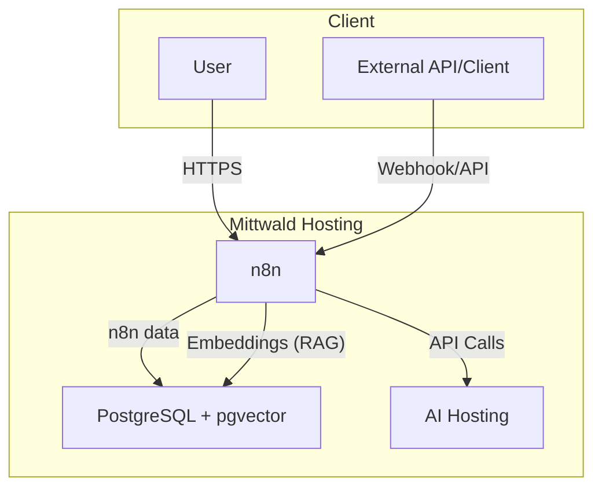

# Running n8n

## Introduction

n8n is an automation platform that allows you to connect different services and applications via so-called workflows. It works similarly to tools like Zapier or Make (formerly Integromat), but offers more flexibility and control – especially for developers.

With n8n you can:

- Create automated workflows between over 300 services (e.g. Slack, Google Sheets, GitHub, databases, etc.)
- Add your own logic – for example, with conditions, loops, custom JavaScript
- Self-host the software, which allows for complete data sovereignty

## Creating an n8n Container

You can provide n8n in your mittwald hosting environment using containers. There are several main approaches:

### Using the mStudio user interface

1. In your project, go to the **Container** menu item in mStudio and create a new container. You can choose any name you like.

2. Enter the image `n8nio/n8n:stable`. You can leave the entrypoint and command as suggested.

#### Volumes

To persistently store your n8n data, define volumes under **Volumes** as follows:

- Create a new volume, with **Path in container** (Mount Point): `/home/node/.n8n`

#### Environment Variables

Set the following environment variables for the container:

```dotenv
N8N_HOST=example.project.space
N8N_PORT=5678
N8N_PROTOCOL=https
NODE_ENV=production
WEBHOOK_URL=https://example.project.space/
GENERIC_TIMEZONE=Europe/Berlin
```

Here, adjust the environment variables `N8N_HOST` and `WEBHOOK_URL` to match the host where you want to access the n8n web interface.

#### Ports

Use the suggested default port `5678`.

### Using the CLI with `mw container run`

You can also deploy an n8n container with the mittwald CLI and the command `mw container run`:

```bash
mw container run \
  --name n8n \
  --env N8N_HOST=example.project.space \
  --env N8N_PORT=5678 \
  --env N8N_PROTOCOL=https \
  --env NODE_ENV=production \
  --env WEBHOOK_URL=https://example.project.space/ \
  --env GENERIC_TIMEZONE=Europe/Berlin \
  --volume n8n-data:/home/node/.n8n \
  --publish 5678:5678/tcp \
  --create-volumes \
  n8nio/n8n:stable  # alternatives: https://hub.docker.com/r/n8nio/n8n/tags
```

This command creates a new container named "n8n" with the n8n image, sets all necessary environment variables, and mounts volumes for persistent data storage.

### Using the CLI with `mw stack deploy`

If you prefer Docker Compose, you can create a `docker-compose.yml` file and deploy it with the `mw stack deploy` command:

1. Create a `docker-compose.yml` file with the following content:

   ```yaml
   version: "3"
   services:
     n8n:
       image: n8nio/n8n:stable
       environment:
         - N8N_HOST=example.project.space
         - N8N_PORT=5678
         - N8N_PROTOCOL=https
         - NODE_ENV=production
         - WEBHOOK_URL=https://example.project.space/
         - GENERIC_TIMEZONE=Europe/Berlin
       ports:
         - "5678:5678"
       volumes:
         - n8n-data:/home/node/.n8n
   volumes:
     n8n-data:
   ```

2. Deploy the stack with the CLI:

   ```bash
   mw stack deploy
   ```

This approach is especially useful if you want to deploy multiple containers that work together.

## Operation

Your n8n data is secured as part of the regular project backups and can be restored accordingly. Make sure to assign separate volumes to each container for their data so that you can re-create containers independently of their data.

:::caution
For secure production operation, further measures or clarifications are required, depending on the specific use case:

- Access to n8n: Who is allowed to create, edit, trigger workflows, etc.?
- Authentication for n8n, user and role management concepts
- Configuration of n8n: Allowed nodes, system users, etc.
- Access to the vector database: read/write, schema changes
- Access to documents: Who is allowed to read/write/delete?
- Access to webhooks: Authorization and authentication, consumers or clients

During development and testing, some of these aspects can be simplified, but for production use, all these aspects must be clearly regulated. Without clear resolution of these security issues, there is a risk of unintentionally disclosing too much information, potentially making internal documents publicly accessible or even triggering processes.
:::

### Use case: RAG with PostgreSQL and Mittwald AI Hosting

n8n can be used to build RAG systems of various forms. The following example shows one possible setup, but due to the large n8n ecosystem, it is only one of many approaches. This example is intended to serve as a starting point for building more complex and especially production-ready systems.

#### Requirements

- Mittwald Container Hosting
- Mittwald AI Hosting
- mStudio access, via webapp and API token
- A set up and configured `mw` CLI, deployment of the container stack

#### Introduction, Basic Setup

The goal is to give a chat agent access to information from documents, so that the agent’s actions and answers can refer specifically to those documents. Such documents can be, for example, manuals, guides, or even Excel workbooks with lots of data.

To achieve this, a persistence layer is needed where information can be stored in a "AI-friendly" way. Under the hood, at least two AI models are used: one for generating so-called "embeddings" and another to control the agent. Embeddings are the "AI-friendly" way to persist text and documents, so they can be quickly provided as context for conversations.

In the example, these two models from Mittwald AI Hosting are used:

- **Embedding**: `Qwen3-Embedding-8B`
- **Agent**: `Devstral-Small-2-24B-Instruct-2512`

Embeddings are stored in a vector database. Several options exist for this; the example uses `PostgreSQL` with the `pgvector` extension. A prepared Docker image is available for this.

The stack consists of at least these containers:

- **n8n**: creating and operating the RAG system
- **pgvector**: vector database for embeddings **and** n8n persistence layer



#### Installation

If all prerequisites are met, you can start the installation. First, create the Docker Compose file:

```
version: "3.9"
services:
  pgvector:
    image: ankane/pgvector:latest
    container_name: pgvector
    restart: always
    environment:
      POSTGRES_USER: ${POSTGRES_USER}
      POSTGRES_PASSWORD: ${POSTGRES_PASSWORD}
      POSTGRES_DB: n8n
    ports:
      - "5432:5432"
    volumes:
      - pgvector-data:/var/lib/postgresql/data

  n8n:
    image: n8nio/n8n:latest
    container_name: n8n
    restart: unless-stopped
    environment:
      N8N_HOST: ${N8N_HOST}
      WEBHOOK_URL: ${WEBHOOK_URL}
      N8N_DATABASE_POSTGRESDB_USER: ${POSTGRES_USER}
      N8N_DATABASE_POSTGRESDB_PASSWORD: ${POSTGRES_PASSWORD}
      NODES_EXCLUDE: ${NODES_EXCLUDE}
      N8N_PROTOCOL: https
      GENERIC_TIMEZONE: Europe/Berlin
      N8N_DATABASE_POSTGRESDB_HOST: pgvector
      N8N_DATABASE_POSTGRESDB_PORT: 5432
      N8N_DATABASE_POSTGRESDB_DATABASE: n8n
      N8N_PORT: 5678
    ports:
      - "5678:5678"
    depends_on:
      - pgvector
    volumes:
      - n8n-data:/home/node/.n8n

volumes:
  pgvector-data:
    driver: local
  n8n-data:
    driver: local
```

All critical settings, such as passwords, are set as environment variables. This allows, among other things, quick setup of multiple environments, e.g., for testing and production.

We write the specific settings into a `.env` file:

```
N8N_HOST=example.project.space
WEBHOOK_URL=https://example.project.space/
POSTGRES_USER=<postgres user>
POSTGRES_PASSWORD=<postgres password>
NODES_EXCLUDE=[]
```

For easy differentiation, it’s recommended to give the `.env` files descriptive names, such as `test.env` or `prod.env`.

:::caution
`NODES_EXCLUDE=[]` enables **all** nodes for use. Some of these nodes may pose a security risk. While this is very useful for testing, for production environments it is advisable to maintain a detailed list of nodes to exclude.
:::

Once all settings are prepared, the stack can be deployed:

```
mw stack deploy -c path/to/n8n/docker-compose.yml --env-file path/to/n8n/example.env
```

If you see a success message in the console, check the new containers in mStudio – the installation step is complete!

#### Example Workflow

<a href="/examples/mw_ai_host_n8n_rag_demo.json" download>
  Download example workflow (JSON)
</a>

Based on [source](https://n8n.io/workflows/10157-local-document-question-answering-with-ollama-ai-agentic-rag-and-pgvector/)

#### Setup

After installation, we set up the RAG system in n8n and configure it. First, activate an n8n license key and download the base nodes for workflow creation. The required nodes are in `n8n-nodes-base` and can be downloaded and installed directly from the application.

:::note

Always check **before** running a workflow whether all involved nodes are present and correctly connected. n8n error messages can be very technical or even misleading—taking a moment to check in advance can save debugging effort.

:::

Besides being present, some nodes must be configured correctly.

You will need:
- Access to Mittwald AI Hosting (or a comparable, OpenAI-compatible host) with API key
- Access to the database; user and password have already been prepared in the container stack

**Security:** For production, it’s best practice to manage multiple database users with different privileges. However, this requires manual adjustments to the database container, which are not covered here for simplicity. As a rule, the database user utilized by the AI agent for user input should **not** have permission to change the database schema!

So, create credentials for the database and the AI host, then assign them to the appropriate nodes. When creating credentials, the connection is already checked—so you can immediately see whether the stack is working correctly. For webhook authentication, set up JWT; to generate a token for simulating a client, you can use [the JWT encoder on jwt.io](https://www.jwt.io/).

#### Operation – Webhook

**Security:** For production, webhooks must be protected with an authentication method. If possible, don’t expose webhooks directly, but consume them from another application in the stack. If you want to expose webhooks on purpose, it’s worthwhile to include a proxy server in your stack, which only forwards defined webhook URLs to n8n.

Let the initial webhook listen in test mode—you can test it, for example with Postman or curl, and you’ll see the exact URL:

```
curl -X POST -d '{
  "chatInput": "Hello World!",
  "sessionId": 42
}'
-H "Content-Type: application/json" \
-H "Authorization: Bearer xxx.yyy.zzz" \
https://example.project.space/webhook-test/<webhook uuid>
```

As long as our RAG setup isn’t loaded with documents, we have a simple chatbot here, using the "baked-in" knowledge of the model. If you ask explicitly, the agent will explain:

```
curl -X POST -d '{
  "chatInput": "How many documents do you know?",
  "sessionId": 42
}'
-H "Content-Type: application/json" \
-H "Authorization: Bearer xxx.yyy.zzz" \
https://example.project.space/webhook-test/<webhook uuid>
{"output":"I currently do not have access to any documents in my knowledge base. If you'd like, I can help answer questions based on general knowledge or assist with other tasks."}
```

#### Operation – RAG, Filesystem

After basic operation is confirmed, the RAG system can be populated with documents. In the example, documents are stored, processed, and made accessible to the AI agent in the filesystem. In practice, it can be worthwhile to also consider other sources in addition to the filesystem, or configure the filesystem against a service, or an Internet share (e.g., Google Share).

In the first node ("Local file trigger") for file system monitoring, set the directory in the n8n container where the documents should be placed. For example, enter `/home/node/rag_documents`.

Afterwards, you can test the monitoring by placing documents in the designated folder. Document delivery can take place in several ways (via SSH, SFTP, etc.); in this example, we are restricting ourselves to an `SSH` connection and deliver our documents using `scp`. Prepare the directory:

```shellsession
ssh <Mittwald SSH URL, see mStudio>
mkdir -p /home/node/rag_documents
```

Activate the monitoring node in n8n, deliver documents:

```shellsession
scp my_documents/example_manual.txt <Mittwald SSH URL n8n Container, see mStudio>:/home/node/rag_documents/
```

With the new file, the subsequent workflow is triggered. The document, its metadata, and the embeddings are stored in the database and are then available in the chat.

For testing, known documents to which you can easily ask test questions are especially useful:

```shellsession
# Place sample documents
scp -r python3_docs/*.txt <Mittwald SSH URL n8n Container, see mStudio>:/home/node/rag_documents/
# Workflow will be triggered in n8n ...
# Check after completion:
curl -X POST -d '{
  "chatInput": "How to report bugs in Python?",
  "sessionId": 42
}'
-H "Content-Type: application/json" \
-H "Authorization: Bearer xxx.yyy.zzz" \
https://example.project.space/webhook-test/<webhook uuid>
{"output":"To report bugs in Python, you can use the Python issue tracker on GitHub. Here’s how you can do it:\n\n1. **GitHub Issues Tracker**: Submit bug reports for Python via the GitHub issues tracker at [https://github.com/python/cpython/issues](https://github.com/python/cpython/issues). This platform provides a web form where you can enter pertinent information and submit it to the developers.\n\n2. **Bug Writing Guidelines**: When writing a bug report, include as much detail as possible to help the developers understand and reproduce the issue. While some guidelines are specific to the Mozilla project, they describe general best practices for writing effective bug reports.\n\n3. **Documentation Bugs**: If you find a bug in the Python documentation or have suggestions for improvements, you can also submit a bug report on the issue tracker. …

# Source Reference:
curl -X POST -d '{
  "chatInput": "Name your document source",
  "sessionId": 42
}'
-H "Content-Type: application/json" \
-H "Authorization: Bearer xxx.yyy.zzz" \
https://example.project.space/webhook-test/<webhook uuid>
{"output":"The document source for reporting bugs in Python is titled \"bugs\" and is located at `/home/node/rag_documents/python3_docs/bugs.txt`."}
```

#### Outlook

With the system set up up to this point, you have a solid foundation to further develop your RAG system into a production-ready solution.

In addition to the already mentioned security aspects, there are other considerations:
- Data sources for documents: other sources such as external databases, network drives, etc.
- Refinement of the agent: model settings, prompt, document filters
- Integration of additional tools with the AI agent: web search, image recognition, etc.
- Scaling: storage requirements for documents and embeddings, system behavior under load, etc.

This list is not exhaustive, but rather shows additional points of contact that should be considered when rolling out such systems into production.
