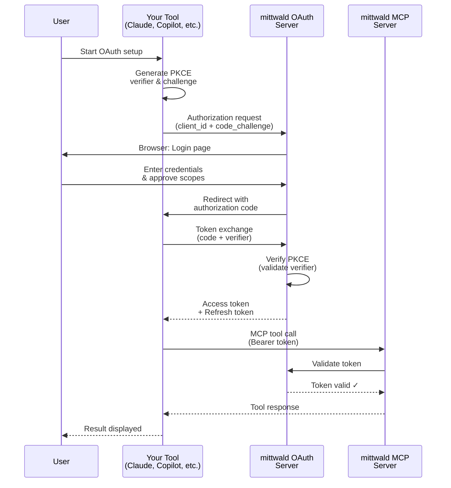

# Getting Connected to mittwald MCP

Welcome! This guide helps you set up authentication for mittwald MCP with your preferred agentic coding tool.

**Why authentication is required**: mittwald MCP requires authenticated access to your mittwald resources. OAuth 2.1 is the recommended method for interactive use, and API tokens are available for headless/CI workflows.

## Choose Your Tool {#choose-your-tool}

mittwald MCP works with 6 popular AI tools. Choose the one you use:

### Claude Desktop {#claude-desktop}

**Best for**: Users of Claude Desktop app or Claude.ai web interface

- **Type**: Desktop app / Web app
- **OAuth Pattern**: Browser-based (connector settings UI)
- **Setup Time**: ~5 minutes
- **Complexity**: ⭐ (Very Simple - settings UI only)

→ **[Set up Claude Desktop](./claude-desktop)**

### ChatGPT {#chatgpt}

**Best for**: Users of ChatGPT Plus, Team, Enterprise, or Education

- **Type**: Web app / Mobile app
- **OAuth Pattern**: Browser-based (connector settings UI)
- **Setup Time**: ~5 minutes
- **Complexity**: ⭐ (Very Simple - settings UI only)

→ **[Set up ChatGPT](./chatgpt)**

### Claude Code {#claude-code}

**Best for**: Developers using Anthropic's Claude Code CLI

- **Type**: Command-line interface
- **OAuth Pattern**: Browser-based (standard web flow)
- **Setup Time**: ~10 minutes
- **Complexity**: ⭐⭐ (Simple - straightforward CLI commands)

→ **[Set up Claude Code](./claude-code)**

### GitHub Copilot {#github-copilot}

**Best for**: Developers using GitHub Copilot in VS Code, Visual Studio, JetBrains IDEs, or Xcode

- **Type**: IDE extension (multiple platforms)
- **OAuth Pattern**: IDE-based (Dynamic Client Registration)
- **Setup Time**: ~10 minutes
- **Complexity**: ⭐⭐ (Simple - IDE settings-based)

→ **[Set up GitHub Copilot](./github-copilot)**

### Cursor {#cursor}

**Best for**: Developers using Cursor IDE (VS Code fork with AI features)

- **Type**: IDE (desktop application)
- **OAuth Pattern**: IDE-based (configuration file or settings UI)
- **Setup Time**: ~10 minutes
- **Complexity**: ⭐⭐ (Simple - JSON configuration)

→ **[Set up Cursor](./cursor)**

### Codex CLI {#codex-cli}

**Best for**: Developers using OpenAI's Codex CLI for terminal-based AI workflows

- **Type**: Command-line interface
- **OAuth Pattern**: RFC 8252 loopback (native app pattern)
- **Setup Time**: ~10 minutes
- **Complexity**: ⭐⭐ (Simple - CLI commands, browser for auth)

→ **[Set up Codex CLI](./codex-cli)**

## Quick Comparison {#quick-comparison}

| Feature               | Claude Desktop | ChatGPT        | Claude Code                           | GitHub Copilot                           | Cursor                                                  | Codex CLI                           |
| --------------------- | -------------- | -------------- | ------------------------------------- | ---------------------------------------- | ------------------------------------------------------- | ----------------------------------- |
| **Type**              | Desktop/Web    | Web/Mobile     | CLI                                   | IDE Extension                            | IDE                                                     | CLI                                 |
| **Platform**          | All            | All            | macOS, Linux, Windows                 | VS Code, Visual Studio, JetBrains, Xcode | macOS, Linux, Windows                                   | macOS, Linux, Windows               |
| **Configuration**     | Settings UI    | Settings UI    | CLI command                           | IDE settings                             | IDE settings or JSON file                               | CLI command                         |
| **Browser Required**  | Yes (for auth) | Yes (for auth) | Yes (for auth)                        | Yes (for auth)                           | Yes (for auth)                                          | Yes (for auth)                      |
| **PKCE**              | Automatic      | Automatic      | Automatic                             | Automatic                                | Automatic                                               | Automatic                           |
| **Redirect Handling** | Managed by app | Managed by app | Local callback managed by Claude Code | Managed by IDE                           | Managed by Cursor (or static redirect for static OAuth) | Local callback managed by Codex CLI |

## Two Ways to Authenticate {#two-ways-to-authenticate}

mittwald MCP supports two authentication methods. Choose based on your use case:

### Option 1: OAuth 2.1 (Recommended) {#option-1-oauth}

**Best for**: Interactive development, local machines, security-conscious workflows

**How it works**:

1. Your tool redirects you to mittwald OAuth server
2. You log in via browser with your mStudio credentials
3. You approve the requested scopes
4. Your tool receives an access token automatically
5. Your tool attempts token refresh when refresh tokens are available

**Pros**:

- ✅ Most secure (short-lived tokens)
- ✅ Minimal manual token management in common setups
- ✅ Revocable from mStudio
- ✅ Scoped access (you control what the tool can do)

**Cons**:

- ❌ Requires browser (not suitable for headless servers)
- ❌ More complex initial setup

**Supported by**: All 6 tools (Claude Desktop, ChatGPT, Claude Code, GitHub Copilot, Cursor, Codex CLI)

### Option 2: API Token (Direct Authentication) {#option-2-api-token}

**Best for**: CI/CD pipelines, headless servers, automated scripts, simple testing

**How it works**:

1. You create an API token in mStudio (User Settings → API Tokens)
2. You configure your tool to send the token as a Bearer header
3. The MCP server validates the token directly with mittwald API
4. No OAuth flow, no browser required

**Pros**:

- ✅ Works in headless environments (SSH, Docker, CI)
- ✅ Simpler setup (no browser required)
- ✅ Good for testing and automation

**Cons**:

- ❌ Manual token management (no auto-refresh)
- ❌ Token is long-lived (security risk if leaked)
- ❌ Must rotate manually

**Supported by**: Claude Code, GitHub Copilot, Cursor, Codex CLI (different configuration methods per tool)

### Which Should I Choose? {#which-should-i-choose}

**Use OAuth if**:

- You're developing locally on your machine
- You want the most secure authentication
- You don't mind using a browser for initial setup

**Use API Token if**:

- You're running in CI/CD (GitHub Actions, GitLab CI, etc.)
- You're working on a headless server via SSH
- You're automating tasks with scripts
- You need quick setup for testing

**You can use both**: Configure OAuth for local development and API tokens for CI/CD.

## What is OAuth and Why Do I Need It? {#what-is-oauth}

**OAuth 2.1** is a secure authorization protocol that allows mittwald MCP to access your mittwald resources on your behalf **without sharing your password**.

### How OAuth Works (Step-by-Step) {#how-oauth-works}

1. **You choose a tool** (Claude Code, Copilot, Cursor, or Codex CLI)
2. **The tool requests access** to mittwald on your behalf
3. **You log in to mittwald** through your browser (your password stays secure)
4. **You see what the tool can access** (transparency - you approve the scopes)
5. **mittwald issues an access token** to your tool
6. **Your tool uses the token** to call MCP tools and access your mittwald resources
7. **Your password is never shared** with the tool - only the access token

### Security Features {#security-features}

**PKCE** (Proof Key for Code Exchange)

- Prevents authorization code interception attacks
- Automatically handled by your tool (no action needed)
- Required by mittwald OAuth for all clients

**Scoped Access**

- Tools only get permission for what they need
- You see and approve the scopes during login
- Common scopes: `user:read`, `project:read`, `app:read`

**Token Expiration**

- Access tokens expire after ~1 hour
- Most tools refresh automatically when supported
- If refresh fails or is unavailable, re-authentication may be required

**No Password Sharing**

- Your mittwald password stays at mittwald
- Tools receive only a temporary access token
- If token is compromised, impact is limited and token can be revoked

## Common OAuth Concepts Explained {#common-oauth-concepts}

### Redirect URI {#redirect-uri}

The callback URL where mittwald OAuth sends you after authentication. Each tool uses a different pattern:

- **CLI tools** (Claude Code, Codex CLI): `http://127.0.0.1/callback` (loopback)
- **IDE tools** (Copilot, Cursor): IDE-specific callback (handled automatically)

### Client ID {#client-id}

A unique identifier for your tool registration with mittwald OAuth. Some tools obtain this automatically (DCR), while others may require static client credentials.

### Authorization Code {#authorization-code}

A temporary code (valid ~10 minutes) exchanged for an access token during OAuth flow. You don't handle this manually - your tool does automatically.

### Access Token {#access-token}

Your credential for accessing mittwald MCP tools. Your tool includes this in every request. It expires (typically ~1 hour) and may be refreshed automatically depending on the client/provider flow.

### Refresh Token {#refresh-token}

A long-lived credential used to obtain new access tokens. Stored securely by your tool; enables you to stay authenticated for days without re-logging in.

### Scope {#scope}

What your tool is allowed to do. mittwald scopes follow `resource:action` format:

- `user:read` - Read user profile
- `project:read` - Read projects
- `app:read` - Read apps and domains
- `database:read` - Read databases

## After OAuth Setup {#after-oauth-setup}

Once OAuth is configured for your chosen tool, you can:

- **Use mittwald MCP tools** to manage your mittwald infrastructure via natural language
- **Follow guided walkthroughs** in [tutorials](../tutorials/) for end-to-end learning flows
- **Use outcome-focused playbooks** in [how-to](../how-to/) for day-to-day operations
- **Prepare for incidents** with [runbooks](../runbooks/)

## Troubleshooting {#troubleshooting}

### "I'm not sure which tool to choose" {#not-sure-which-tool}

Each tool is best suited to different workflows:

- **Claude Desktop**: Want the simplest setup with Claude's native app or web interface
- **ChatGPT**: Prefer OpenAI's ChatGPT interface (web or mobile)
- **Claude Code CLI**: Terminal lovers who want pure CLI workflows
- **GitHub Copilot**: Already using Copilot in your IDE
- **Cursor IDE**: Want an IDE specifically designed for AI-assisted coding
- **Codex CLI**: Prefer OpenAI's tools and terminal-based development

All have simple OAuth setup (~5-10 min each). You can always set up multiple tools if you want.

### "I got stuck during OAuth setup" {#stuck-during-oauth-setup}

Each guide has a detailed **troubleshooting section** with solutions for:

- Port conflicts
- Browser not opening
- Redirect URI mismatches
- Token expiration issues
- And more

Visit your tool's guide (links above) and find your specific error.

### "I need more technical detail" {#need-more-technical-detail}

Check out the [Auth & Token Lifecycle](../auth-token-lifecycle/) section for details on consent, refresh, and re-authentication behavior.

## OAuth Flow Diagram {#oauth-flow-diagram}

Here's what happens behind the scenes when you authenticate:

**Key insight**: PKCE (code verifier/challenge) ensures only your original tool can exchange the authorization code for a token - even if the code is intercepted, it's worthless without the verifier.

## Frequently Asked Questions {#faq}

**Q: Is my mittwald password sent to the tool?**

A: No. Your password is entered only at mittwald's official OAuth server in your browser. The tool never sees it. You only share a temporary access token.

**Q: Can I revoke access later?**

A: Yes. Simply remove the MCP server configuration from your tool, and access is immediately revoked. The tool can no longer access mittwald.

**Q: Do I need to set up OAuth for each tool?**

A: Only for the tool(s) you plan to use. You can set up multiple tools if you want (e.g., both Claude Desktop and Cursor).

**Q: How long does an access token last?**

A: Typically about 1 hour. Many clients refresh automatically, but behavior depends on the tool and provider implementation.

**Q: What if the token expires?**

A: Usually the client will refresh using the refresh token. If that fails, re-run your tool's authentication step.

**Q: What scopes do I need?**

A: The default scopes in each guide cover most use cases: `user:read customer:read project:read app:read`. During OAuth, you'll see exactly what's being requested.

**Q: Can I use the same OAuth client on multiple computers?**

A: Yes, but the token storage is per-computer. On a new computer, you'll go through OAuth setup again (takes ~10 min). Each registration can have a different client_name (e.g., "Claude Code - Laptop" vs "Claude Code - Desktop").

**Q: What if I want to use multiple mittwald accounts?**

A: Register separate OAuth clients for each account (give them different names). Manage separate configurations for each client in your tool.

**Q: Can I use an API token instead of OAuth?**

A: Yes! The CLI and IDE tools (Claude Code, GitHub Copilot, Cursor, Codex CLI) support API token authentication as an alternative to OAuth. API tokens are best for headless environments (CI/CD, SSH servers) where browser-based OAuth isn't practical. See your tool's setup guide for instructions.

**Q: Where do I get an API token?**

A: Log in to [mStudio](https://studio.mittwald.de), go to **User Settings → API Tokens**, create a new token with the scopes you need, and copy it immediately (you won't see it again).

## Terminology Glossary {#terminology-glossary}

To help avoid confusion, here's how we use authentication-related terms in this documentation:

| Term                    | Definition                                                                                                                                                                |
| ----------------------- | ------------------------------------------------------------------------------------------------------------------------------------------------------------------------- |
| **API token**           | A token you create in [mStudio](https://studio.mittwald.de) (User Settings → API Tokens) for direct authentication. Also called "Personal Access Token" in some contexts. |
| **Bearer token**        | The HTTP header format for sending authentication: `Authorization: Bearer <TOKEN>`. Can contain either an API token (from mStudio) or an OAuth access token.              |
| **OAuth access token**  | Short-lived token (1 hour) issued by the OAuth server after successful authentication. Automatically refreshed.                                                           |
| **OAuth refresh token** | Long-lived token used to obtain new access tokens without re-authentication.                                                                                              |
| **OAuth flow**          | The browser-based authentication process where you log in and approve scopes.                                                                                             |

**Learn more**: [mittwald API Authentication](/docs/v2/api/intro/) - Official documentation on API tokens and authentication methods.

## Ready to Get Started? {#ready-to-get-started}

Choose your tool from the list above and follow the step-by-step guide. OAuth setup takes about 10 minutes, and then you'll have access to all available mittwald MCP tools!

### Quick Links {#quick-links}

- **[Claude Desktop Setup](./claude-desktop)** - For Claude Desktop and Claude.ai users
- **[ChatGPT Setup](./chatgpt)** - For ChatGPT users
- **[Claude Code Setup](./claude-code)** - For Claude Code CLI users
- **[GitHub Copilot Setup](./github-copilot)** - For Copilot IDE users
- **[Cursor Setup](./cursor)** - For Cursor IDE users
- **[Codex CLI Setup](./codex-cli)** - For Codex CLI users

## Need Help? {#need-help}

- **Specific error?** Check your tool's guide troubleshooting section
- **Token issues?** See [Auth & Token Lifecycle](../auth-token-lifecycle/)
- **mittwald support?** Email support@mittwald.de

Happy coding.
