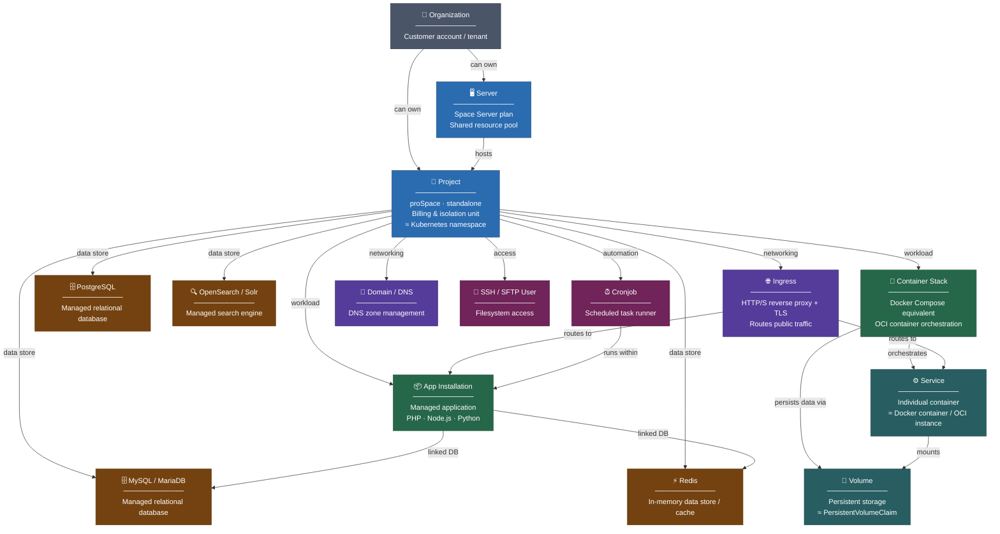

# Platform Overview: Entity Hierarchy

This page gives you a bird's-eye view of the mittwald hosting platform. It maps the main entities – such as servers, projects, workloads, and databases – to their technical counterparts and shows how they relate to each other.

## Entity hierarchy {#entity-hierarchy}

The following diagram shows all major platform entities, how they are nested inside each other, and what technology underpins each of them:

## Entity descriptions {#entity-descriptions}

### Organization {#organization}

The **organization** (also called _customer account_ or _tenant_) is the top-level entity. It owns servers and projects and is the billing subject for all resources.

### Server {#server}

A **server** (Space Server plan) is a shared resource pool that can host multiple projects. It provides a fixed amount of CPU, memory, and storage that is shared across all projects on it. Use this plan when you want a cost-efficient environment for multiple smaller projects.

### Project {#project}

A **project** is the primary unit of isolation and billing. Every workload, database, domain, and user belongs to a project. Projects on a standalone plan (proSpace) have dedicated, guaranteed resources; projects on a server share the server's resource pool.

Technically, a project corresponds roughly to a **Kubernetes namespace** – it provides network isolation and separate resource quotas.

### App installation {#app-installation}

An **app installation** (also called _managed application_) is a pre-configured runtime environment for a specific technology stack such as PHP, Node.js, or Python. mittwald manages the underlying framework and system software; you only provide your application code.

App installations can be linked to MySQL / MariaDB or Redis databases, and may have their own cronjobs and SSH/SFTP users for deployment.

### Container stack {#container-stack}

A **container stack** is a Docker Compose-compatible deployment unit. It groups one or more _services_ (containers) together, provides shared _volumes_ for persistent data, and exposes ports internally within the project.

### Service {#service}

A **service** is an individual container running inside a container stack. It maps directly to a Docker container / OCI runtime instance and can be given CPU and memory limits.

### Volume {#volume}

A **volume** is persistent storage attached to a container stack. Volumes survive container restarts and can be mounted into one or more services. They are analogous to Kubernetes `PersistentVolumeClaim` objects.

### Managed databases {#managed-databases}

| Entity            | Technology       | Typical use                                  |
| ----------------- | ---------------- | -------------------------------------------- |
| MySQL / MariaDB   | Relational (SQL) | Web applications, CMS                        |
| PostgreSQL        | Relational (SQL) | Applications requiring advanced SQL features |
| Redis             | In-memory store  | Caching, sessions, queues                    |
| OpenSearch / Solr | Search engine    | Full-text search, log analysis               |

Databases are project-scoped managed services. Their connection credentials can be linked directly to app installations.

### Ingress {#ingress}

An **ingress** maps a public hostname (domain + path) to a workload running inside a project. It acts as an HTTP/S reverse proxy, handles TLS termination (via Let's Encrypt or a custom certificate), and routes traffic to either an app installation or a container service.

### Domain / DNS {#domain}

**Domains** allow you to manage DNS zones and records directly inside a project. A domain entry represents ownership and DNS management of a registered domain name.

### SSH / SFTP user {#ssh-sftp-user}

**SSH / SFTP users** grant filesystem access to a project's file storage. They are primarily used for file deployment or legacy FTP-style workflows.

### Cronjob {#cronjob}

A **cronjob** is a scheduled task that runs a command within an app installation on a configurable schedule (cron syntax). Cronjobs are project-scoped and tied to a specific app installation.

## Workload types at a glance {#workload-types}

| Workload         | Best for                                  | Technical basis           |
| ---------------- | ----------------------------------------- | ------------------------- |
| App installation | Pre-built runtimes (PHP, Node.js, Python) | Managed runtime framework |
| Container stack  | Custom containers, microservices          | OCI / Docker Compose      |
