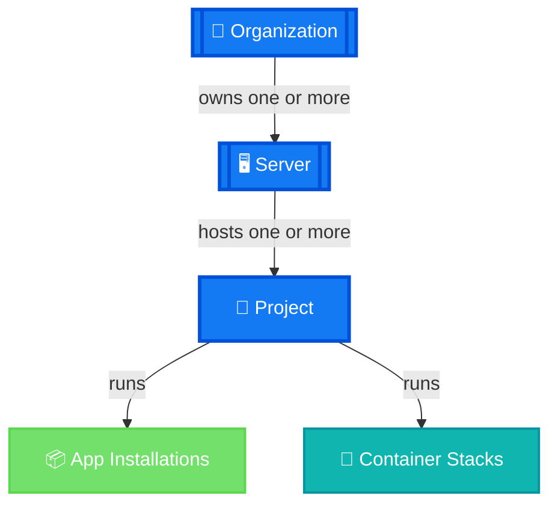
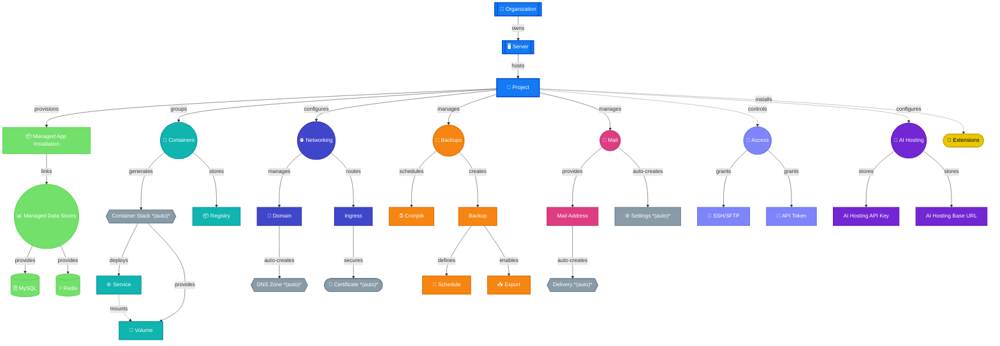

import InteractiveMermaidDiagram from "@site/src/components/InteractiveMermaidDiagram";

# Platform Overview: Entity Hierarchy

This page gives you a bird's-eye view of the mittwald hosting platform, mapping core concepts to their underlying technologies. For example, a **project** is technically a Kubernetes namespace; a **service** runs as a Docker container; and a **delivery box** is the IMAP mailbox backend for email. Understanding these technical foundations helps you design and troubleshoot your infrastructure more effectively.

## Simplified Overview: What Runs Where? {#what-runs-where}

Before diving into all the details, here's the answer to the question: **What runs where on the mittwald platform?** This simplified diagram shows the core containment structure – how the platform is organized from the top level down to the actual workloads that serve your customers. Everything else in the platform (databases, domains, email, backups, etc.) builds on top of this foundational hierarchy.

<InteractiveMermaidDiagram title="What Runs Where: Simplified Overview"
                           defaultZoom={200}
                           minZoom={100}
                           maxZoom={500}
                           zoomStep={50}>

</InteractiveMermaidDiagram>

**Key relationships:**
- An **organization** owns one or more servers and projects
- A **server** is a shared resource pool that hosts multiple projects
- A **project** is the main unit where you deploy workloads – it can run app installations, container stacks, or both
- **App installations** and **container stacks** are the workload types that do the actual work: running your application code

## Entity hierarchy {#entity-hierarchy}

The following diagram shows all major platform entities, how they are nested inside each other, and what technology underpins each of them:

<InteractiveMermaidDiagram title="Platform Entity Hierarchy"
                           defaultZoom={300}
                           minZoom={100}
                           maxZoom={2000}
                           zoomStep={50}>

</InteractiveMermaidDiagram>

## Entity descriptions {#entity-descriptions}

### Organization {#organization}

The **organization** (also called _customer account_ or _tenant_) is the top-level entity. It owns servers and projects and is the billing subject for all resources.

### Server {#server}

A **server** (Space Server plan) is a shared resource pool that can host multiple projects. It provides a fixed amount of CPU, memory, and storage that is shared across all projects on it. Use this plan when you want a cost-efficient environment for multiple smaller projects.

### Project {#project}

A **project** is the primary unit of isolation and billing. Every workload, database, domain, and user belongs to a project.

Technically, a project corresponds roughly to a **Kubernetes namespace** – it provides network isolation and separate resource quotas.

When created, a project automatically generates a default Container Stack, DNS zones for managed domains, and Mail Settings for email management.

### App installation {#app-installation}

An **app installation** (also called _managed application_) is a pre-configured runtime environment for a specific technology stack such as PHP, Node.js, Python, or PHP Worker. mittwald manages the underlying framework and system software; you only provide your application code.

App installations can be linked to MySQL or Redis databases, and may have their own cronjobs and SSH/SFTP users for deployment.

### Container stack {#container-stack}

A **container stack** is a Docker Compose-compatible deployment unit. It groups one or more _services_ (containers) together, provides shared _volumes_ for persistent data, and exposes ports internally within the project.

Each project includes one default container stack created automatically. You can declare additional stacks and services via the API or stack configuration files.

### Service {#service}

A **service** is an individual container running inside a container stack. It maps directly to a Docker container / OCI runtime instance and can be given CPU and memory limits.

### Volume {#volume}

A **volume** is persistent storage attached to a container stack. Volumes survive container restarts and can be mounted into one or more services. They are analogous to Kubernetes `PersistentVolumeClaim` objects.

### Managed databases {#managed-databases}

mittwald provides both managed services and container-based database options.

**Managed services** are fully managed by mittwald with automatic backups and simplified connection management:

| Entity | Technology       | Typical use                                  |
| ------ | ---------------- | -------------------------------------------- |
| MySQL  | Relational (SQL) | Web applications, CMS                        |
| Redis  | In-memory store  | Caching, sessions, queues                    |

Each MySQL database can have multiple **MySQL Users** – separate user accounts with configurable access privileges and hostnames. This allows you to grant granular permissions to different applications or services accessing the same database.

**Container-based databases** are deployed as containers within your project, offering more flexibility and advanced features:

| Entity      | Technology       | Typical use                                  |
| ----------- | ---------------- | -------------------------------------------- |
| MariaDB     | Relational (SQL) | Web applications, CMS (open-source option)  |
| PostgreSQL  | Relational (SQL) | Applications requiring advanced SQL features |
| OpenSearch  | Search engine    | Full-text search, log analysis               |
| Solr        | Search engine    | Full-text search, indexed content retrieval  |

Managed services can be linked directly to app installations. Container-based databases are configured as separate services within your project's container stack.

### Ingress {#ingress}

An **ingress** maps a public hostname (domain + path) to a workload running inside a project. It acts as an HTTP/S reverse proxy, handles TLS termination via an SSL/TLS certificate (either Let's Encrypt or custom), and routes traffic to either an app installation or a container service.

Each ingress requires one SSL/TLS certificate. If you don't provide one, mittwald automatically creates a free Let's Encrypt certificate for you.

### Domain / DNS {#domain}

A **domain** represents a registered domain name and its ownership state within a project. mittwald can manage your domain registration and DNS, or you can point your existing domain to mittwald by updating your nameservers.

When you add a domain to a project, mittwald automatically creates a **DNS Zone** – a container for managing individual DNS records (A, AAAA, CNAME, MX, TXT, SRV, etc.). This separates domain ownership data from the actual DNS record management.

### SSH / SFTP user {#ssh-sftp-user}

**SSH / SFTP users** grant filesystem access to a project's file storage. SSH users have full access to the project's filesystem, while SFTP users can be restricted to specific directories and access levels (read-only or full). They are primarily used for file deployment or legacy FTP-style workflows.

### Cronjob {#cronjob}

A **cronjob** is a scheduled task that runs on a configurable schedule (cron syntax). Cronjobs can execute bash commands, PHP scripts, or HTTP requests, and are tied to a specific app installation. Cronjobs are project-scoped.

### SSL/TLS Certificate {#ssl-certificate}

An **SSL/TLS certificate** enables secure HTTPS connections to your workloads via ingresses. mittwald supports two types:

- **Let's Encrypt certificates** (free, auto-renewing): Automatically created and managed when you set up an ingress without specifying a custom certificate.
- **Custom certificates**: Uploaded manually for organizations with existing certificates or special requirements.

Each ingress uses exactly one certificate. The certificate is automatically renewed before expiration.

### DNS Zone {#dns-zone}

A **DNS zone** is a container for DNS records (A, AAAA, CNAME, MX, TXT, SRV, etc.) for a specific domain. It is automatically created when you add a domain to your project.

The DNS zone is distinct from the Domain entity – the domain represents ownership and registration, while the DNS zone manages the actual DNS records. You can manage DNS records for your zone directly through the mittwald API or mStudio.

### Registry {#registry}

A **registry** stores private Docker image credentials. If you use custom container images in your container stack that are hosted on private registries (e.g., private Docker Hub, GitHub Container Registry, or self-hosted registries), you can create registry credentials in your project.

Services within your container stack can reference these registry credentials to pull private images securely.

### MySQL User {#mysql-user}

A **MySQL user** is a separate database user account for accessing a MySQL database. Each MySQL database can have multiple users, each with:

- A unique username and password
- Configurable privileges (SELECT, INSERT, UPDATE, DELETE, etc.)
- Host restrictions (which servers/IPs can connect)

This allows you to grant different permission levels to different applications or services accessing the same database. For example, you might create a read-only user for a reporting service and a full-access user for your main application.

### Mail Address {#mail-address}

A **mail address** is an email address (e.g., `info@example.com`) with integrated IMAP/SMTP/POP3 mail services. When you create a mail address, mittwald automatically creates a **Delivery Box** (IMAP mailbox backend) to store incoming messages.

Mail addresses can be configured with:
- Storage quota (disk space limit)
- Catch-all forwarding (redirect unmatched mail)
- Autoresponder (automatic reply messages)
- Archive settings (separate storage for older messages)

### Delivery Box {#delivery-box}

A **delivery box** is the IMAP mailbox backend automatically created for each mail address. It stores inbound messages and dialogue history. While mail addresses represent the public-facing email identity, delivery boxes handle the actual message storage and retrieval.

You typically interact with delivery boxes indirectly through mail clients (Outlook, Apple Mail, Thunderbird) connecting via IMAP or POP3 protocols.

### Mail Settings {#mail-settings}

**Mail Settings** is a project-wide configuration for email behavior. It is automatically created for each project and allows you to:

- Whitelist or blacklist specific email addresses or domains
- Configure spam protection settings
- Enable/disable message archiving
- Set default storage limits for new mail addresses

Mail Settings apply globally to all mail addresses within a project.

### Backup Schedule {#backup-schedule}

A **backup schedule** automatically creates snapshots of your project at regular intervals. You can configure:

- Backup frequency (daily, weekly, monthly, etc.)
- Retention time (how long backups are kept)
- Backup window (when backups should run, if applicable)

Backup schedules are optional – you can also create manual backups as needed. Automated backups appear as regular Backup entities in your project.

### Backup Export {#backup-export}

A **backup export** is a downloadable copy of a backup snapshot. You can export any backup to receive a compressed archive (e.g., .tar.gz) that you can download and store locally or on external storage.

Backup exports are independent records that track when and where backup data has been exported, separate from the backups themselves.

### API Token {#api-token}

An **API token** is an authentication credential for programmatic API access. You can create and manage API tokens in your user account settings (not per-project).

API tokens allow you to authenticate to mittwald's REST API without using your password. Each token can be individually revoked and has full access to all your projects and customer account.

### AI Hosting {#ai-hosting}

**AI Hosting** enables your applications to interact with Large Language Models (LLMs) via mittwald's hosting infrastructure. It provides a centralized way to configure and use AI capabilities across your project – either using mittwald's hosted LLM service or integrating with external AI providers.

AI Hosting is designed for agencies building AI-powered client solutions, SaaS products with AI components, and organizations requiring EU-based, privacy-conscious AI infrastructure.

Each AI Hosting integration requires two configuration values:
- **AI Hosting API Key**: Your authentication credential for accessing the AI service
- **AI Hosting Base URL**: The endpoint URL for the AI service (mittwald's hosted service or external provider)

Once configured at the project level, any app installation or container service within your project can use these credentials to make API calls for tasks like text generation, chatbots, image processing, and AI agents.

### AI Hosting API Key {#ai-hosting-key}

An **AI Hosting API Key** is an authentication credential that grants access to the AI Hosting service. It authenticates requests from your applications to the LLM endpoint.

The API key is stored securely at the project level and can be referenced by any workload within the project. You should treat it like a password – keep it confidential and rotate it periodically according to security best practices.

### AI Hosting Base URL {#ai-hosting-base-url}

An **AI Hosting Base URL** is the endpoint address for mittwald's AI Hosting service. It is provided as a constant value in mStudio that you copy into your application for API requests.

This endpoint is configured at the project level and is used by your applications and container services to communicate with the LLM infrastructure.

## Workload types at a glance {#workload-types}

| Workload         | Best for                                          | Technical basis           |
| ---------------- | ------------------------------------------------- | ------------------------- |
| App installation | Pre-built runtimes (PHP, Node.js, Python, PHP Worker) | Managed runtime framework |
| Container stack  | Custom containers, microservices                  | OCI / Docker Compose      |

## Entity creation reference {#entity-creation-reference}

The following table summarizes how platform entities are created and managed:

| Entity | Creation Method | Auto-created | Typical use |
| ------ | --------------- | ------------ | ----------- |
| Project | UI/API | — | Primary organization unit |
| Container Stack | Auto + API | ✅ Yes (one per project) | Docker Compose unit for services |
| App Installation | UI/API | — | Managed runtime (PHP, Node.js, etc.) |
| MySQL Database | UI/API | — | Managed relational database |
| MySQL User | UI/API | — | Database access control |
| Redis Database | UI/API | — | Managed in-memory cache |
| Domain | UI/API | — | Domain registration/ownership |
| DNS Zone | Auto + API | ✅ Yes (from domain) | DNS record container |
| Ingress | UI/API | — | HTTP/S routing to workloads |
| SSL/TLS Certificate | Auto + UI/API | ✅ Partial (Let's Encrypt auto) | HTTPS certificate |
| Mail Address | UI/API | — | Email address with IMAP/SMTP |
| Delivery Box | Auto | ✅ Yes (from mail address) | IMAP mailbox backend |
| Mail Settings | Auto | ✅ Yes (per project) | Project-wide mail config |
| Backup | UI/API | — | Project snapshot/restore point |
| Backup Schedule | API | — | Automated backup configuration |
| Cronjob | UI/API | — | Scheduled task runner |
| SSH / SFTP User | UI/API | — | Filesystem access |
| API Token | UI/API | — | API authentication |
| Registry | UI/API | — | Private image registry credentials |
| AI Hosting API Key | UI/API | — | LLM API credentials |
| AI Hosting Base URL | UI/API | — | LLM API endpoint |
| Extensions | UI/API | — | Marketplace extensions |
