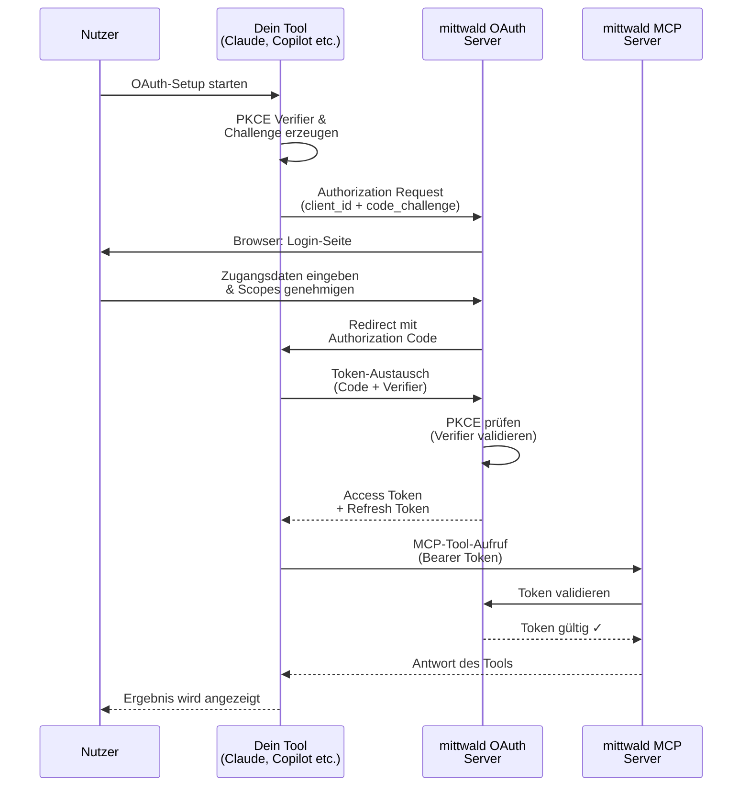

# Verbindung zu mittwald MCP herstellen

Willkommen! Diese Anleitung hilft dir, die Authentifizierung für mittwald MCP mit deinem bevorzugten Tool einzurichten.

**Warum Authentifizierung erforderlich ist**: mittwald MCP erfordert authentifizierten Zugriff auf deine mittwald-Ressourcen. OAuth 2.1 ist die empfohlene Methode für interaktive Nutzung, und API-Tokens stehen für CI/CD und nicht-interaktive Umgebungen zur Verfügung.

## Wähle dein Tool {#choose-your-tool}

mittwald MCP funktioniert mit 7 beliebten KI-Tools. Wähle dasjenige, das du verwendest:

### Claude {#claude-desktop}

**Am besten für**: Nutzer der Claude Desktop App oder des Claude.ai Web-Interface

- **Typ**: Desktop App / Web App
- **OAuth-Muster**: Browser-basiert (offizieller Connector, Installation aus dem Claude Connectors Directory)
- **Setup-Zeit**: ~2 Minuten
- **Komplexität**: ⭐ (Sehr einfach — Installation mit einem Klick)

→ **[Claude einrichten](./claude-desktop)**

### ChatGPT {#chatgpt}

**Am besten für**: Nutzer von ChatGPT (jeder Plan, auch der kostenlose)

- **Typ**: Web App / Mobile App
- **OAuth-Muster**: Browser-basiert (offizielle App, Installation aus dem ChatGPT App-Verzeichnis)
- **Setup-Zeit**: ~2 Minuten
- **Komplexität**: ⭐ (Sehr einfach — Installation mit einem Klick)

→ **[ChatGPT einrichten](./chatgpt)**

### Claude Code {#claude-code}

**Am besten für**: Entwickler, die Anthropics Claude Code CLI verwenden

- **Typ**: Command-line Interface
- **OAuth-Muster**: Browser-basiert (Standard-Web-Flow)
- **Setup-Zeit**: ~10 Minuten
- **Komplexität**: ⭐⭐ (Einfach — unkomplizierte CLI-Befehle)

→ **[Claude Code einrichten](./claude-code)**

### GitHub Copilot {#github-copilot}

**Am besten für**: Entwickler, die GitHub Copilot in VS Code, Visual Studio, JetBrains IDEs oder Xcode verwenden

- **Typ**: IDE Extension (mehrere Plattformen)
- **OAuth-Muster**: IDE-basiert (Dynamic Client Registration)
- **Setup-Zeit**: ~10 Minuten
- **Komplexität**: ⭐⭐ (Einfach — über IDE-Einstellungen)

→ **[GitHub Copilot einrichten](./github-copilot)**

### Cursor {#cursor}

**Am besten für**: Entwickler, die Cursor IDE verwenden (VS Code Fork mit KI-Features)

- **Typ**: IDE (Desktop Application)
- **OAuth-Muster**: IDE-basiert (Konfigurationsdatei oder Einstellungen)
- **Setup-Zeit**: ~10 Minuten
- **Komplexität**: ⭐⭐ (Einfach — JSON-Konfiguration)

→ **[Cursor einrichten](./cursor)**

### Codex CLI {#codex-cli}

**Am besten für**: Entwickler, die OpenAIs Codex CLI für terminalbasierte KI-Workflows verwenden

- **Typ**: Command-line Interface
- **OAuth-Muster**: RFC 8252 Loopback (Native App Pattern)
- **Setup-Zeit**: ~10 Minuten
- **Komplexität**: ⭐⭐ (Einfach — CLI-Befehle plus Browser-Anmeldung)

→ **[Codex CLI einrichten](./codex-cli)**

### Hermes Agent {#hermes-agent}

**Am besten für**: Entwickler, die Hermes Agent im Terminal betreiben, oft zusammen mit Modellen aus dem mittwald AI Hosting

- **Typ**: Command-line Interface
- **OAuth-Muster**: Browser-basiert, gestartet mit `hermes mcp add --auth oauth`
- **Setup-Zeit**: ~10 Minuten
- **Komplexität**: ⭐⭐ (Einfach — ein CLI-Befehl plus Browser-Anmeldung)

→ **[Hermes Agent einrichten](./hermes-agent)**

## Kurzvergleich {#quick-comparison}

| Merkmal                   | Claude                         | ChatGPT                        | Claude Code                                 | GitHub Copilot                           | Cursor                                                               | Codex CLI                                     | Hermes Agent                           |
| ------------------------- | ------------------------------ | ------------------------------ | ------------------------------------------- | ---------------------------------------- | -------------------------------------------------------------------- | --------------------------------------------- | -------------------------------------- |
| **Typ**                   | Desktop/Web                    | Web/Mobil                      | CLI                                         | IDE Extension                            | IDE                                                                  | CLI                                           | CLI                                    |
| **Plattform**             | Alle                           | Alle                           | macOS, Linux, Windows                       | VS Code, Visual Studio, JetBrains, Xcode | macOS, Linux, Windows                                                | macOS, Linux, Windows                         | macOS, Linux, Windows                  |
| **Konfiguration**         | Installation aus dem Directory | Installation aus dem Directory | CLI-Befehl                                  | IDE-Einstellungen                        | IDE-Einstellungen oder JSON-Datei                                    | CLI-Befehl                                    | CLI-Befehl oder `config.yaml`          |
| **Browser erforderlich**  | Ja (zur Anmeldung)             | Ja (zur Anmeldung)             | Ja (zur Anmeldung)                          | Ja (zur Anmeldung)                       | Ja (zur Anmeldung)                                                   | Ja (zur Anmeldung)                            | Ja (für OAuth)                         |
| **PKCE**                  | Automatisch                    | Automatisch                    | Automatisch                                 | Automatisch                              | Automatisch                                                          | Automatisch                                   | Automatisch                            |
| **Redirect-Verarbeitung** | Von der App verwaltet          | Von der App verwaltet          | Lokaler Callback, von Claude Code verwaltet | Von der IDE verwaltet                    | Von Cursor verwaltet (oder statischer Redirect bei statischem OAuth) | Lokaler Callback, von der Codex CLI verwaltet | Lokaler Callback, von Hermes verwaltet |

## Zwei Authentifizierungsoptionen {#two-ways-to-authenticate}

mittwald MCP unterstützt zwei Authentifizierungsmethoden. Wähle nach deinem Anwendungsfall:

### Option 1: OAuth 2.1 (Empfohlen) {#option-1-oauth}

**Am besten für**: Interaktive Entwicklung, lokale Rechner, sicherheitsbewusste Workflows

**Wie es funktioniert**:

1. Dein Tool leitet dich zum mittwald OAuth-Server weiter
2. Du meldest dich im Browser mit deinen mStudio-Zugangsdaten an
3. Du genehmigst die angeforderten Scopes
4. Dein Tool erhält automatisch ein Access Token
5. Dein Tool erneuert das Token, sofern Refresh Tokens verfügbar sind

**Vorteile**:

- ✅ Am sichersten (kurzlebige Tokens)
- ✅ In den üblichen Setups kaum manuelle Token-Verwaltung
- ✅ Jederzeit im mStudio widerrufbar
- ✅ Scope-basierter Zugriff (du kontrollierst, was das Tool darf)

**Nachteile**:

- ❌ Erfordert einen Browser (nicht für nicht-interaktive Server geeignet)
- ❌ Aufwendigeres initiales Setup

**Unterstützt von**: allen 7 Tools (Claude, ChatGPT, Claude Code, GitHub Copilot, Cursor, Codex CLI, Hermes Agent)

### Option 2: API-Token (direkte Authentifizierung) {#option-2-api-token}

**Am besten für**: CI/CD-Pipelines, nicht-interaktive Server, automatisierte Skripte, einfaches Testen

**Wie es funktioniert**:

1. Du erstellst ein API-Token im mStudio (Benutzereinstellungen → API-Tokens)
2. Du konfigurierst dein Tool so, dass es das Token als Bearer-Header sendet
3. Der MCP-Server validiert das Token direkt gegen die mittwald-API
4. Kein OAuth-Flow, kein Browser erforderlich

**Vorteile**:

- ✅ Funktioniert in nicht-interaktiven Umgebungen (SSH, Docker, CI)
- ✅ Einfacheres Setup (kein Browser erforderlich)
- ✅ Gut für Tests und Automatisierung

**Nachteile**:

- ❌ Manuelle Token-Verwaltung (keine automatische Erneuerung)
- ❌ Das Token ist langlebig (Sicherheitsrisiko, wenn es abhandenkommt)
- ❌ Muss manuell rotiert werden

**Unterstützt von**: Claude Code, GitHub Copilot, Cursor, Codex CLI, Hermes Agent (mit je nach Tool unterschiedlichen Konfigurationsmethoden)

### Was soll ich wählen? {#which-should-i-choose}

**Nimm OAuth, wenn**:

- du lokal auf deinem Rechner entwickelst
- du die sicherste Authentifizierung willst
- es dir nichts ausmacht, für das initiale Setup einen Browser zu verwenden

**Nimm ein API-Token, wenn**:

- du in CI/CD arbeitest (GitHub Actions, GitLab CI etc.)
- du auf einem Server ohne Desktop-Umgebung per SSH arbeitest
- du Aufgaben mit Skripten automatisierst
- du für einen Test schnell ein Setup brauchst

**Du kannst beides nutzen**: OAuth für die lokale Entwicklung und API-Tokens für CI/CD.

## Was ist OAuth und warum brauche ich es? {#what-is-oauth}

**OAuth 2.1** ist ein sicheres Autorisierungsprotokoll, mit dem mittwald MCP in deinem Namen auf deine mittwald-Ressourcen zugreifen kann, **ohne dass du dein Passwort weitergibst**.

### Wie OAuth funktioniert (Schritt für Schritt) {#how-oauth-works}

1. **Du wählst ein Tool** (Claude Code, Copilot, Cursor, Codex CLI oder Hermes Agent)
2. **Das Tool fordert Zugriff** auf mittwald in deinem Namen an
3. **Du meldest dich bei mittwald an** — über deinen Browser, dein Passwort bleibt geschützt
4. **Du siehst, worauf das Tool zugreifen darf** — du genehmigst die Scopes transparent
5. **mittwald stellt ein Access Token** für dein Tool aus
6. **Dein Tool nutzt das Token**, um MCP-Tools aufzurufen und auf deine mittwald-Ressourcen zuzugreifen
7. **Dein Passwort wird nie an das Tool weitergegeben** — nur das Access Token

### Sicherheitsmerkmale {#security-features}

**PKCE** (Proof Key for Code Exchange)

- Verhindert das Abfangen des Authorization Codes
- Wird automatisch von deinem Tool übernommen (kein Zutun nötig)
- Von mittwald OAuth für alle Clients vorausgesetzt

**Scope-basierter Zugriff**

- Tools erhalten nur die Berechtigungen, die sie brauchen
- Du siehst und genehmigst die Scopes bei der Anmeldung
- Gängige Scopes: `user:read`, `project:read`, `app:read`

**Token-Ablauf**

- Access Tokens laufen nach etwa einer Stunde ab
- Die meisten Tools erneuern sie automatisch, sofern unterstützt
- Schlägt die Erneuerung fehl oder ist sie nicht verfügbar, kann eine erneute Anmeldung nötig sein

**Keine Passwortweitergabe**

- Dein mittwald-Passwort bleibt bei mittwald
- Tools erhalten nur ein temporäres Access Token
- Wird ein Token kompromittiert, ist der Schaden begrenzt und das Token lässt sich widerrufen

## Gängige OAuth-Begriffe erklärt {#common-oauth-concepts}

### Redirect URI {#redirect-uri}

Die Callback-URL, an die mittwald OAuth dich nach der Anmeldung zurückschickt. Jedes Tool verwendet ein eigenes Muster:

- **CLI-Tools** (Claude Code, Codex CLI, Hermes Agent): `http://127.0.0.1/callback` (Loopback)
- **IDE-Tools** (Copilot, Cursor): IDE-spezifischer Callback (wird automatisch verarbeitet)

### Client ID {#client-id}

Eine eindeutige Kennung für die Registrierung deines Tools bei mittwald OAuth. Manche Tools beziehen sie automatisch (DCR), andere benötigen statische Client-Zugangsdaten.

### Authorization Code {#authorization-code}

Ein temporärer Code (rund 10 Minuten gültig), der im OAuth-Flow gegen ein Access Token eingetauscht wird. Darum musst du dich nicht selbst kümmern — das erledigt dein Tool automatisch.

### Access Token {#access-token}

Deine Zugangsberechtigung für die mittwald MCP-Tools. Dein Tool schickt es bei jedem Request mit. Es läuft ab (typischerweise nach etwa einer Stunde) und wird je nach Client und Provider-Flow automatisch erneuert.

### Refresh Token {#refresh-token}

Eine langlebige Zugangsberechtigung, mit der neue Access Tokens beschafft werden. Dein Tool speichert es sicher und hält dich damit tagelang angemeldet, ohne dass du dich erneut anmelden musst.

### Scope {#scope}

Was dein Tool tun darf. mittwald-Scopes folgen dem Format `resource:action`:

- `user:read` — Benutzerprofil lesen
- `project:read` — Projekte lesen
- `app:read` — Apps und Domains lesen
- `database:read` — Datenbanken lesen

## Nach dem OAuth-Setup {#after-oauth-setup}

Sobald OAuth für dein Tool konfiguriert ist, kannst du:

- **mittwald MCP-Tools nutzen**, um deine mittwald-Infrastruktur per natürlicher Sprache zu verwalten
- **geführten Walkthroughs folgen** in den [Tutorials](../tutorials/) für End-to-End-Lernpfade
- **ergebnisorientierte Playbooks nutzen** in den [How-To-Anleitungen](../how-to/) für den Alltag
- **dich auf Störungen vorbereiten** mit den [Runbooks](../runbooks/)

## Fehlerbehebung {#troubleshooting}

### „Ich bin unsicher, welches Tool ich wählen soll“ {#not-sure-which-tool}

Jedes Tool passt zu anderen Workflows:

- **Claude**: du willst das einfachste Setup mit Claudes eigener App oder dem Web-Interface
- **ChatGPT**: du bevorzugst OpenAIs ChatGPT-Oberfläche (Web oder Mobil)
- **Claude Code CLI**: für Terminal-Fans, die rein in der CLI arbeiten wollen
- **GitHub Copilot**: du nutzt Copilot ohnehin schon in deiner IDE
- **Cursor IDE**: du willst eine IDE, die gezielt für KI-gestütztes Coding gebaut ist
- **Codex CLI**: du bevorzugst OpenAIs Tools und terminalbasierte Entwicklung
- **Hermes Agent**: du betreibst einen Terminal-Agenten, der auch Modelle aus dem mittwald AI Hosting nutzen kann

Alle lassen sich unkompliziert per OAuth einrichten (jeweils ~5–10 Minuten). Du kannst jederzeit auch mehrere Tools einrichten.

### „Ich komme beim OAuth-Setup nicht weiter“ {#stuck-during-oauth-setup}

Jede Anleitung hat einen ausführlichen Abschnitt zur **Fehlerbehebung** mit Lösungen für:

- Port-Konflikte
- Browser, der sich nicht öffnet
- Nicht übereinstimmende Redirect URIs
- Probleme mit abgelaufenen Tokens
- und mehr

Sieh in der Anleitung zu deinem Tool nach (Links oben) und suche dort deine konkrete Fehlermeldung.

### „Ich brauche mehr technische Details“ {#need-more-technical-detail}

Der Abschnitt [Auth- und Token-Lebenszyklus](../auth-token-lifecycle/) beschreibt im Detail, wie Einwilligung, Token-Erneuerung und erneute Anmeldung ablaufen.

## Diagramm des OAuth-Flows {#oauth-flow-diagram}

Das passiert im Hintergrund, wenn du dich authentifizierst:

**Der entscheidende Punkt**: PKCE (Code Verifier/Challenge) stellt sicher, dass nur dein ursprüngliches Tool den Authorization Code gegen ein Token eintauschen kann — selbst ein abgefangener Code ist ohne den Verifier wertlos.

## Häufig gestellte Fragen {#faq}

**F: Wird mein mittwald-Passwort an das Tool übermittelt?**

A: Nein. Du gibst dein Passwort ausschließlich beim offiziellen OAuth-Server von mittwald in deinem Browser ein. Das Tool sieht es nie. Du teilst nur ein temporäres Access Token.

**F: Kann ich den Zugriff später widerrufen?**

A: Ja. Entferne einfach die MCP-Server-Konfiguration aus deinem Tool, dann ist der Zugriff sofort widerrufen. Das Tool kann anschließend nicht mehr auf mittwald zugreifen.

**F: Muss ich OAuth für jedes Tool einrichten?**

A: Nur für die Tools, die du tatsächlich nutzen willst. Du kannst mehrere Tools einrichten, wenn du magst (zum Beispiel Claude und Cursor).

**F: Wie lange ist ein Access Token gültig?**

A: Typischerweise etwa eine Stunde. Viele Clients erneuern es automatisch, das Verhalten hängt aber vom Tool und der Implementierung des Anbieters ab.

**F: Was passiert, wenn das Token abläuft?**

A: In der Regel erneuert der Client es über das Refresh Token. Schlägt das fehl, führe den Authentifizierungsschritt deines Tools erneut aus.

**F: Welche Scopes brauche ich?**

A: Die Standard-Scopes aus den jeweiligen Anleitungen decken die meisten Anwendungsfälle ab: `user:read customer:read project:read app:read`. Während des OAuth-Flows siehst du genau, was angefordert wird.

**F: Kann ich denselben OAuth-Client auf mehreren Rechnern verwenden?**

A: Ja, die Tokens werden aber pro Rechner gespeichert. Auf einem neuen Rechner durchläufst du das OAuth-Setup erneut (dauert ~10 Minuten). Jede Registrierung kann einen eigenen `client_name` haben (zum Beispiel „Claude Code – Laptop“ und „Claude Code – Desktop“).

**F: Was ist, wenn ich mehrere mittwald-Accounts nutzen möchte?**

A: Registriere für jeden Account einen eigenen OAuth-Client und gib ihnen unterschiedliche Namen. Pflege in deinem Tool für jeden Client eine eigene Konfiguration.

**F: Kann ich statt OAuth ein API-Token verwenden?**

A: Ja! Die CLI- und IDE-Tools (Claude Code, GitHub Copilot, Cursor, Codex CLI, Hermes Agent) unterstützen API-Tokens als Alternative zu OAuth. API-Tokens eignen sich besonders für nicht-interaktive Umgebungen (CI/CD, SSH-Server), in denen browserbasiertes OAuth nicht praktikabel ist. Die Setup-Anleitung deines Tools beschreibt das Vorgehen.

**F: Wo bekomme ich ein API-Token?**

A: Melde dich im [mStudio](https://studio.mittwald.de) an, gehe zu **Benutzereinstellungen → API-Tokens**, erstelle ein neues Token mit den benötigten Scopes und kopiere es sofort — später wird es nicht noch einmal angezeigt.

## Glossar {#terminology-glossary}

Damit keine Missverständnisse entstehen, hier die Begriffe rund um Authentifizierung, so wie wir sie in dieser Dokumentation verwenden:

| Begriff                 | Definition                                                                                                                                                                                     |
| ----------------------- | ---------------------------------------------------------------------------------------------------------------------------------------------------------------------------------------------- |
| **API-Token**           | Ein Token, das du im [mStudio](https://studio.mittwald.de) erstellst (Benutzereinstellungen → API-Tokens), um dich direkt zu authentifizieren. Teilweise auch „Personal Access Token“ genannt. |
| **Bearer Token**        | Das HTTP-Header-Format zum Übermitteln der Authentifizierung: `Authorization: Bearer <TOKEN>`. Es kann entweder ein API-Token (aus dem mStudio) oder ein OAuth Access Token enthalten.         |
| **OAuth Access Token**  | Kurzlebiges Token (eine Stunde), das der OAuth-Server nach erfolgreicher Anmeldung ausstellt. Wird automatisch erneuert.                                                                       |
| **OAuth Refresh Token** | Langlebiges Token, mit dem neue Access Tokens beschafft werden, ohne sich erneut anzumelden.                                                                                                   |
| **OAuth-Flow**          | Der browserbasierte Anmeldeprozess, bei dem du dich einloggst und die Scopes genehmigst.                                                                                                       |

**Mehr erfahren**: [mittwald API Authentication](/docs/v2/api/intro/) — offizielle Dokumentation zu API-Tokens und Authentifizierungsmethoden.

## Bereit loszulegen? {#ready-to-get-started}

Wähle oben dein Tool aus und folge der Schritt-für-Schritt-Anleitung. Das OAuth-Setup dauert etwa 10 Minuten — danach stehen dir alle verfügbaren mittwald MCP-Tools offen!

### Schnellzugriff {#quick-links}

- **[Claude einrichten](./claude-desktop)** — für Nutzer von Claude Desktop und Claude.ai
- **[ChatGPT einrichten](./chatgpt)** — für ChatGPT-Nutzer
- **[Claude Code einrichten](./claude-code)** — für Nutzer der Claude Code CLI
- **[GitHub Copilot einrichten](./github-copilot)** — für Copilot-Nutzer in der IDE
- **[Cursor einrichten](./cursor)** — für Cursor-Nutzer
- **[Codex CLI einrichten](./codex-cli)** — für Nutzer der Codex CLI
- **[Hermes Agent einrichten](./hermes-agent)** — für Nutzer von Hermes Agent

## Brauchst du Hilfe? {#need-help}

- **Konkreter Fehler?** Sieh in den Abschnitt zur Fehlerbehebung in der Anleitung deines Tools
- **Probleme mit Tokens?** Siehe [Auth- und Token-Lebenszyklus](../auth-token-lifecycle/)
- **mittwald Support?** Schreib eine E-Mail an support@mittwald.de

Viel Spaß beim Entwickeln.
