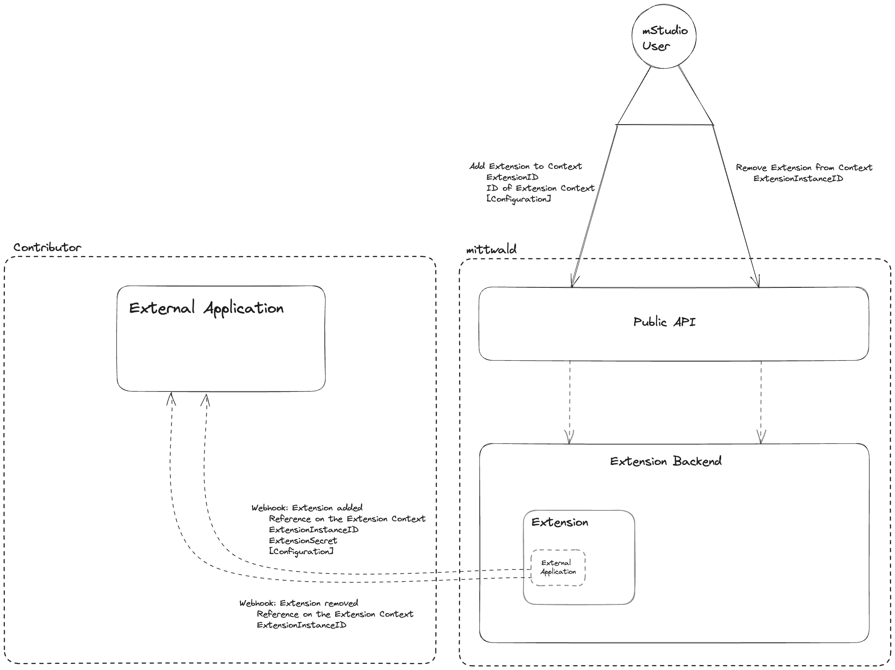
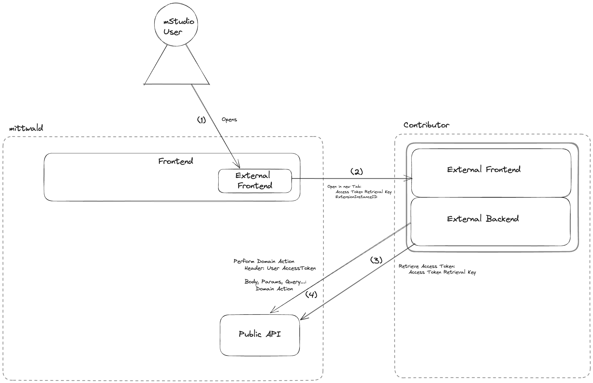
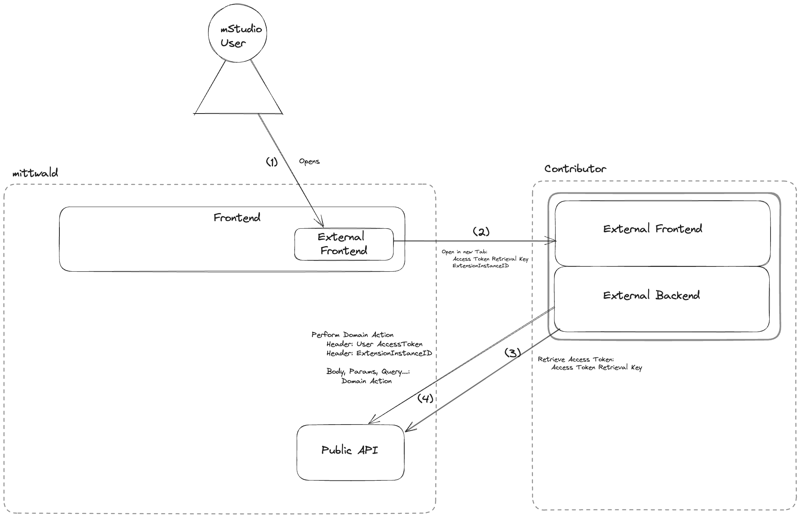
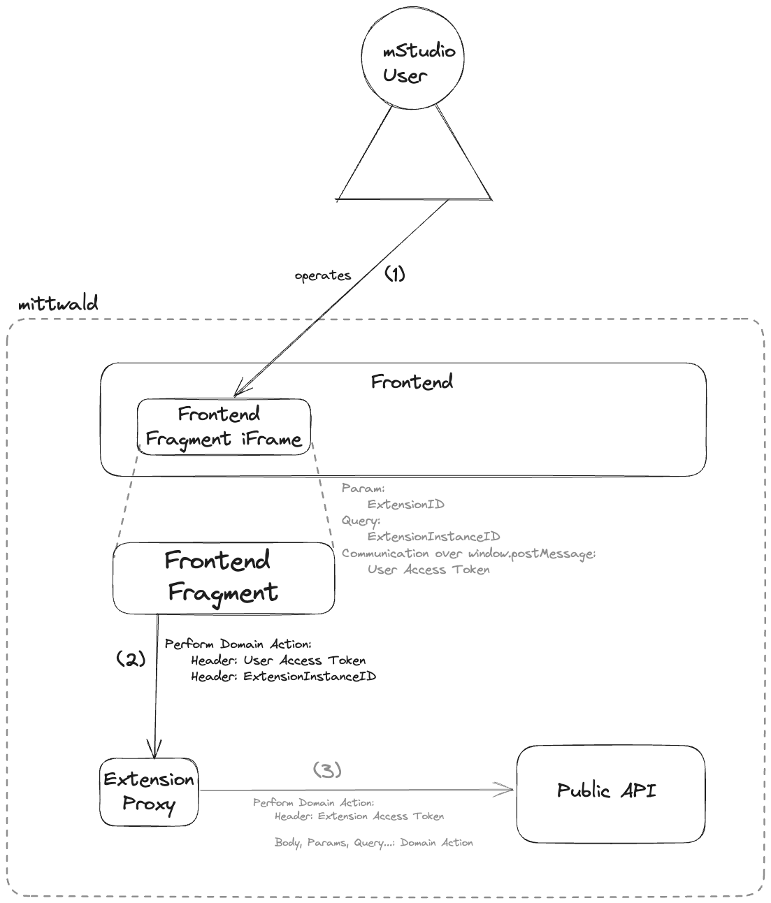

# Extensions

Extensions sind der ideale Weg, das mStudio um Funktionen zu erweitern, die nicht von mittwald bereitgestellt werden. Dieser Abschnitt wird dich dabei begleiten, Extensions zu verstehen und Eigene zu entwickeln.

## Zuerst einige Definitionen

### Contributor

Wir betrachten Sie, eine Organisation im Kontext eines mStudio, die bereit ist, Inhalte für das mStudio und dessen Benutzer bereitzustellen, als `Contributor`. Nicht jede Organisation kann zum mStudio contributen, da Organisationen erst zum Contributor "befördert" müssen.

### Contribution

Eine `Contribution` ist etwas, das von einem Contributor bereitgestellt wird, um das mStudio zu erweitern. Aktuell kann dies eine Extension sein, aber in der Zukunft werden weitere Möglichkeiten in Betracht gezogen.

### Extension

Eine `Extension` ist eine konkrete Contribution zum mStudio. Sie kann aus mehreren Komponenten bestehen, die zusammenarbeiten, um einen bestimmten Nutzen für den mStudio-Benutzer bereitzustellen. Derzeit sprechen wir von externen Anwendungen und Frontend Fragmenten als Komponenten, aus denen eine Extension bestehen kann.

### Extension-Kontext

Da Extensions zu verschiedenen Arten von Entitäten hinzugefügt werden können, nennen wir diese Entität im Allgemeinen einen `Extension-Kontext`. Derzeit verfügbare Extension-Kontexte sind die Organisation und das Projekt. In Zukunft könnten weitere Entitäten hinzukommen. Für jede Extension musst du als Contributor entscheiden, für welche Extension-Kontext sie verfügbar ist.

### Extension-Instance

Wenn du eine Extension zu einem Extension-Kontext hinzufügst, wird eine `Extension-Instance` erstellt. Eine Extension-Instance ist eine konkrete Instanz einer Extension in einem bestimmten Extension-Kontext. Zum Beispiel wird beim Hinzufügen einer Extension zu einem Projekt eine Extension-Instance für dieses Projekt erstellt. Wenn du dieselbe Extension zu einem anderen Projekt hinzufügst, wird eine weitere Extension-Instance für das zweite Projekt erstellt. Dies ist wichtig, weil jede Extension-Instance ihre eigene ID, Konfiguration, zugestimmte Scopes usw. hat.

### Scope

Ein `Scope` ist ein Satz von Berechtigungen, die eine Extension anfordern kann. Wenn du eine Extension zu einem Extension-Kontext hinzufügst, muss der mStudio-Benutzer allen zustimmen.

### Domain Action

`Domain Action` ist ein universeller Begriff für einen beliebigen Request, wie z.B. das Erstellen eines neuen Projekts oder das Einladen eines Benutzers in eine Organisation, der gegen unsere öffentliche API werden kann.

### Fragment

Ein Fragment ist ein Stück Inhalt, Code oder eine andere Art von Daten, das von uns überprüft werden muss und das in das mStudio integriert, ausgeführt oder gerendert werden muss. Ein `Frontend-Fragment`, ein Stück Frontend-Code, das im mStudio gerendert wird, ist ein Beispiel für ein Fragment.

## Komponenten einer Extension

Wie bereits erwähnt, sollte eine Extension derzeit die Entwicklung von externen Anwendungen mit eigenem Backend und Frontend und Frontend-Fragmenten ansprechen, die in das mStudio integriert sind. Diese schließen sich nicht gegenseitig aus. Eine Extension kann aus mehreren dieser Komponenten bestehen.

### Externe Anwendung

Eine Externe Anwendung ist eine normale Anwendung, die überall gehostet werden kann. Sie kann einen Endpunkt anbieten, der für spezifische Lebenszyklus-Webhooks von Extension-Instances aufgerufen werden kann. Externe Anwendungen können eine eigene Benutzerverwaltung und Authentifizierung verwenden oder auch ein eigenes Frontend nutzen. In der Theorie kann die Externe Anwendung also vollständig genutzt werden, ohne auf unserer Plattform registriert zu sein. Dies ist besonders nützlich für Whitelabel-Lösungen. Um authentifizierte Domain Actions außerhalb des Kontexts eines mStudio-Benutzers durchzuführen, muss die Externe Anwendung Webhook-Endpunkte konfigurieren, um ein Extension Secret und die Extension-Instance ID zu empfangen. Diese Parameter können verwendet werden, um ein Extension-Access-Token abzurufen und Domain Actions im Auftrag der Extension-Instance auszuführen.

### Frontend Fragment

Ein Frontend Fragment ist ein Stück Frontend, das (fast) nahtlos in das mStudio integriert ist. Das Ziel sollte sein, das Gefühl einer nativen mStudio-Funktion zu vermitteln.

Um authentifizierte Domain Actions auszuführen, verwendet das Frontend-Fragment das vorhandene Benutzer-Access-Token und eine gegebene Extension-Instance ID, um Domain Actions gegen den Extension-Proxy auszuführen. Der Extension-Proxy löst diese Parameter in ein Extension-Access-Token auf und leitet die Domain Action im Auftrag der Extension-Instance weiter.

Frontend-Fragmente werden in Zukunft genauer definiert.

## Durchführen von authentifizierten Domain Actions ...

### ... als registrierter mStudio-Benutzer im Kontext einer externen Anwendung

Um einen mStudio-Benutzer im Kontext einer externen Anwendung zu authentifizieren, sind zwei Möglichkeiten vorgesehen.

Erstens kann die externe Anwendung den mStudio OAuth2-Authentifizierungsablauf verwenden. Weitere Details dazu werden in Zukunft bereitgestellt, da dies noch nicht vollständig ausgearbeitet ist.

Zweitens können Sie als Contributor eine URL (oder ein URL-Template) für die Extension bereitstellen, die der Benutzer über eine Schaltfläche im mStudio aufrufen kann, um zur externen Anwendung weitergeleitet zu werden. Während der Weiterleitung stellen wir einen Access Token Retrieval Key als Query-Parameter bereit. Die externe Anwendung kann diesen verwenden, um das eigentliche Access-Token zum Authentifizieren gegen die öffentliche API abzurufen.

Das direkte Abfragen der mStudio-Anmeldeinformationen ist keine Methode, die wir akzeptieren, da wir dem Benutzer nicht beibringen möchten, seine Anmeldeinformationen an eine Drittanbieteranwendung weiterzugeben.

Nach erfolgreicher Authentifizierung kann der Benutzer Domain Actions gegen die öffentliche API ausführen. Beachte, dass dies aufgrund von CORS-Einschränkungen derzeit nur über ein externes Backend möglich ist. In Zukunft werden Möglichkeiten zur automatischen Akzeptanz von Cross-Origin-Anfragen von externen Anwendungen evaluiert.

### ... als nicht registrierter Benutzer im Kontext einer externen Anwendung

Die Durchführung einer Domain Action im Kontext einer externen Anwendung als nicht registrierter Benutzer ist der Hauptanwendungsfall für Extensions mit externen Anwendungen, die eine eigene Nutzerverwaltung anbieten oder die Funktionen bereitstellen möchten, die nicht direkt mit der manuellen Interaktion eines bestimmten mStudio-Benutzers verknüpft sind. Die Externe Anwendung muss einen Endpunkt für eingehende Lebenszyklus-Webhook-Aufrufe bereitstellen, um Paare von Extension-Instance ID und Extension Secret (siehe oben) zu erhalten, die verwendet werden können, um ein Extension-Access-Token zu erhalten. Dieses Extension-Access-Token kann verwendet werden, um Domain Actions gegen die öffentliche API auszuführen.

### ... als registrierter mStudio-Benutzer im Namen einer Extension-Instance

Um Domain Actions als registrierter mStudio-Benutzer, aber im Namen und nur mit Berechtigungen einer Extension-Instance durchzuführen, benötigt der Benutzer ein gültiges User-Access-Token (für Externe Anwendungen siehe oben) und die spezifische Extension-Instance ID. Mit diesen Parametern kann der Benutzer Domain Actions gegen den Extension-Proxy ausführen. Dabei stellen wir sicher, dass nicht nur die Extension-Instance, sondern auch der Benutzer selbst zur Ausführung der Domain Action berechtigt ist und Zugriff auf die Extension-Instance hat. Wenn diese Methode verwendet wird, muss nicht mehr selbst geprüft werden, ob ein bestimmter Benutzer berechtigt ist, eine bestimmte Domain Action in einem bestimmten Extension-Kontext auszuführen.

Dieser Ablauf ist interessant für Externe Anwendungen, die eine Mischung aus den vorherigen Ansätzen darstellen (z.B. um ein Admin-Panel für registrierte mStudio-Benutzer und ein Benutzerpanel für nicht registrierte Endkunden zu implementieren). Außerdem ist dies relevant für Frontend-Fragmente (siehe unten).

