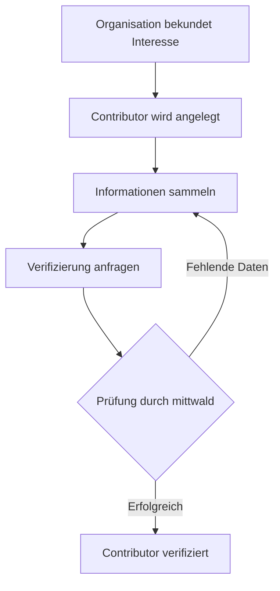

## Was ist ein Contributor?

Ein Contributor ist eine Organisation, die [Extensions](../extensions) für das mStudio entwickeln und bereitstellen kann.
Um Contributor zu werden, muss deine [Organisation bekunden, Interesse daran zu haben, zu contributen](../../how-to/become-contributor#listing-as-a-contributor).
Dadurch wird für deine Organisation ein Contributor angelegt und du kannst mit der Entwicklung von Extensions beginnen.

:::note
Ohne Verifizierung können deine Extensions nur innerhalb deiner eigenen Organisation und Projekte verwendet werden.
:::

## Verifizierung des Contributors

Um Extensions veröffentlichen zu können, muss deine Organisation als Contributor verifiziert werden.
Dazu werden einige Informationen benötigt, die du im Abschnitt [Welche Informationen werden für die Verifizierung eines Contributors benötigt?](#welche-informationen-werden-für-die-verifizierung-eines-contributors-benötigt) findest.
Wenn alle benötigten Informationen vorliegen, kann die Verifizierung angefragt werden.
Wir prüfen die Angaben und geben dir eine Rückmeldung, sobald deine Organisation verifiziert wurde.

## Welche Informationen werden für die Verifizierung eines Contributors benötigt?

Wenn deine Organisation zu einem Contributor wird, werden einige Informationen automatisch von deiner Organisation übernommen.
Auch wenn die Informationen später auf Organisationsebene geändert werden, werden diese Änderungen automatisch auf den Contributor übertragen.
Für manche Informationen kannst du abweichende Werte hinterlegen.
Andere Informationen müssen spezifisch für den Contributor angegeben werden und können nicht von der Organisation übernommen werden.

Die folgende Tabelle gibt einen Überblick über die Informationen, ob sie von der Organisation übernommen werden können und ob sie für die Verifizierung erforderlich sind:

| Feld                  | Vererbbar | Pflicht |
| --------------------- | --------- | ------- |
| Name                  | ✅        | ✅      |
| Logo                  | ✅        | ❌      |
| Beschreibung          | ❌        | ❌      |
| Webseite              | ❌        | ❌      |
| Vertragspartner       | ✅        | ✅      |
| Support-Informationen | ✅        | ✅      |
| Ansprechperson        | ❌        | ✅      |
| Anbieterkennzeichnung | ❌        | ✅      |

### Name

Um auf dem mStudio Marktplatz als Contributor gelistet zu werden, benötigt deine Organisation einen Namen.
Standardmäßig wird dieser von deiner Organisation übernommen.
Du kannst aber auch einen abweichenden Namen für deinen Contributor hinterlegen.

### Logo

Um auf dem mStudio Marktplatz als Contributor gelistet zu werden, benötigt deine Organisation ein Logo.
Standardmäßig wird dieses von deiner Organisation übernommen.
Du kannst aber auch ein abweichendes Logo für deinen Contributor hinterlegen.

### Beschreibung

Du kannst deinen Contributor **optional** mit einer Beschreibung versehen, die auf dem mStudio Marktplatz angezeigt wird.

### Webseite

Um die Kunden deiner Extensions auf eine Landing Page zu deinem Contributor zu leiten, kannst du **optional** eine Webseite für deinen Contributor angeben.

### Vertragspartner

Deine Organisation muss über einen gültigen Vertragspartner verfügen.
Standardmäßig wird der Vertragspartner deiner Organisation für die Rechnungen deiner Kunden verwendet.
Falls erforderlich, kannst du für den Contributor einen abweichenden Vertragspartner definieren.

### Support-Informationen

Deine Organisation muss gültige Kontaktdaten für den Support angeben.
Diese bestehen derzeit mindestens aus einer E-Mail-Adresse und einer optionalen Telefonnummer.
Standardmäßig werden die E-Mail-Adresse und die Telefonnummer des Vertragspartners deiner Organisation für den Support verwendet.
Du kannst separate Support-Informationen für deinen Contributor hinterlegen.

### Ansprechperson

Für den Fall, dass wir deine Organisation erreichen müssen, muss eine Ansprechperson angegeben werden.
Im Falle von technischen Problemen oder wichtigen Informationen bezüglich der Contribution werden wir diese Person kontaktieren.
Standardmäßig ist dies der Benutzer, der das Interesse an der Contribution bekundet hat.
Du kannst aber auch einen anderen Benutzer aus deiner Organisation angeben.

### Anbieterkennzeichnung

Um deine Extension als Produkt im mStudio Marktplatz anbieten zu können, benötigen wir eine Anbieterkennzeichnung.
Deine Anbieterkennzeichnung **muss** mit [§5 DDG](https://gesetz-digitale-dienste.de/5-ddg/) konform sein.

- Die Anbieterkennzeichnung ist **verpflichtend** und kann nicht von der Organisation übernommen werden.
- Du kannst entweder auf deine bestehende Anbieterkennzeichnung in Form einer URL verlinken oder eine neue formulieren.
- Für die Erstellung kannst du einen Online-Generator für rechtliche Hinweise nutzen, z. B. die Extension [Dieter macht den Datenschutz](https://mstudio.mittwald.de/app/marketplace/marketplace/62cfdf0b-9e64-4d48-ae3d-dfa3ba433df4).
