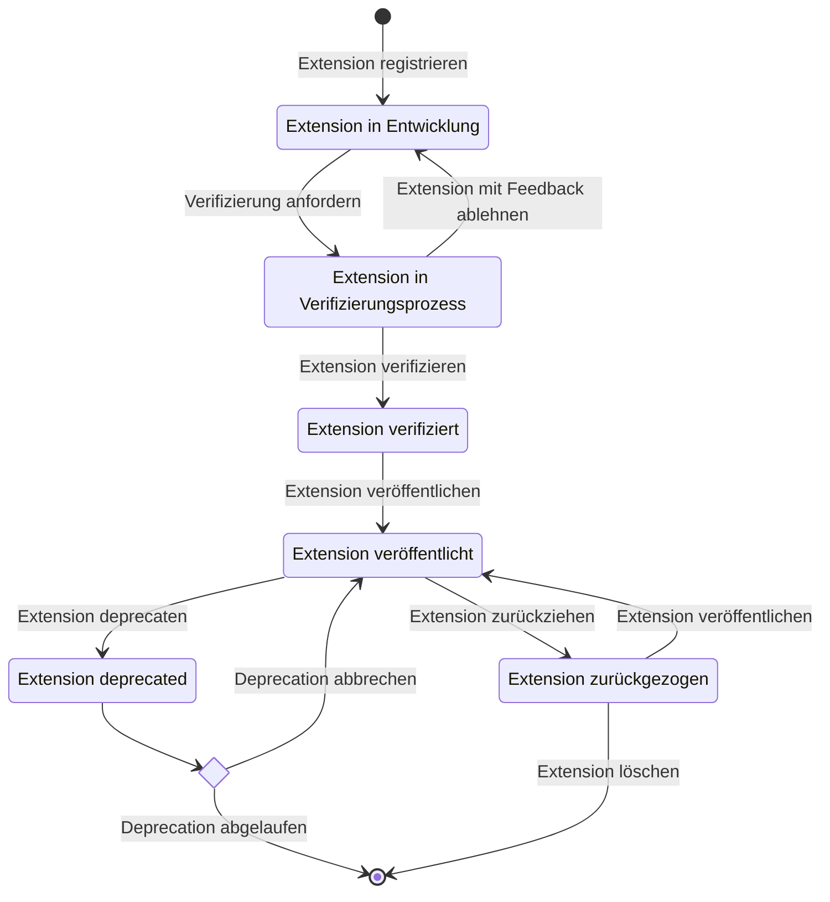

## Was ist eine Extension?

Aus fachlicher Sicht ist eine Extension eine Erweiterung des mStudio, die es ermöglicht,
zusätzliche Funktionalitäten für das mStudio bereitzustellen.
Extensions werden dem mStudio [bekannt gemacht](../../how-to/manage-extensions), und potenzielle Nutzer können sie von dort aus in einem [Extension Context](../../glossary#extension-context) (beispielsweise also einem Projekt oder einer Organisation) installieren.
Wenn ein Nutzer eine Extension zu einem Extension Context hinzufügt, erstellt das mStudio eine [Extension Instance](../../glossary#extension-instance) für diese Extension.
Die Extension ist also die Beschreibung einer Erweiterung, die zu einem Extension Context hinzugefügt werden kann.
Die Extension Instance ist die konkrete Ausprägung einer Extension in einem Extension Context.

Aus technischer Sicht ist eine Extension eine separate und unabhängige Applikation, die über REST-APIs mit dem mStudio kommuniziert.
die über REST-APIs mit dem mStudio integriert wird.
Eine Extension muss ein öffentlich erreichbares Backend bereitstellen und kann optional ein Frontend bereitstellen,
wenn es für die Nutzung der Extension sinnvoll ist.
Wenn Extension Instances beispielsweise erstellt oder gelöscht werden, benachrichtigt das mStudio das Backend der Extension über einen [Lifecycle Webhook](../concepts/lifecycle-webhooks).

Außerdem bieten Extensions verschiedene [Authentifizierungs- und Authorisierungsstrategien](../concepts/authentication),
um authentifizierte [Domain Actions](../../glossary#domain-action) im mStudio durchführen zu können.
Dies kann entweder im Namen des mStudio Users, der die Extension bedient oder im Namen der Extension selbst geschehen.

## Lebenszyklus einer Extension

Eine Extension muss dem mStudio zunächst bekannt gemacht werden, bevor sie verwendet werden kann.
Dabei durchläuft sie mehrere Schritte, die im Folgenden erläutert werden.

Jeder Schritt wird entweder durch den Contributor oder durch mittwald durchgeführt, der Contributor kann seine Extension in seinem Entwickeln Tab bearbeiten sowie Verifizierung von Mittwald anfragen. Alternativ kann jeder Schritt auch über API-Operationen ausgeführt werden.

### Extension in Entwicklung

Nach der Registrierung der Extension ist sie nicht öffentlich sichtbar.
Sie kann auch nur durch den Contributor der Extension installiert werden (, wenn ein Extension Context festgelegt wurde).
Während der Entwicklung ergeben sich Informationen zu den verschiedenen Feldern der Extension,
wie die benötigten Scopes, die Beschreibungen, etc. und können in der Extension hinterlegt werden.

Wenn die Extension durch den Contributor zu einem Extension Context hinzugefügt wurde und der Extension Context geändert wird,
werden alle Extension Instances der Extension vorher entfernt.
Dies funktioniert nur, während die Extension in Entwicklung ist.

### Extension im Verifizierungsprozess

Sobald die Extension fertig entwickelt, in Betrieb genommen und konfiguriert ist, kann der Verifizierungsprozess gestartet werden.
Um die Verifizierung der Extension zu beantragen, müssen alle erforderlichen Felder ausgefüllt sein.
mittwald überprüft die Extension hinsichtlich der Qualität und der Einhaltung der Richtlinien.
Gegebenenfalls erhältst du Feedback, um die Extension zu verbessern.

### Extension verifiziert

Wenn alle Anforderungen erfüllt sind, wird die Extension durch mittwald verifiziert.
Das heißt jedoch noch nicht, dass die Extension veröffentlicht ist.
Du behältst die Kontrolle darüber, wann die Extension veröffentlicht wird.

### Extension veröffentlicht

Die Extension ist nun öffentlich sichtbar und kann von anderen mStudio-Nutzern installiert werden.

In diesem Zustand können immer noch Änderungen an der Extension vorgenommen werden.
Es ist zu diesem Zeitpunkt jedoch nicht mehr möglich, den Extension Context zu ändern.
Andere potenziell sicherheitsrelevante Änderungen, wie erforderliche Scopes und Webhook URLs, erfordern eine Bestätigung durch mittwald.

### Extension deprecated

Beim deprecaten einer Extension wird ein Zeitpunkt angegeben, ab dem die Extension nicht mehr unterstützt wird.
Die Extension kann bis zu diesem Zeitpunkt weiterhin installiert und genutzt werden.
Dem Nutzer der Extension wird nur angezeigt, dass die Extension ab einem bestimmten Zeitpunkt nicht mehr unterstützt wird.
Nach Ablaufen des Zeitraums werden automatisch alle Extension Instances gelöscht und die Extension wird aus dem Marktplatz entfernt.
Die Deprecation kann jederzeit abgebrochen werden, solange der Zeitraum noch nicht abgelaufen ist.

### Extension zurückgezogen

Extensions können durch mittwald jederzeit zurückgezogen werden,
wenn sie gegen die Richtlinien verstoßen oder nicht mehr funktionieren und der Contributor nicht erreichbar ist.
In diesem Zustand werden alle Extension Instances deaktiviert und sind nicht mehr nutzbar.
Die Extension wird in diesem Zustand nicht mehr im Marktplatz angezeigt.

Wenn die Probleme der Extension behoben wurden, kann sie erneut durch mittwald veröffentlicht werden.
Wenn der Contributor nicht reagiert oder sich nicht bereit erklärt, die Probleme zu beheben, wird die Extension durch mittwald gelöscht.

## Aus welchen Informationen besteht eine Extension?

Eine Extension besteht aus verschiedenen Informationen, die in der [Extension-Referenz](../../reference/extensions) im Detail beschrieben sind.  
Die folgenden Felder können im Entwickeln-Tab gepflegt werden und bestimmen, wie die Extension im mStudio dargestellt und verwendet wird.

### Name und Beschreibungen

Jede Extension enthält vier Felder zur Beschreibung.

Die ersten sichtbaren Elemente für den Nutzer sind der **Name** und der **SubTitle**.
Der **Name** kann kreativ und ansprechend gestaltet werden – er muss nicht unbedingt beschreibend sein.
Der Untertitel bietet die Möglichkeit, den Hauptvorteil der Extension kurz und prägnant darzustellen.

Für eine etwas ausführlichere Erklärung kann die **Description** genutzt werden.
Zusätzlich gibt es eine **Detailed Description**, die noch mehr Informationen enthält und Formatierungen erlaubt.
Hier können Funktionen erläutert, Anleitungen bereitgestellt, weiterführende Links geteilt, ein Changelog integriert und vieles mehr beschrieben werden.

### State

Der **State** einer Extension definiert, ob sie im mStudio sichtbar und nutzbar ist.  
Dazu gehört unter anderem, ob die Extension aktiv ist, im Marktplatz angezeigt wird und zu einem Extension Context hinzugefügt werden kann.

### Tags

Tags sind eine Möglichkeit, Extensions zu kategorisieren.
Sie werden im mStudio dazu genutzt, Extensions nach Anwendungsfall zu gruppieren.
Dabei sollte darauf geachtet werden, dass die Tags aussagekräftig sind und eine klare Zuordnung zu den Features der Extension ermöglichen.
Auch sollte darauf geachtet werden, dass sie in etwa dem entsprechen, wonach potenzielle Kunden der Extension suchen würden.
Eine Kategorie, in der sich nur eine Extension befindet, bietet keinen Mehrwert in der Suche nach Extensions
und verringert sowohl die Auffindbarkeit als auch die Vergleichbarkeit der Extensions.

### Support

Für den Support bei der Nutzung von Extensions ist der Contributor verantwortlich.
Entsprechend benötigt der Nutzer einer Extension Informationen darüber, wie er Support erhalten kann.
Dazu muss mindestens eine E-Mail-Adresse angegeben werden, an die sich Nutzer wenden können.

### Scopes

Um auf die REST-API des mStudios zuzugreifen und **Domain Actions** auszuführen, benötigt eine Extension bestimmte Berechtigungen.  
Diese werden als [**Scopes**](../concepts/scopes) definiert und müssen bei der Installation durch die Nutzer:innen bestätigt werden.

Die Scopes können im Entwickeln-Tab eingetragen und verwaltet werden.
### Extension Context

Eine Extension kann entweder einem Projekt oder einer Organisation hinzugefügt werden.  
Der passende Extension Context sollte während der Entwicklung festgelegt werden.  
Er richtet sich nach dem Anwendungsfall, der Zielgruppe und ggf. dem Geschäftsmodell.

Der Context kann während der Entwicklungsphase geändert werden – dabei werden jedoch alle vorhandenen Extension Instances gelöscht.  
Nach der Verifizierung ist der Context nicht mehr änderbar.

### Lifecycle Webhook Endpoints

Lifecycle Webhooks informieren die Extension über Änderungen an ihren Extension Instances, z. B. bei Erstellung oder Löschung.  
Für jeden Lebenszyklus-Zeitpunkt kann ein eigener Webhook-Endpoint definiert werden.

Die Konfiguration der Endpoints erfolgt im Entwickeln-Tab.  
Die Angabe von Lifecycle Webhook Endpoints ist optional.

Weitere Informationen finden sich im [Konzept zu Lifecycle Webhooks](../concepts/lifecycle-webhooks).

### Frontend

Optional kann eine Extension externe Frontends oder eingebettete Frontend-Fragmente definieren.

- **Externe Frontends** dienen als Einstiegspunkt zur Extension.
- **Frontend-Fragmente** können direkt im mStudio eingebettet werden.

In beiden Fällen handelt es sich um eigenständige Webanwendungen.  
Details dazu finden sich unter [Frontend-Entwicklung](../concepts/frontend-development).

### Änderungsanfragen

Nach der Verifizierung sind sicherheitsrelevante Felder wie Scopes oder Webhook-URLs nicht direkt änderbar.  
Um Änderungen vorzunehmen, kann über den Entwickeln-Tab eine Änderungsanfrage gestellt werden.

Mittwald prüft solche Anfragen in der Regel innerhalb von 2–3 Werktagen.  
Nach Freigabe bleibt die Extension für bestehende Nutzer:innen weiter nutzbar, neue Scopes müssen jedoch einzeln bestätigt werden.

### Assets

Assets sind Medieninhalte wie Screenshots oder Videos, die im Marktplatz angezeigt werden.  
Sie dienen dazu, Funktionen oder die Benutzeroberfläche der Extension visuell zu präsentieren.

Assets sind optional, können aber über den Entwickeln-Tab als Weitere Medien hochgeladen und sortiert werden.

### Statistiken

Im Marktplatz wird die Anzahl aktiver Extension Instances angezeigt. Dieser Wert wird abgerundet auf die nächstniedrigere Hunderter-Stufe dargestellt.

Contributoren sehen im Entwickeln-Tab zusätzlich die **exakte Anzahl** ihrer aktiven Instances.

## Versionierung von Extensions

Das mStudio sieht kein Konzept für die Versionierung von Extensions vor.
Extensions sind eigenständige Applikationen, die zur Laufzeit in der Verantwortung des Contributors liegen
und nur per API mit dem mStudio integriert sind.
Deshalb kann mittwald keinen verlässlichen Einfluss auf die Versionierung und Stabilität von Versionen der Extensions nehmen.

Falls eine Extension den Anwendungsfall hat, Funktionalität in verschiedenen Versionen bereitzustellen,
erfolgt die Versionierung von Extensions unabhängig vom mStudio in Eigenimplementierung.
Der Contributor ist für die Versionierung der Extension verantwortlich und kann dabei eigene Regeln und Konventionen festlegen.

Falls die Extension selbst eine API bereitstellt, die von externen Applikationen genutzt wird,
wird empfohlen auf Versionierung und Stabilität dieser API zu achten.
Hierbei können gängige Konventionen und Best Practices für API-Versionierung angewendet werden.
