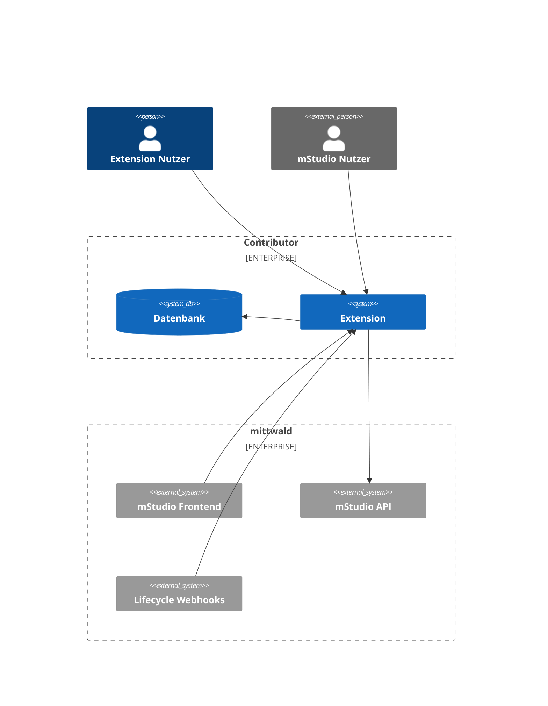
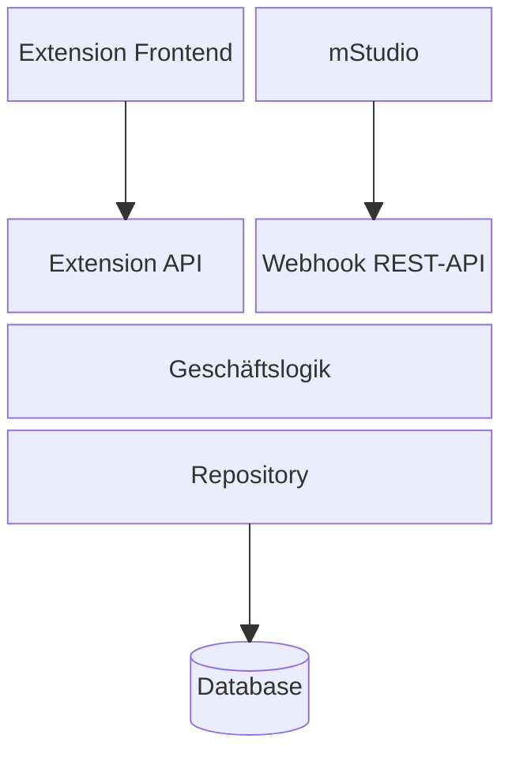
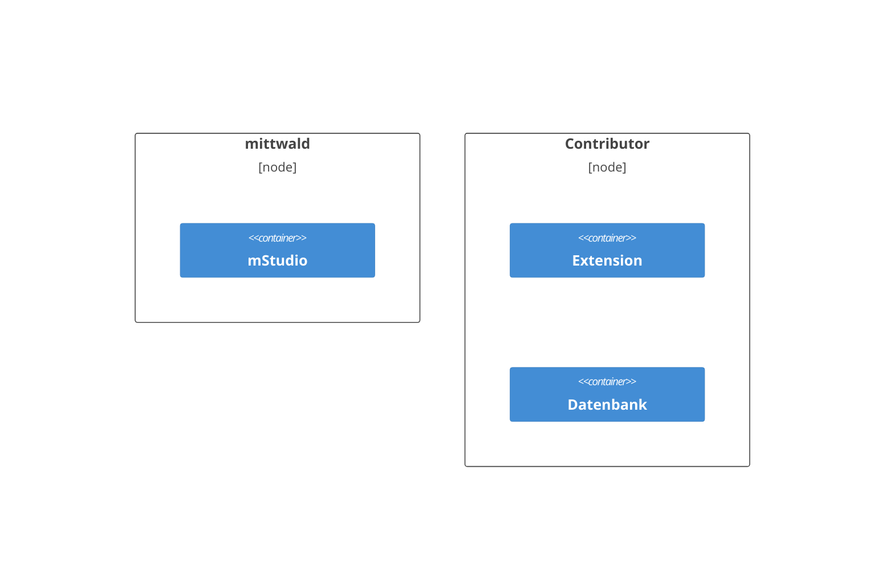
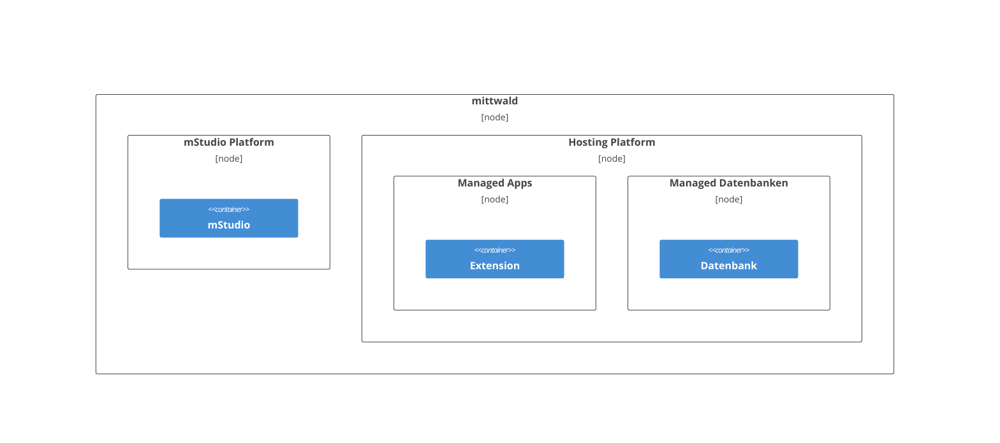

## Systemkontext aus Sicht der Extension

Eine Extension ist eine eigenständige Applikation, die außerhalb des mStudio betrieben wird.
In den meisten Fällen benötigt eine Extension eine Persistenzschicht, wie beispielsweise eine Datenbank, um Daten zu speichern und zu verwalten.

Es gibt verschiedene Akteure, die mit einer Extension interagieren können:

- mStudio Nutzer: mStudio Benutzer, die über mStudio auf die Extension weitergeleitet werden.
- Extension Nutzer: Benutzer, die dem mStudio nicht bekannt sind und über eine eigene Nutzerverwaltung der Extension direkt mit dieser interagieren.

Wenn die Extension über ein Frontend verfügt, können Nutzer auf unterschiedliche Weise darauf zugreifen:

- Über das mStudio: Nutzer können aus dem mStudio zur Extension navigieren.
- Direktzugriff: Nutzer können die Extension über ein Bookmark oder einen direkten Link aufrufen.

Um sich mit dem mStudio zu integrieren, muss eine Extension einen API-Endpunkt bereitstellen, den das mStudio für [Lifecycle Webhooks](../concepts/lifecycle-webhooks) aufrufen kann.
Außerdem kann die Extension die mStudio API verwenden, um ihre Funktionalitäten bereitzustellen und die Integration mit dem mStudio zu ermöglichen.

## Prototypische Architektur einer Extension

Eine Extension muss zwingend eine REST-API für Lifecycle Webhooks bereitstellen, um funktionsfähig zu sein.
Diese wird genutzt, um die Extension über erstellte Extension Instances zu informieren und deren Lebenszyklus zu steuern.

Davon abgesehen ist der Aufbau einer Extension flexibel und kann je nach Anforderungen des Contributors variieren.
Eine typische Architektur könnte wie folgt aussehen:

Diese Architektur ist typisch für eine Extension, die Zusatzfunktionalität für das mStudio bereitstellen soll
und dessen Daseinsberechtigung in der Integration mit dem mStudio liegt.
Sie sieht eine klare Trennung von Frontend, API-Schicht, Geschäftslogik und Datenbank vor.
Eine Single-Page-Applikation kommuniziert über eine REST-API mit der Geschäftslogik, die wiederum auf eine Datenbank zugreift.

Dieser Ansatz stellt nur einen Vorschlag dar.
Beispielsweise können die APIs für die Geschäftslogik der Extension und die Lifecycle Webhooks in einem gemeinsamen API-Service konsolidiert werden.
Außerdem kann die Extension statt einer Single-Page-Applikation
auch ein Server-Side gerendertes Frontend, eine CLI oder gar kein Frontend verwenden.

## Deployment Model einer Extension

Eine Extension wird nicht durch mittwald betrieben, sondern durch den Contributor.
Das ist dadurch bedingt, dass eine Extension eine eigenständige Applikation ist, die unabhängig vom mStudio betrieben wird.

Support und Betrieb liegen in der Verantwortung des Contributors.
Der Vorteil liegt darin, dass der Contributor die volle Kontrolle über die Extension hat
und diese nach seinen eigenen Anforderungen, wie dem Technologie-Stack oder der Deployment-Strategie betreiben kann.
Außerdem ist der Contributor so nicht gezwungen, mittwald den Code der Extension oder eingesetzter privater Libraries offenzulegen.

Es ist jedoch durchaus denkbar, die Extension auf einem Produkt der mittwald Plattform zu betreiben.
Allerdings kann weiterhin das Deployment, der Betrieb und das Operating durch den Contributor erfolgen.

