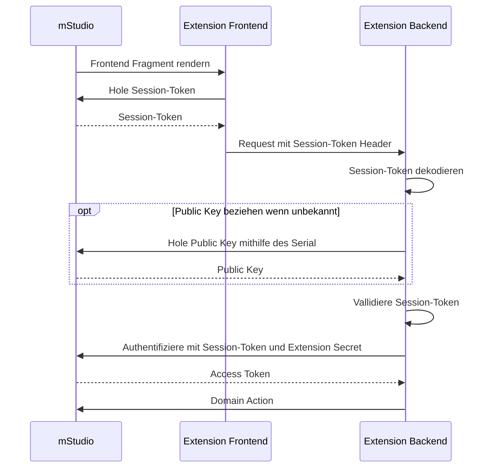

import OperationLink from "@site/src/components/OperationLink";

Im Allgemeinen müssen Extensions nicht unbedingt Frontends bereitstellen, da sie optional sind.
Meistens sollten Extensions jedoch ein Frontend für die Konfiguration oder Interaktion mit der Geschäftslogik bereitstellen.

## Externes Frontend vs. Frontend Fragment

Im mStudio gibt es zwei Hauptwege, um ein webbasiertes Frontend für deine Extension zu implementieren und zu verbinden.
Externe Frontends arbeiten unabhängig vom mStudio, indem sie in einem neuen Tab geöffnet werden.
Frontend Fragmente bieten eine Möglichkeit, Teile des Frontends direkt im mStudio zu integrieren.
Im Allgemeinen schließen sich diese beiden Ansätze nicht gegenseitig aus. Eine Extension kann beide Varianten gleichzeitig nutzen.

Hier ist ein kurzer Vergleich, der die Hauptunterschiede zeigt:

|                            | Externes Frontend                                                           | Frontend Fragment                                                                                      |
| -------------------------- | --------------------------------------------------------------------------- | ------------------------------------------------------------------------------------------------------ |
| **Wie es funktioniert**    | Öffnet sich in einem neuen Tab oder Fenster                                 | Direkt im mStudio eingebettet mit einem iframe                                                         |
| **Technologie und Design** | Freiheit, jeden Technologie-Stack und jedes Design zu wählen                | Entwickelt mit denselben UI-Komponenten wie mStudio, was ein nahtloses Benutzererlebnis schafft        |
| **Wann zu verwenden**      | Du benötigst volle Kontrolle über das Design und Verhalten deiner Extension | Du strebst eine enge Integration im mStudio an willst ein konsistentes Aussehen und Gefühl beibehalten |

## Externe Frontends

Ein externes Frontend schafft einen Einstiegspunkt vom mStudio in die Extension, indem sie als neuer Tab geöffnet wird.
Mit einem externen Frontend hast du die volle Freiheit, jeden Technologie-Stack und jedes Design für deine Extension zu wählen.

Du solltest ein externes Frontend verwenden, wenn das Frontend deiner Extension nicht mit Flow-Komponenten entwickelt werden kann oder der Benutzer die Extension öffnen können sollte,
ohne das mStudio zu öffnen.

Die Definition eines externen Frontends ermöglicht die Nutzung von Single Sign-On über [Access Token Retrieval Key (ATReK)](../authentication#access-token-retrieval-key).

### Konfiguration

Das externe Frontend wird als URL konfiguriert, die auf das Frontend verweist, das in einem neuen Tab geöffnet werden soll.
Diese Konfiguration unterstützt Templating.
Für weitere Informationen siehe [Templating von Konfigurationswerten](../templating).
Das externe Frontend wird in der Extensiondefinition konfiguriert.
Für weitere Informationen siehe [Extensionreferenz](../../../reference/extensions).

### Verwendung des ATReK

Du musst die folgenden Platzhalter in der URL definieren, um die Single Sign-On-Funktion über ATReK zu nutzen:

- `accessTokenRetrievalKey`
- `userId`

Die Extension kann dann den ATReK und die User-ID aus dem HTTP-Aufruf extrahieren und gegen ein Access Token austauschen.
Für weitere Informationen siehe [Verwendung eines Access Token Retrieval Key](../../../reference/api#using-an-access-token-retrieval-key).

### Verwendung des Benutzerkontexts innerhalb des mStudio

Du kannst das externe Frontend auch verwenden, um den aktuellen Benutzerkontext vom mStudio in der Extension zu nutzen.
Dies kann sinnvoll sein, wenn ein Benutzer die Extension aus einem bestimmten Projekt betritt und die Extension dieses Projekt anzeigen soll.

Nützliche Platzhalter in der URL für internes Routing sind:

- `apiVersion` - API-Version des externen Frontend-URL (Templates). Zu Beginn immer `v1`. Für weitere Informationen siehe [API-Versionierung](../api-versioning)
- `contributorId` - Die ID des Contributors im UUID-Format
- `extensionId` - Die ID der Extension im UUID-Format
- `extensionInstanceId` - Die ID der Extension Instance im UUID-Format
- `context` - Die Art des Extension Contexts, zu dem die Extension Instance hinzugefügt wurde
- `contextId` - Die ID des Extension Contexts, zu dem die Extension Instance hinzugefügt wurde
- `userId` - Die ID des Benutzers, der die Extension derzeit verwendet
- `accessTokenRetrievalKey` - Der Access Token Retrieval Key, allgemein als ATReK bezeichnet, des Benutzers. Kann von der Extension verwendet werden, um [Authentifizierung über ATReK](../authentication#access-token-retrieval-key) durchzuführen

#### Example

```
https://myextension.com/:apiVersion/frontend?atrek=:accessTokenRetrievalKey&userId=:userId&projectId=:contextId
```

## Frontend Fragmente

Die Konfiguration von Frontend Fragmenten dient dazu, Frontends einer Extension direkt in vordefinierte [Anchor](#anchors) innerhalb des mStudio zu integrieren.
Dies ist besonders nützlich, wenn das Frontend der Extension nahtlos in das mStudio integriert werden soll, um das Gefühl einer nativen Funktion zu vermitteln.

Frontend Fragmente werden in einer Extension konfiguriert.
Detailliertere Informationen findest du in der [Extensionsreferenz](../../../reference/extensions).

Frontend Fragmente werden über ein iframe im mStudio eingebettet.
Dieses iframe wird nicht direkt im sichtbaren Bereich der Seite gerendert.
Stattdessen wird eine **remote Architektur** verwendet, die Webkomponenten, die innerhalb eines iframes gerendert werden, als React-Komponenten im mStudio spiegelt.
Daher kann die Entwicklung nicht vollständig lokal erfolgen - du musst eine mStudio-Instanz mit einer installierten Extension als Einstiegspunkt verwenden.
Dieser Ansatz gewährleistet ein konsistentes Benutzererlebnis und ermöglicht Funktionen wie Overlays.

Benutzerdefinierte Komponenten und CSS können nicht verwendet werden.
Um ein Frontend Fragment zu entwickeln, müssen [Flow Remote Elements](#flow-remote-elements) verwendet werden.

Da Frontend Fragmente über ein iframe eingebettet sind und Safari insbesondere bei Drittanbieter-Cookies restriktiv ist, dürfen Frontend Fragmente nicht auf Cookies angewiesen sein.
Die Authentifizierung und Sitzungsverwaltung erfolgen über [Session-Tokens](#authentifizierung-und-sitzungsverwaltung-mit-session-tokens) und Access Token, die über das Session-Token erhalten werden.

Während diese Seite einen allgemeinen Überblick über Frontend Fragmente bietet, bietet die [Dokumentation zur Entwicklung von Frontend Fragmenten](../../../how-to/develop-frontend-fragment) detailliertere Erklärungen und Beispiele.

### Anchor

Das mStudio bietet definierte Integrationspunkte - sogenannte **Anchor** - an denen Frontend Fragmente eingebettet werden können.
Jeder Anchor hat eine eindeutige Kennung und muss explizit in deiner Extension konfiguriert werden.

> ⚠️ Derzeit kann jede Extension nur **ein Frontend Fragment pro Anchor** anhängen.

### Anchorbereich und Einschränkungen

- Extensions, die auf **Projekten** installiert sind, können nur Anchor verwenden, die auf **Projektebene oder darunter** definiert sind.
- Extensions, die auf **Organisationen** installiert sind, können Anchor auf **Organisationsebene** sowie alle darunter liegenden Ebenen (einschließlich Anchor auf Projektebene) verwenden.

**Beispiel:** Wenn eine Extension auf einer Organisation installiert ist, kann sie auch Anchor auf Projektebene verwenden.
Wenn sie jedoch auf einem Projekt installiert ist, kann sie **nicht** auf Anchor auf Organisationsebene zugreifen.

### Unterstützte Anchortypen (in Entwicklung oder verfügbar):

- Benutzerdefinierte Menüpunkte (mit zugehörigen Seiten) auf jeder Navigationsebene
- Zusätzliche Tabs in tabbed views
- Zusätzliche Abschnitte auf seiten mit Abschnitten

### Finden von Anchor (Kommende Funktion)

Eine Funktion wird derzeit entwickelt, um verfügbare Anchor innerhalb des mStudio visuell zu lokalisieren.
Diese wird auch Metadaten für jeden Anchor dokumentieren - wie erforderliche Parameter oder verfügbaren Kontext.

Für eine vollständige Liste der verfügbaren Anchor siehe die [Dokumentation der implementierten Anchor](../../../reference/frontend-fragment-anchors).

## Flow Remote Elements

Das mStudio rendert nur Komponenten, die es kennt.
Um Frontend Fragmente zu entwickeln, ist es erforderlich, [Flow Remote Elements](https://github.com/mittwald/flow/tree/main/packages/remote-elements) zu verwenden.
Eigene Components und CSS sind nicht erlaubt, weil das mStudio nur die ihm bekannten Components rendern kann und sich Frontend Fragmente anfühlen sollen, wie ein natives Feature.

Obwohl die Verwendung von React nicht zwingend nötig ist, ist es empfehlenswert für die Entwicklung von Frontend Fragmenten React zu verwenden, da dies die Verwendung von [Remote React Components](https://github.com/mittwald/flow/tree/main/packages/remote-react-components) ermöglicht.
Diese bieten die genau gleiche API wie die regulären [Flow Components](https://github.com/mittwald/flow/tree/main/packages/components),
sind jedoch speziell für die Verwendung in Remote DOMs (Frontend Fragmenten) konzipiert.

## Authentifizierung und Sitzungsverwaltung mit Session-Tokens

Ein sogenanntes Session-Token wird für die Authentifizierung und Sitzungsverwaltung innerhalb von Frontend Fragmenten verwendet.
Dieses Session-Token kann jederzeit vom mStudio angefordert werden.
Es ist ein JWT, das Informationen über den aktuellen Benutzer und die Extension Instance enthält.
Das Token ist ein Online-Token, das nur 60 Sekunden gültig ist und daher nicht gespeichert werden sollte.

Das mStudio stellt sicher, dass ein Frontend Fragment nicht bei jeder Anfrage ein neues Session-Token erstellt, sondern Tokens innerhalb der ersten 40 Sekunden ihrer Gültigkeit wiederverwendet.

Session-Tokens enthalten immer eine Session-ID, die für die aktuelle Sitzung stabil ist.
Diese ID kann verwendet werden, um die Sitzung eines Benutzers zu identifizieren und beispielsweise Backend-Sitzungen zuzuordnen.
Session-Cookies können nicht verwendet werden, da dies in WebKit-basierten Browsern wie Safari nicht funktioniert.

Ein Frontend Fragment muss immer das Session-Token mitsenden, wenn es Anfragen an sein Backend sendet.
Die JWT-Claims im Session-Token enthalten eine Property namens `publicKeySerial`,
die sich auf die Seriennummer des mStudio-Öffentlichen Schlüssels bezieht, der zum Signieren des Tokens verwendet wurde.
Der Ed25519 Public Key kann über die mStudio-API mit der Operation <OperationLink tag="Marketplace" operation="extension-get-public-key" /> abgerufen werden.
Verwende dazu den publicKeySerial aus dem Session-Token als Seriennummer und den Purpose `session_token`.

Um die Signaturüberprüfung zu vereinfachen, kann der öffentliche Schlüssel im SPKI-Format, ASN.1-serialisiert und PEM-codiert über den `format`-Query Parameter abgerufen werden.

Das Backend muss das Session-Token bei jeder Anfrage gegen den im Token angegebenen mStudio-öffentlichen Schlüssel validieren,
da das Token als Authentifizierungsnachweis des Benutzers dient.
Dies umfasst das Dekodieren des JWT, das Abrufen des öffentlichen Schlüssels über die API und die Validierung des JWT gegen den Schlüssel.
Ein öffentlicher Schlüssel mit einer bestimmten Seriennummer ist stabil und kann gecacht oder gespeichert werden.

Das Session-Token kann auch in Kombination mit einem Extension Secret verwendet werden, um ein Access Token zu erhalten.
Dazu kann die Operation <OperationLink tag="Marketplace" operation="extension-authenticate-with-session-token" /> verwendet werden.
Das resultierende Access Token ist ebenfalls nur 60 Sekunden gültig und sollte nicht gespeichert werden.

Der gesamte Authentifizierungsprozess wird im folgenden Sequenzdiagramm veranschaulicht:



## Extension Bridge

Die Extension Bridge ist eine JavaScript-Bibliothek, die in Frontend Fragmenten verwendet werden kann, um mit dem mStudio zu kommunizieren.
Sie bietet Funktionen zum Abrufen von Kontextparametern und zum Erhalten, Dekodieren und Validieren von Session-Tokens und Access Tokens

Für weitere Informationen siehe die [Dokumentation zur Entwicklung von Frontend Fragmenten](../../../how-to/develop-frontend-fragment).
