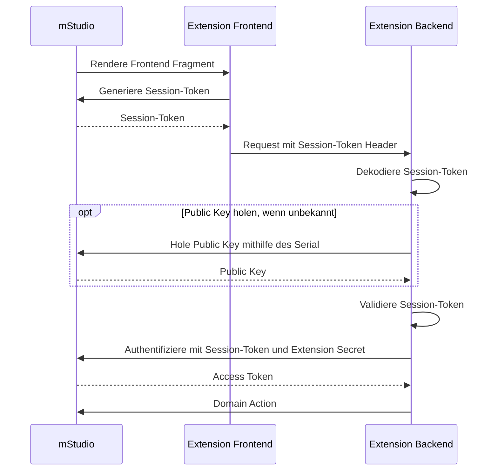

import OperationLink from "@site/src/components/OperationLink";

Die Konfiguration von Frontend Fragmenten dient dazu,
Frontend einer Extension direkt an definierten [Anchors](#anchors) in das mStudio zu integrieren.
Dies bietet sich vor allem an, wenn das Frontend der Extension nahtlos in das mStudio eingebunden und das Gefühl eines nativen Features vermitteln werden soll.

Frontend Fragmente werden an einer Extension konfiguriert.
Genauere Informationen dazu finden sich in der [Extension Referenz](../../../reference/extensions).

Frontend Fragmente werden über einen iframe in das mStudio eingebunden.
Dieser iframe wird nicht direkt im sichtbaren Bereich der Seite gerendert.
Stattdessen wartet das mStudio auf Kommunikation über Window Messages, welche bekannten Komponenten gerendert werden sollen.
Auf diese Weise kann eine einheitliche User Experience gewährleistet und Funktionen wie Overlays angeboten werden.

Eigene Komponenten und CSS können nicht verwendet werden.
Um ein Frontend Fragment zu entwickeln, müssen die [Flow Remote Components](#flow-remote-components) genutzt werden.

Da Frontend Fragmente mittels iframe eingebunden werden und insbesondere Safari hinsichtlich Third-Party Cookies restriktiv ist,
können Frontend Fragmente nicht mit Cookies arbeiten. Die Authentifizierung und das Session Handling wird über [Session-Tokens](#authentifizierung-und-session-handling-mittels-session-token) realisiert.

## Anchors

Das mStudio bietet klar definierte Stellen, an denen Frontend Fragmente eingebunden werden können.
Diese `Anchor` genannten Stellen haben einen eindeutigen Identifier und werden in der Extension Definition konfiguriert.
Pro Anchor kann eine Extension derzeit nur ein Frontend Fragment einbinden.

Eine Extension, die zu einem Projekt hinzugefügt wird, kann nur Anchor verwenden, die auf Ebene der Projekt-Detailseite oder darunter definiert sind.
Extensions, die auf Ebene der Organisation hinzugefügt werden, können Anchor auf jeder Ebene auf oder unterhalb der Organisations-Detailseite verwenden.

Derzeit wird daran gearbeitet, an den folgenden Stellen Anchor anzubieten:

- Zusätzliche Menüeinträge auf jeder Navigationsebene mit damit zusammenhängenden eigenen (Unter-)Seiten
- Zusätzliche Tabs auf allen Seiten, die Tabs anbieten
- Zusätzliche Sections auf allen Seiten, die in Sections unterteilt sind

Außerdem wird an einer Möglichkeit gearbeitet, direkt im mStudio Anchor ausfindig zu machen und, damit verbunden, einzusehen, welche Additional Properties für einen Anchor definiert werden können oder müssen.
Zum jetzigen Zeitpunkt unterstützt mittwald über die gängigen Kommunikationskanäle bei der Konfiguration von Frontend Fragmenten.

## Flow Remote Components

Das mStudio rendert nur Komponenten, die dem mStudio bekannt sind.
Um Frontend Fragmente zu entwickeln wird empfohlen, die [Flow Remote Elements](https://github.com/mittwald/flow/tree/main/packages/remote-elements) zu verwenden.

Auch wenn die Verwendung von React/Next.js nicht vorgeschrieben ist, wird empfohlen, Frontend Fragmente in React oder Next.js zu entwickeln, da so die [Remote React Components](https://github.com/mittwald/flow/tree/main/packages/remote-react-components) genutzt werden können.
Diese bieten grundsätzlich exakt dieselbe API wie die normalen [Flow Components](https://github.com/mittwald/flow/tree/main/packages/components), sind jedoch für die Verwendung in Remote DOMs (Frontend Fragmenten) ausgelegt.

## Authentifizierung und Session Handling mittels Session-Token

Für die Authentifizierung und das Session Handling im Frontend Fragment wird ein sogenannter Session-Token verwendet.
Dieser Session-Token kann von einem Frontend Fragment jederzeit über Window Messages vom mStudio angefordert werden.
Der Session-Token ist ein JWT, das Informationen über den aktuellen Nutzer und die Extension Instance enthält.
Es stellt ein sogenanntes Online-Token dar, das nur 60 Sekunden gültig ist und somit nicht persistiert werden sollte.
Das mStudio stellt sicher, dass ein Frontend Fragment nicht bei jeder Anfrage einen neuen Session-Token erstellt,
sondern Session-Tokens innerhalb der ersten 40 Sekunden der Gültigkeit wiederverwendet werden.

Session-Tokens enthalten stets eine für die jeweilige Session stabile Session ID.
Diese Session ID kann genutzt werden, um die Session eines Nutzers zu identifizieren und bspw. Backend-Sessions abzubilden.
Session-Cookies können nicht verwendet werden, da dies unter WebKit-basierten Browsern wie Safari nicht funktioniert.

Ein Frontend Fragment muss bei Requests an das eigene Backend stets den Session-Token mitsenden.
Das Session-Token enthält in den JWT-Claims unter dem Key `publicKeySerial` die Serial des Public Keys des mStudio, mit dem das Session-Token signiert wurde.
Der Ed25519 Public Key kann über die mStudio API mithilfe der Operation <OperationLink tag="Marketplace" operation="extension-get-public-key" /> abgerufen werden.
Dazu muss der `publicKeySerial` aus dem Session-Token als Serial und der Purpose `session_token` verwendet werden.
Zur Vereinfachung der Prüfung der Signatur kann über den Query-Parameter `format` der Public Key im SPKI-Format, ASN.1 serialisiert und PEM kodiert, abgerufen werden.

Das Backend muss den Session-Token bei jedem Request gegen den im Session-Token angegebenen Public Key des mStudio validieren, da der Session-Token das Authentifizierungsmerkmal des Nutzers darstellt.
Dazu muss das JWT erst dekodiert werden, der Public Key über die API abgerufen und schließlich das JWT gegen den Public Key validiert werden.
Der Public Key mit einem spezifischen Serial ist stabil und kann gecached/persistiert werden.

Das Session-Token kann in Kombination mit einem Extension Secret für den Abruf eines Access Tokens verwendet werden.
Dazu kann die Operation <OperationLink tag="Marketplace" operation="extension-authenticate-with-session-token" /> genutzt werden.
Das dabei entstehende Access Token ist ebenfalls nur 60 Sekunden gültig und sollte nicht persistiert werden.

Der gesamte Prozess der Authentifizierung ist im folgenden Sequenzdiagramm dargestellt:

## Kontext Parameter

Neben dem Session-Token können vom mStudio auch Kontext Parameter abgefragt werden.
Diese geben Aufschluss darüber, in welchem Kontext das Frontend Fragment aufgerufen wurde.
Wenn bspw. eine Organisations-Extension ein Frontend Fragment innerhalb der App eines Projekts einbindet, erhält die Extension über diesen Weg Informationen darüber, in welcher Organisation, in welchem Projekt und in welcher App das Frontend Fragment gerendert wurde.

## Extension Bridge

Die Extension Bridge ist eine JavaScript-Bibliothek, die in Frontend Fragmenten verwendet werden kann, um mit dem mStudio zu kommunizieren.
Sie bietet Library-Funktionen um Kontext Parameter abzufragen und um Session-Tokens zu erhalten, dekodieren und validieren.
Für weitere Informationen siehe [Extension Bridge Dokumentation](https://github.com/mittwald/flow/tree/main/packages/ext-bridge)
