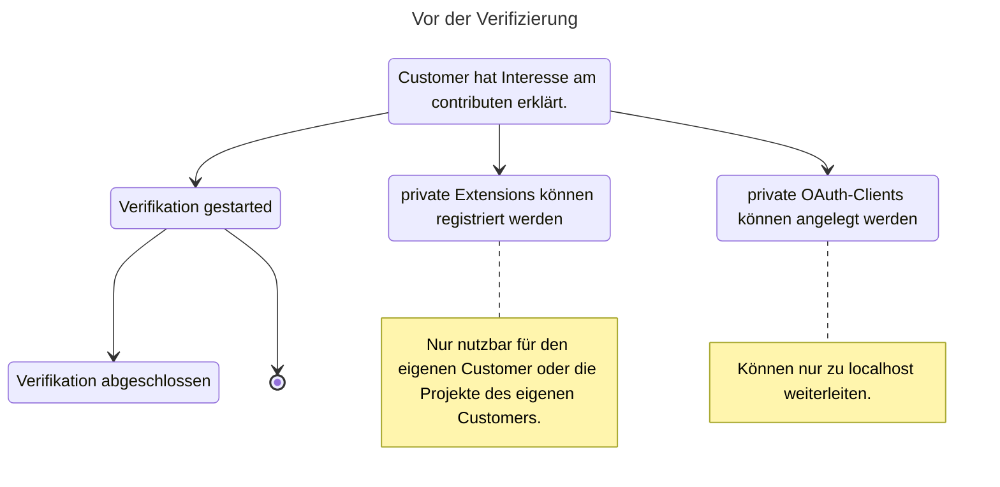
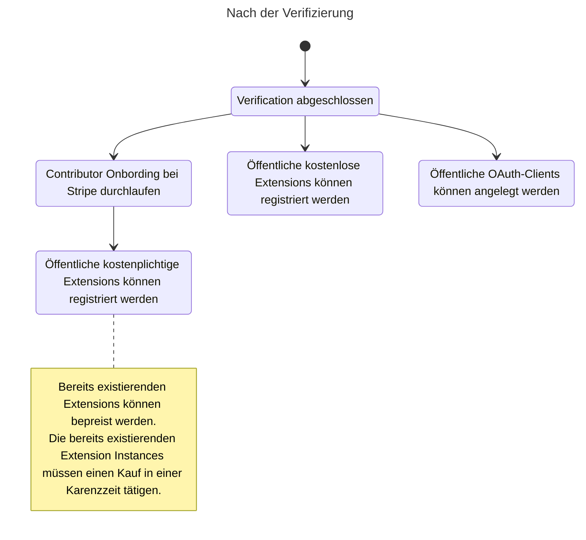

## Contributor Lifecycle

Nach dem Bekunden von Mitwirkungsinteresse wird eine Organisation als Contributor betrachtet.

```mermaid
---
title: Vor der Verifizierung
---

stateDiagram-v2
    C1: Customer hat Interesse am contributen erklärt.
    C2: Verifikation gestarted
    C3: Verifikation abgeschlossen
    E1: private Extensions können registriert werden
    O1: private OAuth-Clients können angelegt werden

    note right of O1
        Können nur zu localhost weiterleiten.
    end note
    note right of E1
        Nur nutzbar für den eigenen Customer oder die Projekte des eigenen Customers.
    end note

    C1 --> C2
    C2 --> C3
    C1 --> E1
    C1 --> O1
    C2 --> [*]
```

```mermaid
---
title: Nach der Verifizierung
---

stateDiagram-v2
    C3: Verification abgeschlossen
    C4: Contributor Onbording bei Stripe durchlaufen
    E2: Öffentliche kostenlose Extensions können registriert werden
    E3: Öffentliche kostenplichtige Extensions können registriert werden
    O2: Öffentliche OAuth-Clients können angelegt werden

    note right of E3
        Bereits existierenden Extensions können bepreist werden.
        Die bereits existierenden Extension Instances müssen einen Kauf in einer Karenzzeit tätigen.
    end note

    [*] --> C3
    C3 --> E2
    C3 --> C4
    C3 --> O2
    C4 --> E3
```
