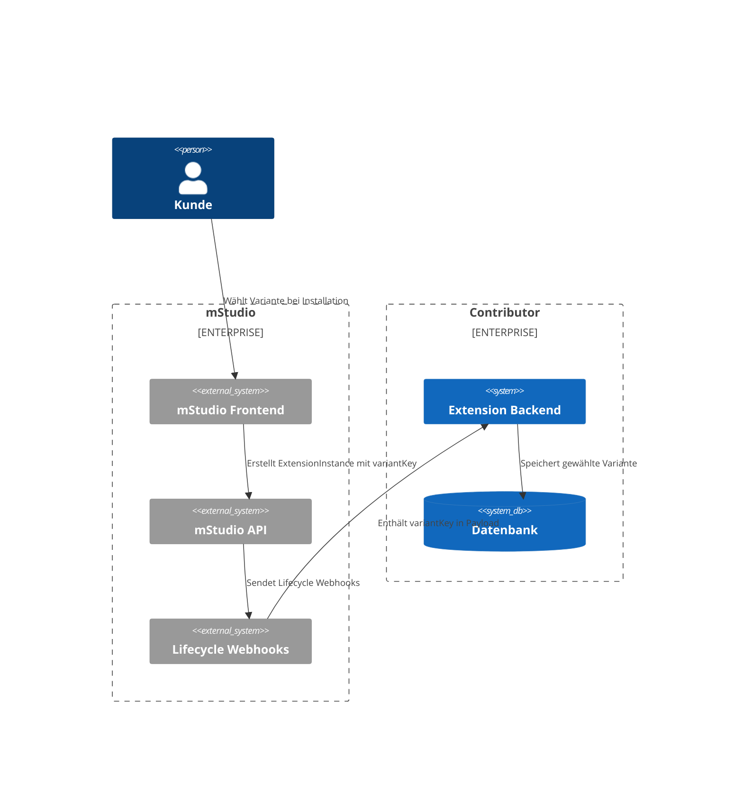
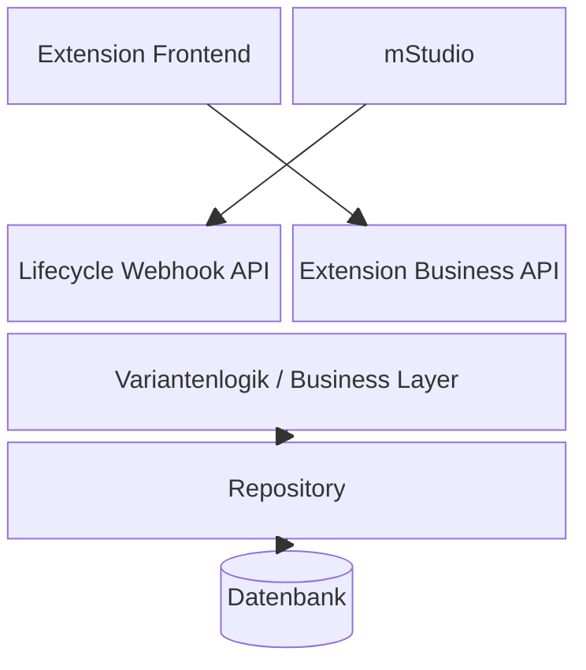

## Konzept der Preisvarianten

Extensions im mStudio können mit unterschiedlichen Preismodellen angeboten werden.  
Ein Contributor kann entscheiden, ob eine Extension:

- **Kostenlos** angeboten wird  
- Einen **einzelnen festen Preis** hat  
- Oder **mehrere Preisvarianten** anbietet  

Eine Preisvariante ermöglicht es, verschiedene **Funktionsumfänge** einer Extension zu unterschiedlichen Preisen anzubieten.

Jede Variante besteht aus folgenden Eigenschaften:

| Eigenschaft | Beschreibung |
|--------------|---------------|
| **Name** | Anzeigename der Variante (z. B. „Basic“, „Pro“, „Enterprise“) |
| **Preis** | Monatlicher Preis, der dem Kunden berechnet wird |
| **Leistungsmerkmale** | Beschreibung des Leistungsumfang der Variante. Dies ist spezifischer als die Extension-Beschreibung |
| **variantKey** | Technischer Key der Variante (muss eindeutig sein und kann nach Anlage nicht mehr geändert werden) |

Wenn Kunden eine Extension installieren, können sie eine der verfügbaren Varianten auswählen.  
Die gewählte Variante bestimmt sowohl den Preis als auch den Funktionsumfang.



---

## Verwaltung von Preisvarianten im mStudio

Preisvarianten werden im Bereich **Extensionverwaltung** des mStudio konfiguriert:

```
Organisation -> Contribution -> Entwicklung -> Extension auswählen oder anlegen -> Details -> Preisdetails
```

Im Abschnitt **Preisdetails** können Contributoren:

1. **Neue Varianten anlegen**, indem sie folgende Angaben machen:
   - Einen **Namen**
   - Einen **Preis**
   - **Leistungsmerkmale**
   - Einen eindeutigen **variantKey**

2. **Bestehende Varianten bearbeiten**, sofern sich die Extension **nicht innerhalb der 30-tägigen Sperrfrist nach Veröffentlichung** befindet (siehe unten).

### Regeln für die Variantenverwaltung

- Der **variantKey** wird vom Contributor vergeben und identifiziert die Variante eindeutig **innerhalb einer Extension**.  
- Nach dem ersten Anlegen kann der **variantKey nicht mehr geändert** werden.  
- Wenn die Extension zuvor einen Einzelpreis hatte, kann der **erste angelegte Preis** als Variatne mit dem **"default" Key** weiterverwendet werden.

### Verhalten der Benutzeroberfläche

Die mStudio-Oberfläche stellt separate Eingabefelder für jede Eigenschaft einer Variante bereit. 
Das System prüft automatisch eindeutige `variantKey`s und Namen.
Es kann nur eine kostenlose Variante geben.
Wenn zutreffend, kann der Contributor bei Änderungen angeben, ob diese eine **Leistungsänderung** darstellen.

---

## Einschränkungen nach Veröffentlichung

Nach der Veröffentlichung einer Extension führt eine Veränderung der Preisdaten zu einer **30 Tage andauernden Sperre für Änderungen an Preisen oder Varianten**.

Diese Sperre betrifft:

- Das Hinzufügen von Varianten  
- Änderungen an **Name**, **Leistungsmerkmalen** oder **Preis** bestehender Varianten  
- Den Wechsel zwischen **kostenlos**, **Einzelpreis** oder **Preisvarianten**
- Änderung des Einzelpreises

Nach Ablauf der 30 Tagen können Änderungen erneut vorgenommen werden.  
Wenn eine Änderung den **Funktionsumfang** betrifft, muss dies im mStudio ausdrücklich gekennzeichnet werden.

---

## Auswirkungen auf bestehende Installationen

Wenn Preis- oder Leistungsumfangsänderungen vorgenommen werden, sorgt das System dafür, dass bestehende Kunden informiert werden und den neuen Bedingungen **zustimmen** oder **ablehnen** müssen.

### Eine Kundeninteraktion ist erforderlich, wenn:

- Eine Extension von **kostenlos → Einzelpreis** oder **kostenlos → Varianten** wechselt  
- Ein **Einzelpreis** geändert wird  
- Die vom Nutzer gewählte **Variante** (Preis oder Leistungsumfang) geändert wird  

### Ablauf

1. Der betroffene Kunde erhält eine **Benachrichtigung im mStudio** sowie eine **E-Mail**.
2. Dem Kunden wird auf der Detailseite der Extension und in seiner Instanzlsite ein Hinweis gezeigt der ihn zur Interaktion auffordert
3. Der Kunde muss innerhalb von **30 Tagen** auf diese Änderung reagieren.  
4. Wenn innerhalb dieser Frist keine Reaktion erfolgt, wird die entsprechende **Extension-Instanz automatisch gelöscht**.

Contributoren werden über diese Vorgänge über **Lifecycle Webhooks** informiert.

---

## Technische Integration

Jede Extension erhält Benachrichtigungen vom mStudio über die **Lifecycle Webhooks**.  
Diese Webhook-Payloads enthalten den `variantKey`, um zu identifizieren, welche Variante ein Kunde gewählt hat.

### Beispiel: Lifecycle-Webhook-Payload

```json
{
  "event": "extensionInstance.created",
  "data": {
    "instanceId": "abc123",
    "extensionId": "my-extension",
    "variantKey": "pro",
    "customerId": "cust789",
    "status": "active"
  }
}
```

Die Extension muss einen Endpoint bereitstellen, der solche Webhook-Aufrufe empfängt.  
Sie sollte den `variantKey` speichern und verarbeiten, um sicherzustellen, dass für den Kunden der richtige Funktionsumfang aktiviert wird.

> **Wichtig:**  
> Der `variantKey` ist der technische Referenzwert für die Variantenverwaltung.  
> Er muss im Backend des Contributors eindeutig auf die entsprechende Variante abgebildet werden.

### Zugriff über die Extension Bridge

Während einer aktiven Sitzung im mStudio kann eine Extension über die **Extension Bridge** auf die gewählte Variante zugreifen:

```js
const variant = window.mittwald.session.variantKey;
```

So kann das Frontend der Extension seine Darstellung oder Funktionalität dynamisch an die gewählte Variante anpassen.

---

## Beispielarchitektur mit Variantenverarbeitung



In diesem Aufbau gilt:

- Die **Lifecycle Webhook API** empfängt Benachrichtigungen vom mStudio, einschließlich `variantKey`.  
- Die **Business API** stellt funktionsabhängige Logik bereit, basierend auf der gespeicherten Variante.  
- Das **Frontend** passt seine Oberfläche und Funktionen an die aktuelle Variante an.  
- Die **Datenbank** speichert alle Varianten-Zuordnungen und Preishistorien.

---

## Verantwortlichkeiten der Contributoren

Contributoren sind verantwortlich für:

- Das Anlegen und Pflegen ihrer Varianten im mStudio  
- Die korrekte Verarbeitung des `variantKey` im eigenen Backend  
- Das Handling der Lifecycle-Webhooks  
- Die technische Abbildung der gewählten Variante im eigenen Funktions- oder Abrechnungssystem  
- Die Einhaltung der **30-Tage-Sperrfrist** nach einer Preisänderung  

---

## Best Practices

- Verwende **aussagekräftige Keys** für Varianten (z. B. `basic`, `pro`, `enterprise`).  
- Beschreibe den **Leistungsumfang** jeder Variante klar und transparent.  
- Logge alle Ereignisse im Zusammenhang mit Variantenänderungen intern.  
- Teste alle Variantenwechsel gründlich vor der Veröffentlichung.  

---

## Fehlerbehebung

| Problem | Mögliche Ursache | Lösung |
|----------|------------------|--------|
| Variante wird im Backend nicht erkannt | Fehlender oder falscher `variantKey` | Webhook-Payload korrekt verarbeiten und Zuordnung prüfen |
| Änderungen nicht möglich | 30-tägige Sperrfrist aktiv | Warten, bis Sperrfrist abgelaufen ist |
| Kunde verliert Zugriff auf Extension | Keine Reaktion auf Preisänderung innerhalb von 30 Tagen | ExtensionInstance wurde automatisch gelöscht |
| Falscher Funktionsumfang aktiv | Variante nicht korrekt in der Business-Logik verarbeitet | `variantKey`-Mapping im Backend prüfen |

---

## Zusammenfassung

Preisvarianten ermöglichen eine flexible Monetarisierung von Extensions im mStudio.  
Durch die Einhaltung der beschriebenen Prozesse und Lifecycle-Anforderungen können Contributoren ihre Extensions sicher und transparent mit unterschiedlichen Preis- und Funktionsstufen anbieten.  
Eine saubere Webhook-Verarbeitung und konsistente Variantenverwaltung sind dabei entscheidend für korrekte Abrechnung und Kundenerfahrung.
