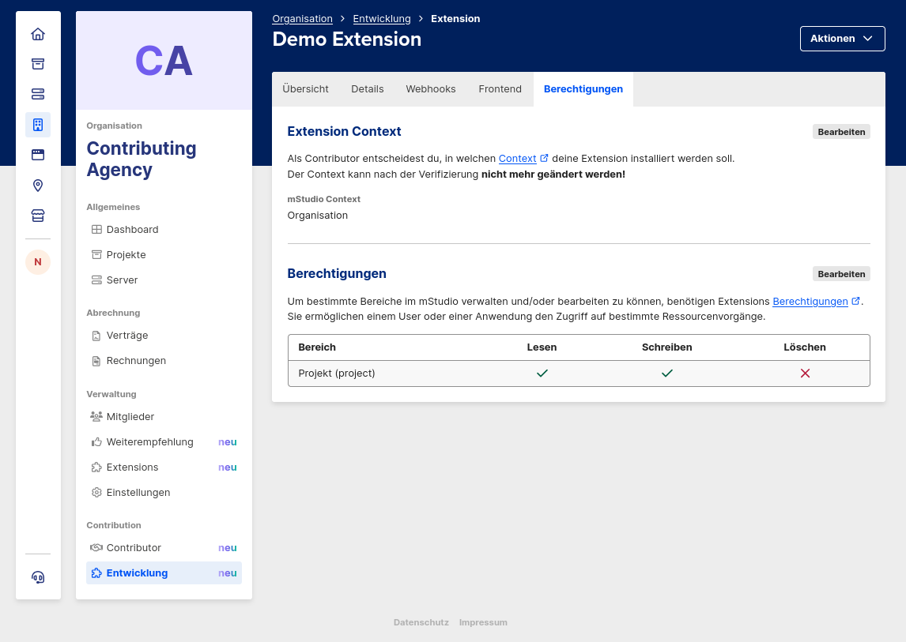

import OperationLink from "@site/src/components/OperationLink";
import SchemaWithExample from "../../../../../../src/components/openapi/SchemaWithExample";

Die lokale Entwicklung von Extensions, die sich stark mit dem mStudio integrieren, kann eine Herausforderung sein,
da keine Möglichkeit besteht, das mStudio lokal oder in einer DEV Umgebung zu starten.
Neben der Möglichkeit, die mStudio API zu mocken, was sich ohne Kenntnisse der API als schwierig erweisen kann,
existieren dennoch Mittel und Wege, um die lokale Entwicklung von Extensions zu erleichtern.
Diese werden im Folgenden vorgestellt.

## Erstellen einer Extension Instance

:::note
Es muss bereits ein [Context](../../glossary/#extension-context) zugewiesen sein, bevor du eine Extension Instance erstellen kannst.
:::

Wenn du deine Extension entwickelst, kannst du sie nur innerhalb des **mStudio** vollständig testen.\
Dazu musst du eine **Extension Instance** erstellen, wofür du die **Extension ID** deiner Extension kennen musst.\
Die Extension ID kann unter dem "Entwicklung" Tab der Extension im mStudio eingesehen werden.

:::note
Alle Extension Instances innerhalb deines Contributors sind kostenlos.
:::

Während der Entwicklung wird deine Extension **nicht** im Marktplatz angezeigt.

### ...über das mStudio (empfohlen)

1. Öffne das **mStudio**.
2. Navigiere zum **Marktplatz**.
3. Wähle eine beliebige Extension aus.
4. Ersetze in der URL-Pfad die Extension ID mit der **Extension ID deiner Extension**.

### ...über die API

Du kannst eine Extension Instance programmatisch mit der

<OperationLink operation="extension-add-extension-to-context" /> Operation
erstellen.

Für jeden benötigten Scope musst du im `scopes`-Feld deines Request-Bodys einen Eintrag im folgenden Format hinzufügen:\
`"bereich:(read|write|delete)"`.
Die benötigten Scopes findest du in dem Bereich "**Berechtigungen**" deiner Extension im mStudio.

### Nach der Veröffentlichung deiner Extension

Nach der Veröffentlichung deiner Extension werden die Extension Instances, die du zu Testzwecken erstellt hast, **entfernt**.  
Du kannst deine Extension jedoch jederzeit kostenlos zu deinen Contextes hinzufügen.

## Authentifizierte Domain Actions

Um die Geschäftslogik im Zusammenspiel mit dem mStudio effektiv zu testen, ist es am einfachsten,
die mStudio API direkt zu verwenden.
Dabei ist es in der Regel erforderlich, sich gegen die API zu authentifizieren.

### ...mittels persönlichem API-Token

In einer frühen Phase, in der die Geschäftsidee noch geprüft und an einem Proof of Concept gearbeitet wird,
bietet es sich an, einen persönlichen API-Token zu verwenden.
Dieser Token kann für die lokale Entwicklung genutzt werden.
Es ist jedoch wichtig, darauf zu achten, dass **API-Tokens nicht in Versionskontrollsysteme** wie Git gelangen
und diese Lösung nur für die lokale Entwicklung gedacht ist.

Weitere Informationen zur Erzeugung eines persönlichen API-Tokens sind zu finden unter [Ein API-Token beziehen](../../../api/intro#obtaining-an-api-token)

### ...mittels Extension Instance Secret Rotation

Eine weitere Möglichkeit, die mStudio API authentifiziert zu nutzen, ohne die Authentifizierungsmethoden vollständig zu implementieren,
ist die Rotation eines Extension Instance Secrets.
Hierfür wird die <OperationLink operation="contributor-rotate-secret-for-extension-instance" />-Operation verwendet.
Das neue Secret wird per Webhook übermittelt, aber auch als Antwort auf den Request zurückgegeben.
Das so erhaltene Secret kann nun sicher hinterlegt werden, ähnlich wie ein persönlicher API-Token,
um ein Access Token beziehen zu können, wie unter [Authentifizierung mittels Extension Instance Secret](../../reference/api#authentifizierung-mittels-extension-instance-secret) beschrieben.
Bei Nutzung dieser Route wird der Lifecycle Webhook synchron ausgeführt.
Bei Fehlschlag wird der Webhook nicht erneut versendet.
Außerdem wird das Secret nicht gültig, wenn der Webhook fehlschlägt.
Um ohne funktionierende Webhooks dennoch testen zu können, kann der Route im Request Body `"allowWebhookFailure": true` hinzugefügt werden.
Der Fehler des Lifecycle Webhooks wird dann ignoriert und das Secret samt Antwort des Extension-Backends trotzdem zurückgegeben.

Diese Methode ist besonders nützlich, wenn die Authentifizierung später ebenfalls über das Extension Instance Secret erfolgen soll.
Zudem können Initialisierungsprozesse, die anschließend zu den Lifecycle Webhooks ausgeführt werden würden,
mit einem funktionierenden Secret getestet werden, ohne im mStudio für jeden Versuch eine neue Extension Instance erstellen zu müssen.

### ...mittels OAuth2

Wenn die Authentifizierung und Ausführung von Domain Actions über OAuth2 getestet werden soll,
empfiehlt es sich, im OAuth2-Client eine lokale Redirect URI einzurichten.
Dies kann entweder localhost oder eine Domain sein, für die ein lokaler Host-Eintrag existiert.
Es sollte darauf geachtet werden, dass bei Verwendung eines Host-Eintrags keine potenziell öffentlich auflösbare Domain verwendet wird,
die nicht unter der Kontrolle des Entwicklers steht, um Sicherheitsrisiken zu vermeiden.

## Testen der Lifecycle Webhooks

### ...mittels lokalem Development Server

Auf Github existiert das [marketplace-local-dev-server](https://github.com/mittwald/marketplace-local-dev-server)-Repository,
welches dafür gedacht ist, lokal Lifecycle Webhooks samt Verifizierung der Sender-Identität zu testen.

:::note

Zum aktuellen Zeitpunkt ist der Marktplatz und die Contribution noch nicht für die Allgemeinheit offen.
Um Zugriff auf das Repository zu erhalten, kontaktiere bitte deinen Ansprechpartner bei mittwald.

:::

Es enthält eine Docker-Compose-Konfiguration, die einen lokalen Server startet, der Lifecycle Webhooks versenden kann.
Dazu wird eine API angeboten, mit der Lifecycle Webhooks angefragt werden können.
Die Werte, die in den Webhooks enthalten sind, können dabei frei gewählt werden.
Falls Werte nicht gesetzt sind, werden sie zufällig generiert.

Wenn bspw. die Extension Instance ID selbst vergeben wird, können so auch ganze Lebenszyklen von Extension Instances simuliert werden,
indem für verschiedene Webhooks eine stabile Extension Instance ID verwendet wird.

### ...mittels Dry Run Webhooks

Mithilfe der <OperationLink operation="extension-dry-run-webhook" />-Operation können Lifecycle Webhooks auch über das mStudio Backend simuliert werden.
Dabei wird der angefragte Lifecycle Webhook an die an der Extension konfigurierten URL gesendet.
Dry Run Webhooks können nur für Extension Instances des Contributors ausgeführt werden.
Sie können genau wie beim lokalen Development Server mit beliebigen Werten gefüllt werden oder zufällige Werte enthalten.
Für eine Übersicht, welche Werte statisch gesetzt werden können, siehe in der verlinkten Operation.

Das Ergebnis samt Response Body, Headern und Status Code wird dabei als Antwort auf die Operation zurückgegeben.

:::caution
Um den Webhook als Dry Run erkennbar zu machen, wird dem Webhook der Query-Parameter `dry-run=true` hinzugefügt.
Es sollte darauf geachtet werden, dass in Produktivsystemen keine Webhooks mit diesem Parameter verarbeitet und persistiert werden,
da es sich um eine Simulation handelt und so die Daten inkonsistent werden könnten.
:::

Zu Dokumentationszwecken kann zusätzlich der `executing-user-id` Query-Parameter ausgewertet werden.
Dieser wird ebenfalls automatisch jedem Dry Run Webhook beigefügt.
Er enthält die ID des Benutzers, der den Dry Run Webhook ausgelöst hat.

## Frontend Fragments testen {#testing-frontend-fragments}

Um zu testen, ob die Integration deines Frontend-Fragments korrekt funktioniert, solltest du dein Frontend starten.
Außerdem solltest du deine (Development-)Extension so konfigurieren, dass sie die URL deines lokalen Entwicklungsservers, z.B. `http://localhost:3000/my-fragment` als Frontend Fragment verwendet.
Dazu kannst du eine versteckte Kopie deiner Extension für die lokale Entwicklung erstellen (siehe [Staging](../staging)).

Dies ermöglicht es dir, dein Frontend-Fragment lokal zu entwickeln und zu testen, bevor du es live bereitstellst.

Eine optimierte Entwicklungsumgebung für Frontend-Fragmente, die diesen Prozess weiter vereinfachen soll, wird in Zukunft eingeführt.
