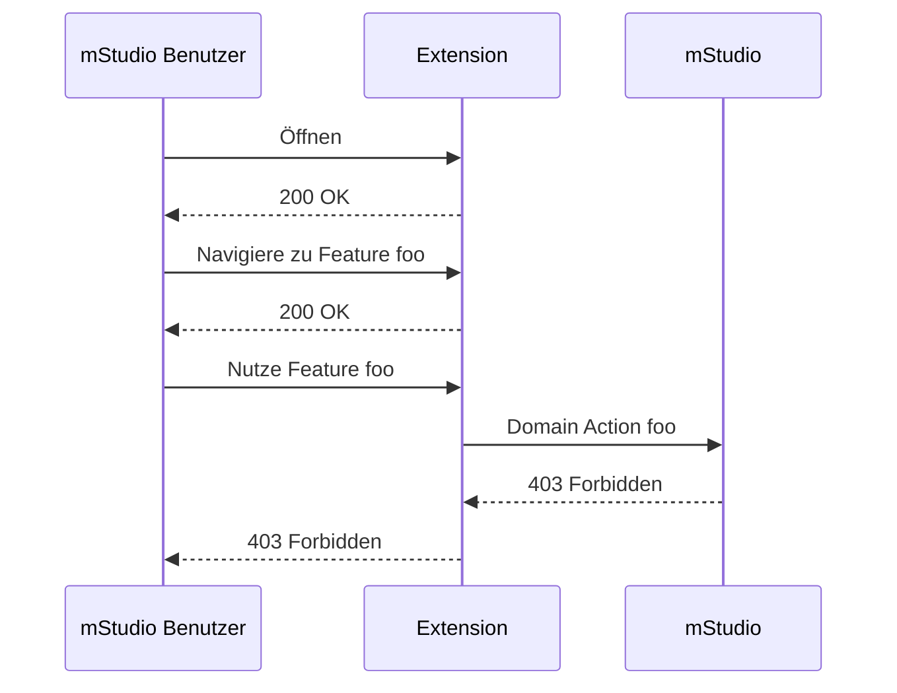
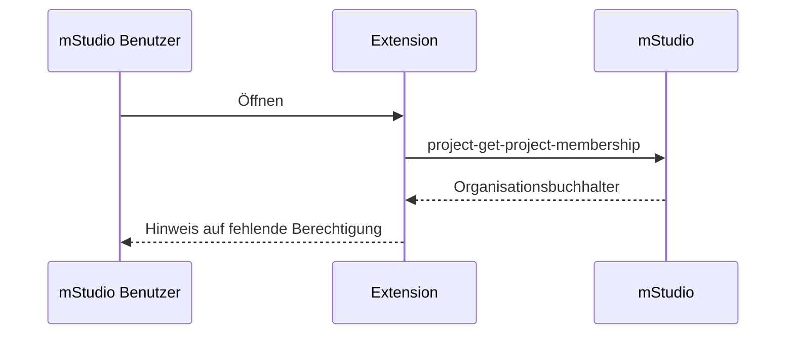
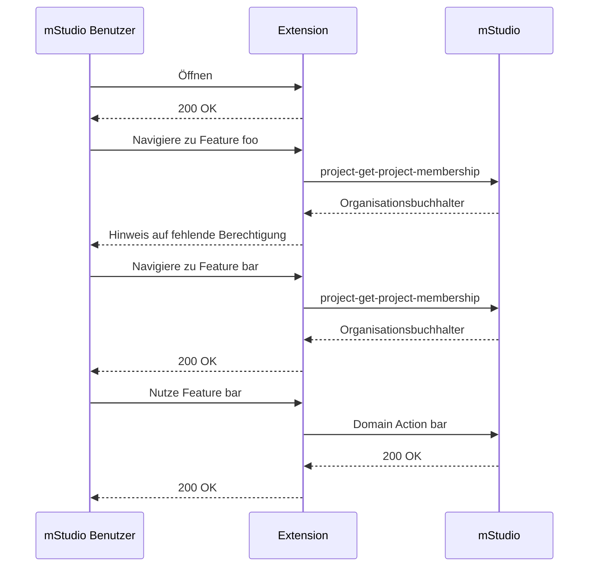

Wenn die Extension im Namen eines mStudio Benutzers die API bedient, können sich Probleme mit unzureichenden Berechtigungen ergeben.
Im Namen eines mStudio Benutzers bedeutet, dass zur Authentifizierung entweder der
[Access Token Retrieval Key](../../overview/concepts/authentication#access-token-retrieval-key)
oder [OAuth2](../../overview/concepts/authentication#oauth2) verwendet wird.

Die Extension-Architektur stellt sicher, dass ein mStudio Benutzer in keinem Szenario mehr Rechte erhält,
als der Benutzer selbst besitzt.
Auch stellt sie sicher, dass ein mStudio Benutzer im Kontext einer Extension nur die Rechte erhält,
denen beim Hinzufügen der Extension zugestimmt wurde.

Es wird jedoch nicht automatisch sichergestellt, dass der mStudio Benutzer die Rechte besitzt,
die für die Ausführung der Domain Actions innerhalb der Extension erforderlich sind.
Dies ist dadurch bedingt, dass das mStudio mit einem Rechte- und Rollensystem arbeitet,
das im Kontext von Organisationen und Projekten verschiedene Rollen vorsieht.
Es kann also passieren, dass eine Extension eine Domain Action ausführt, die der Benutzer nicht ausführen darf
und somit eine Fehlermeldung erhält.

Wenn also beispielsweise eine Extension Projekte über die [project-create-project](../../../reference/project/project-create-project)-Operation erstellen soll
und der Benutzer in der Organisation nur die Rolle "Organisationsbuchhalter" hat, die diese Domain Action nicht erlaubt,
wird der Benutzer bei der Nutzung der Extension eine Fehlermeldung erhalten.

Um eine gute User-Experience zu gewährleisten, sollte die Extension die benötigten Rechte im Vorfeld prüfen.
Dazu kann die Extension die [project-get-project-membership](../../../reference/project/project-get-project-membership)-Operation,
bzw. die [customer-get-customer-membership](../../../reference/customer/customer-get-customer-membership)-Operation verwenden.

Diese Routen geben die aktuelle Mitgliedschaft des Benutzers zu einem Extension Context zurück.
Unter anderem enthält sie, welche Rolle der Benutzer in dem Context hat.

Indem die Rolle des Benutzers geprüft wird, kann nun vor dem eintretenden Fehlerfall ein entsprechender Hinweis an den Benutzer gegeben werden,
dass er nicht die notwendigen Rechte hat, um die Domain Action auszuführen und den Context Administrator kontaktieren muss,
um die Rechte zu erhalten.

Dem Contributor bleibt dabei die Flexibilität, ob er die Extension für mStudio Benutzer mit eingeschränkten Rechten vollständig sperrt, wie im Beispiel oben,
oder nur für die entsprechenden Features.

Rein technisch stellt es eine Alternative dar, die Domain Actions im Namen der Extension auszuführen.
Dafür muss die Extension das [Extension Instance Secret](../../overview/concepts/authentication#extension-instance-secret) verwenden,
um ein Access Token zu beziehen.
In diesem Fall wird die Domain Action mit den Rechten der Extension ausgeführt.
Dies hat jedoch den Nachteil, dass Organisationsinhaber und Project Administratoren nicht mehr über die Vergabe von Rollen steuern können,
welche Benutzer welche Domain Actions ausführen dürfen, was eine Sicherheitslücke darstellen
und zu einer Verschlechterung der User-Experience führen kann.
