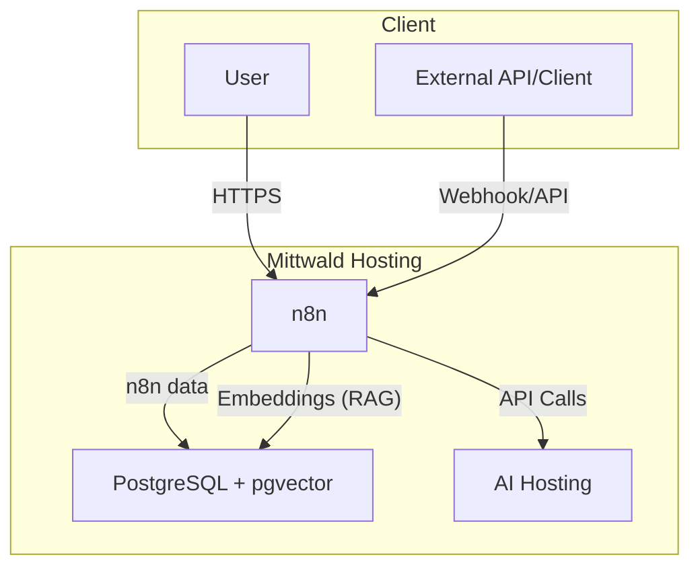

# n8n ausführen

## Einführung

n8n ist eine Automatisierungsplattform, mit der sich verschiedene Dienste und Anwendungen über sogenannte Workflows miteinander verbinden lassen. Sie funktioniert ähnlich zu Tools wie Zapier oder Make (ehemals Integromat), bietet aber mehr Flexibilität und Kontrolle – besonders für Entwickler:innen.

Mit n8n kannst du:

- Automatisierte Abläufe zwischen über 300 Diensten (z. B. Slack, Google Sheets, GitHub, Datenbanken etc.) erstellen.
- Eigene Logik einbauen – z. B. mit Bedingungen, Schleifen, benutzerdefiniertem JavaScript.
- Die Software selbst hosten (Self-Hosting), was volle Datenhoheit ermöglicht.

## n8n Container erstellen

Du kannst n8n in deiner Mittwald Hosting-Umgebung mit Containern bereitstellen. Es gibt verschiedene Hauptansätze:

### Verwendung der mStudio-Benutzeroberfläche

1. Gehe in deinem Projekt in mStudio auf den **Container**-Menüpunkt und erstelle einen neuen Container. Du kannst einen beliebigen Namen wählen.

2. Gib das Image `n8nio/n8n:stable` ein. Du kannst den Entrypoint und das Command wie vorgeschlagen beibehalten.

#### Volumes

Um die Daten deines n8n persistent zu speichern, definiere Volumes unter **Volumes** wie folgt:

- Neues Volume erstellen, auf **Pfad im Container** (Mount Point): `/home/node/.n8n`


#### Umgebungsvariablen

Setze die folgenden Umgebungsvariablen für den Container:

```dotenv
N8N_HOST=p-XXXXXX.project.space
N8N_PORT=5678
N8N_PROTOCOL=https
NODE_ENV=production
WEBHOOK_URL=https://p-XXXXXX.project.space/
GENERIC_TIMEZONE=Europe/Berlin
```

Hier passt du die Umgebungsvariablen `N8N_HOST` und `WEBHOOK_URL` auf den Host an, über den du die Weboberfläche von n8n erreichen möchtest.

#### Ports

Übernehme den vorgeschlagenen Standardport `5678`.

### Verwendung der CLI mit `mw container run`

Du kannst auch einen n8n-Container mit der Mittwald CLI und dem Befehl `mw container run` bereitstellen:

```bash
mw container run \
  --name n8n \
  --env N8N_HOST=p-XXXXXX.project.space \
  --env N8N_PORT=5678 \
  --env N8N_PROTOCOL=https \
  --env NODE_ENV=production \
  --env WEBHOOK_URL=https://p-XXXXXX.project.space/ \
  --env GENERIC_TIMEZONE=Europe/Berlin \
  --volume n8n-data:/home/node/.n8n \
  --publish 5678:5678/tcp \
  --create-volumes \
  n8nio/n8n:stable  # alternatives: https://hub.docker.com/r/n8nio/n8n/tags
```

Dieser Befehl erstellt einen neuen Container namens "n8n" mit dem n8n-Image, setzt alle notwendigen Umgebungsvariablen und mountet Volumes für die persistente Datenspeicherung.

### Verwendung der CLI mit `mw stack deploy`

Wenn du Docker Compose bevorzugst, kannst du eine `docker-compose.yml`-Datei erstellen und sie mit dem Befehl `mw stack deploy` bereitstellen:

1. Erstelle eine `docker-compose.yml`-Datei mit folgendem Inhalt:

   ```yaml
   services:
     n8n:
       image: n8nio/n8n:stable
       environment:
         - N8N_HOST=p-XXXXXX.project.space
         - N8N_PORT=5678
         - N8N_PROTOCOL=https
         - NODE_ENV=production
         - WEBHOOK_URL=https://p-XXXXXX.project.space/
         - GENERIC_TIMEZONE=Europe/Berlin
       ports:
         - "5678:5678"
       volumes:
         - n8n-data:/home/node/.n8n
   volumes:
     n8n-data:
   ```

2. Stelle den Stack mit der CLI bereit:

   ```bash
   mw stack deploy
   ```

Dieser Ansatz ist besonders nützlich, wenn du mehrere Container deployen möchtest, die zusammenarbeiten.

## Betrieb

Deine n8n-Daten werden im Rahmen des regelmäßigen Projektbackups gesichert und können entsprechend auch wiederhergestellt werden. Achte darauf, jedem Container separate Volumes für ihre Daten zuzuordnen, um Container unabhängig von den Daten neu aufsetzen zu können.

:::caution
Für einen sicheren Produktivbetrieb sind weitere Maßnahmen bzw. Klärungen erforderlich, die vom konkreten Anwendungsfall abhängen:

- Zugriff auf n8n: Wer darf Workflows erstellen, bearbeiten, anstoßen, ...
- Authentifizierung n8n, Benutzer- und Rollenkonzept
- Konfiguration n8n: Erlaubte Knoten, Systembenutzer, ...
- Persistenz n8n Daten: Für größere Installationen lohnt sich eine (Separate Datenbank für n8n Daten)[https://docs.n8n.io/hosting/configuration/supported-databases-settings/]
- Zugriff Vektordatenbank: lesen/schreiben, Schema-Veränderungen
- Zugriff auf Dokumente: Wer darf lesen/schreiben/löschen?
- Zugriff auf Webhooks: Authorisierung und Authentifizierung, Konsumenten bzw. Clients

Im Entwicklungs- und Testbetrieb können einige dieser Aspekte vereinfacht werden, im produktiven Betrieb müssen alle diese Aspekte zweifelsfrei geklärt werden. Ohne genaue Klärung dieser Sicherheitsfragen besteht das Risiko, ungewollt zu viele Informationen preiszugeben und im schlimmsten Falle interne Dokumente öffentlich einsehbar zu machen oder gar Prozesse anzustoßen.
n8n bietet auch ein (Werkzeug für Security Audits)[https://docs.n8n.io/hosting/securing/security-audit/], mit dem Produktivumgebungen geprüft werden können.
:::

## Use cases

### RAG mit postgreSQL und Mittwald AI-Hosting

n8n kann benutzt werden, um [Retrieval-Augmented Generation (RAG)](https://de.wikipedia.org/wiki/Retrieval-Augmented_Generation) Systeme verschiedenster Form aufzubauen. Das folgende Beispiel zeigt einen möglichen Aufbau, aufgrund des großen n8n-Ökosystems ist dies aber lediglich einer von vielen Wegen. Viel mehr soll dieses Beispiel als Einstieg dienen, um im Anschluss komplexere und vor allem produktionsreife Systeme aufzusetzen.

#### Vorraussetzungen

- Mittwald Container Hosting
- Mittwald AI-Hosting
- mStudio Zugriff, per Webapp und API-Token
- Installiertes und eingerichtetes `mw` CLI, Deployment des Container Verbunds

#### Einführung, grundlegender Aufbau

Das Ziel ist, einem KI-Agenten Zugriff auf Informationen aus Dokumenten zu gewähren, sodass sich Agenten in ihren Aktionen / Antworten auf eben diese Dokumente beziehen können. Solche Dokumente können konkret vieles sein, z. B. Anleitungen, Handbücher oder gar Excel-Mappen mit vielen Daten.

Um dieses Ziel zu erreichen, ist eine Persistenzschicht nötig, in der Informationen "KI-freundlich" abgelegt werden können. Unter der Haube kommen mindestens zwei KI-Modelle zum Einsatz: Eines zum Erzeugen sog. "Embeddings" und ein weiteres um den Agenten zu steuern. Embeddings sind dabei die "KI-freundliche" Art, Texte und Dokumente für KIs zu persistieren, sodass diese schnell zum Kontext einer Unterhaltung beigesteuert werden können.

Im Beispiel kommen diese zwei Modelle aus dem Mittwald KI-Hosting zum Einsatz:

- **Embedding**: `Qwen3-Embedding-8B`
- **Agent**: `Devstral-Small-2-24B-Instruct-2512`

Zum Speichern der Embeddings wird eine Vektordatenbank benötigt. Hier gibt es mehrere Möglichkeiten, das Beispiel nutzt `postgreSQL` mit der `pgvector` Extension. Hierfür gibt es ein vorbereitetes Docker-Image.

Der aufgebaute Verbund von Containern besteht also mindestens aus:

- **n8n**: Erstellung und Betrieb RAG
- **pgvector**: Vektordatenbank für Embeddings **und** n8n Persistenzschicht



#### Installation

Sind alle Voraussetzungen gegeben, kann mit der Installation begonnen werden. Zunächst erstellen wir die Docker Compose Datei:

```yaml
services:
  pgvector:
    image: ankane/pgvector:latest
    container_name: pgvector
    restart: always
    environment:
      POSTGRES_USER: ${POSTGRES_USER}
      POSTGRES_PASSWORD: ${POSTGRES_PASSWORD}
      POSTGRES_DB: n8n
    ports:
      - "5432:5432"
    volumes:
      - pgvector-data:/var/lib/postgresql/data

  n8n:
    image: n8nio/n8n:stable
    container_name: n8n
    restart: unless-stopped
    environment:
      N8N_HOST: ${N8N_HOST}
      WEBHOOK_URL: ${WEBHOOK_URL}
      N8N_DATABASE_POSTGRESDB_USER: ${POSTGRES_USER}
      N8N_DATABASE_POSTGRESDB_PASSWORD: ${POSTGRES_PASSWORD}
      NODES_EXCLUDE: ${NODES_EXCLUDE}
      N8N_PROTOCOL: https
      GENERIC_TIMEZONE: Europe/Berlin
      N8N_DATABASE_POSTGRESDB_HOST: pgvector
      N8N_DATABASE_POSTGRESDB_PORT: 5432
      N8N_DATABASE_POSTGRESDB_DATABASE: n8n
      N8N_PORT: 5678
    ports:
      - "5678:5678"
    depends_on:
      - pgvector
    volumes:
      - n8n-data:/home/node/.n8n

volumes:
  pgvector-data:
  n8n-data:
```

Alle kritischen Einstellungen wie z. B. Passwörter werden als Umgebungsvariablen eingegeben. Dies erlaubt u.a. das schnelle Aufsetzen mehrerer Umgebungen, z. B. für Test- und Produktivbetrieb.

Die konkreten Einstellungen schreiben wir dann in eine `.env` Datei:

```dotenv
N8N_HOST=p-XXXXXX.project.space
WEBHOOK_URL=https://p-XXXXXX.project.space/
POSTGRES_USER=<postgres user>
POSTGRES_PASSWORD=<postgres password>
NODES_EXCLUDE=[]
```

Zur einfachen Unterscheidung wird empfohlen, den `.env` Dateien sprechende Namen zu geben, z. B. `test.env` oder `prod.env`.

:::caution
`NODES_EXCLUDE=[]` aktiviert **alle** Knoten für die Benutzung. Einige dieser Knoten können ein Sicherheitsrisiko darstellen. Zum Testen kann dies sehr nützlich sein, für produktive Umgebungen wird empfohlen, eine genaue Liste unerwünschter Knoten zu pflegen.
:::

Sind alle Einstellungen vorbereitet, kann der Verbund ausgeliefert werden:

```bash
mw stack deploy -c path/to/n8n/docker-compose.yml --env-file path/to/n8n/example.env
```

Sehen wir in der Konsole eine Erfolgsmeldung, kontrollieren wir die neuen Container im mStudio und haben somit den Installationsschritt abgeschlossen!

#### Beispiel-Workflow

<a href="/examples/mw_ai_host_n8n_rag_demo.json" download>
  Download Beispiel Workflow (JSON)
</a>

Basierend auf [Quelle](https://n8n.io/workflows/10157-local-document-question-answering-with-ollama-ai-agentic-rag-and-pgvector/)

#### Einrichtung

Nach der Installation setzen wir das RAG-System in n8n auf und richten das System ein. Zunächst aktivieren wir einen n8n-Lizenzschlüssel und laden die Basisknoten zur Workflowerstellung herunter. Die benötigten Knoten liegen in `n8n-nodes-base` und können direkt aus der Applikation heraus heruntergeladen und installiert werden.

:::note

Prüfe stets **vor** dem Ausführen eines Workflows, ob alle beteiligten Knoten vorhanden und korrekt verbunden sind. n8n-Fehlermeldungen können sehr technisch oder gar irreführend sein, eine Kontrolle im Vorfeld lohnt sich um Arbeit bei der Fehlersuche zu sparen.

:::

Neben dem bloßen Vorhandensein müssen einige der Knoten korrekt konfiguriert werden.

Benötigt wird:
- Zugang zum Mittwald AI-Hosting ( oder vergleichbarer, OpenAI-kompatibler Host ) mit API-Key
- Zugang zur Datenbank, Benutzer und Passwort haben wir bereits im Container-Verbund vorbereitet

**Security:** Für den Produktivbetrieb ist es sauberer, mehrere Datenbankbenutzer mit unterschiedlichen Privilegien zu pflegen. Dies bedarf allerdings händischer Anpassungen am Datenbank-Container, die hier aus Komplexitätsgründen nicht weiter ausgeführt werden. Grundsätzlich sollte der mit Benutzereingaben arbeitende Datenbankbenutzer des KI-Agenten **keine** Berechtigung haben, das Datenbankschema zu ändern!

Wir erstellen also Zugangsdaten für die Datenbank und den KI-Host, anschließend weisen wir diese den entsprechenden Knoten zu. Beim Anlegen der Zugangsdaten wird bereits die Verbindung geprüft - so siehst du direkt, ob unser Verbund sauber arbeitet. Für die Authentifizierung der Webhooks richten wir JWT ein, für die Erzeugung eines konkreten Tokens zur Simulation eines Clients eignet sich [der JWT encoder auf jwt.io](https://www.jwt.io/).

#### Betrieb - Webhook

**Security:** Für produktiven Betrieb müssen Webhooks mit einer Authentifizierungsmethode abgesichert werden. Nach Möglichkeit sollten Webhooks nicht weiter exponiert, sondern von einer anderen Applikation des Stacks konsumiert werden. Sollen gezielt Webhooks exponiert werden, lohnt sich ein Proxy-Server im Stack, über den nur definierte Webhook-URLs an n8n weitergegeben werden.

Lasse den initialen Webhook lauschen im Test-Modus, dann kann man testen, z. B. per postman oder curl, wobei dir die genaue URL angezeigt wird:

```bash
$ curl -X POST -d '{
    "chatInput": "Hello World!",
    "sessionId": 42
  }'
  -H "Content-Type: application/json" \
  -H "Authorization: Bearer xxx.yyy.zzz" \
  https://p-XXXXXX.project.space/webhook-test/<webhook uuid>
```

Solange unser RAG noch nicht mit Dokumenten befüllt ist, haben wir hier einen einfachen Chatbot mit dem im Model "eingebackenen" Weltwissen. Fragen wir explizit, erklärt sich der Agent auch:

```bash
$ curl -X POST -d '{
    "chatInput": "How many documents do you know?",
    "sessionId": 42
  }'
  -H "Content-Type: application/json" \
  -H "Authorization: Bearer xxx.yyy.zzz" \
  https://p-XXXXXX.project.space/webhook-test/<webhook uuid>
{"output":"I currently do not have access to any documents in my knowledge base. If you'd like, I can help answer questions based on general knowledge or assist with other tasks."}
```

#### Betrieb - RAG, Dateisystem

Nach der Herstellung der Grundfunktion kann das RAG mit Dokumenten gefüllt werden. Im Beispiel werden Dokumente im Dateisystem abgelegt, verarbeitet und für den KI-Agenten sichtbar gemacht. In der Praxis lohnt es sich, neben dem Dateisystem auch andere Quellen in Erwägung zu ziehen, oder das Dateisystem gegen einen Dienst, bzw. einen Internet-Share ( Google Share ), zu konfigurieren.

Im ersten Knoten der Dateisystemüberwachung ( `Local file trigger` ) richten wir das Verzeichnis auf dem n8n-Container ein, das die Dokumente enthalten soll. Hier tragen wir beispielsweise `/home/node/rag_documents` ein.

Im Anschluss können wir die Überwachung testen, indem wir Dokumente im eingerichteten Ordner ablegen. Die Auslieferung der Dokumente kann dabei auf verschiedenen Wegen erfolgen, ( per SSH, SFTP, ), im Beispiel beschränken wir uns auf eine `SSH`-Verbindung und liefern unsere Dokumente per `scp` aus. Ordner vorbereiten:

```shellsession
mw container ssh <CONTAINER-ID>
mkdir -p /home/node/rag_documents
```

Überwachungsknoten aktivieren in n8n, Dokumente ausliefern:

```shellsession
scp my_documents/example_manual.txt <Mittwald SSH URL n8n Container, siehe mStudio>:/home/node/rag_documents/
```

Mit der neuen Datei wird der nachfolgende Workflow ausgelöst. Das Dokument, die Metadaten und die Embeddings werden in der Datenbank hinterlegt und stehen im Chat zur Verfügung.

Zum Testen eignen sich bekannte Dokumente, zu denen einfach Testfragen gestellt werden können:

```shellsession
# Beispieldokumente ablegen
$ scp -r python3_docs/*.txt <Mittwald SSH URL n8n Container, siehe mStudio>:/home/node/rag_documents/
# Workflow wird angestoßen in n8n ...
# Kontrolle nach Abschluss:
$ curl -X POST -d '{
    "chatInput": "How to report bugs in Python?",
    "sessionId": 42
  }'
  -H "Content-Type: application/json" \
  -H "Authorization: Bearer xxx.yyy.zzz" \
  https://p-XXXXXX.project.space/webhook-test/<webhook uuid>
{"output":"To report bugs in Python, you can use the Python issue tracker on GitHub. Here’s how you can do it:\n\n1. **GitHub Issues Tracker**: Submit bug reports for Python via the GitHub issues tracker at [https://github.com/python/cpython/issues](https://github.com/python/cpython/issues). This platform provides a web form where you can enter pertinent information and submit it to the developers.\n\n2. **Bug Writing Guidelines**: When writing a bug report, include as much detail as possible to help the developers understand and reproduce the issue. While some guidelines are specific to the Mozilla project, they describe general best practices for writing effective bug reports.\n\n3. **Documentation Bugs**: If you find a bug in the Python documentation or have suggestions for improvements, you can also submit a bug report on the issue tracker. …

# Quellenangabe:
$ curl -X POST -d '{
    "chatInput": "Name your document source",
    "sessionId": 42
  }'
  -H "Content-Type: application/json" \
  -H "Authorization: Bearer xxx.yyy.zzz" \
  https://p-XXXXXX.project.space/webhook-test/<webhook uuid>
{"output":"The document source for reporting bugs in Python is titled \"bugs\" and is located at `/home/node/rag_documents/python3_docs/bugs.txt`."}
```

#### Ausblick

Mit dem bis hier hin aufgebauten System haben wir eine gute Grundlage, unser RAG-System bis zur Produktionsreife auszuimplementieren.

Neben den bereits genannten Sicherheitsaspekten gibt es weitere Erwägungen:
- Datenquellen für Dokumente: Weitere Quellen, wie z. B. Fremddatenbanken, Netzlaufwerke, …
- Verfeinerung des Agents: Model-Einstellungen, Prompt, Dokumentenfilter
- Anbindung weiterer Werkzeuge an den KI-Agenten: Internetsuche, Bilderkennung, …
- Skalierung: Speicherbedarf für Dokumente und Embeddings, Verhalten unter Last, …
- Aufteilung der Datenbanken: Separate Datenbanken für n8n Daten und RAG Vektorspeicher. Dies erlaubt präzisere Ressourcenzuweisung und gezielte Backups

Diese Liste hat keinen Anspruch auf Vollständigkeit, sondern zeigt lediglich weitere Anknüpfungspunkte auf, die beim Ausrollen solcher Systeme bis in die Produktion beachtet werden müssen.
