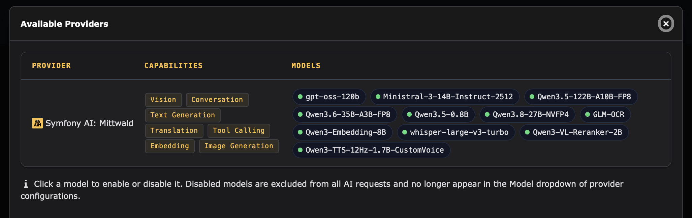
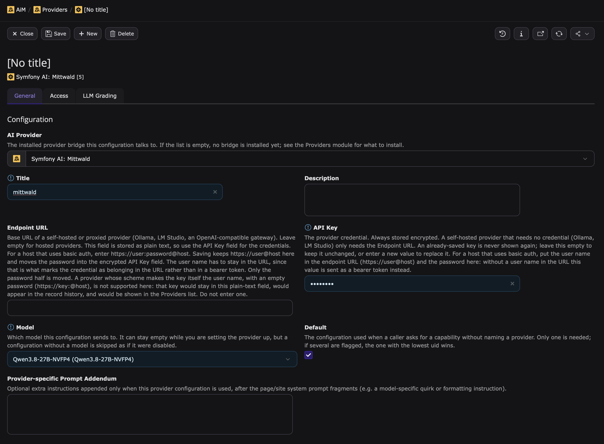

## mittwald AI Hosting mit TYPO3 verwenden {#using-mittwald-ai-hosting}

Anders als [Drupal](../drupal) oder [WordPress](../wordpress) bringt TYPO3 im Core keine Abstraktion für KI-Provider mit. KI-Funktionen kommen über Extensions, und jede Extension entscheidet selbst, wie sie mit einem KI-Provider spricht.

Die meisten davon bauen auf [Symfony AI](https://symfony.com/doc/current/ai/index.html) auf, das einzelne Provider über sogenannte _Bridges_ anbindet. [`mittwald/symfony-ai-platform`](https://github.com/mittwald/symfony-ai-platform) ist die offizielle Bridge für mittwald AI Hosting. Jede TYPO3-Extension, die mit Symfony-AI-Bridges umgehen kann, kann damit auch die bei mittwald gehosteten Modelle nutzen. Die Bridge selbst beschreibt die [Symfony-Anleitung](../symfony) ausführlicher.

Diese Anleitung beschreibt, wie du mittwald AI Hosting mit den folgenden Extensions einrichtest:

- [AiM](#aim) — die zentrale KI-Schicht für TYPO3, von b13
- weitere folgen; [eröffne ein Issue](https://github.com/mittwald/developer-portal/issues), um deine eigene zu ergänzen

### Voraussetzungen {#prerequisites}

Alle hier beschriebenen Integrationen setzen voraus:

- Eine TYPO3-Installation im Composer-Modus
- PHP 8.2 oder neuer, wie von der mittwald-Bridge gefordert
- Einen API-Schlüssel für mittwald AI Hosting

Falls du noch keinen API-Schlüssel hast, folge der [Anleitung zum Zugang zu mittwald AI Hosting](../../access-and-usage/access), um einen über dein mStudio-Dashboard zu erzeugen.

## AiM {#aim}

[AiM](https://github.com/b13/aim) von b13 ist derzeit der De-facto-Standard für KI in TYPO3. Andere Extensions sprechen nicht direkt mit einem KI-Provider, sondern fragen bei AiM eine Fähigkeit an, etwa Textgenerierung, Übersetzung oder Alternativtext für ein Bild. AiM entscheidet dann, welcher konfigurierte Provider und welches Modell antwortet. Zugangsdaten, Budgets, Rate Limits und Request-Logs verwaltest du an einer zentralen Stelle im TYPO3-Backend.

AiM enthält selbst keine KI-Provider. Stattdessen erkennt es automatisch jede installierte Symfony-AI-Bridge, auch die für mittwald AI Hosting.

Dieser Abschnitt beschreibt Installation und Einrichtung mit mittwald AI Hosting. Alles Weitere — Governance, Tone of Voice, die Request-Pipeline und die Verwendung von AiM aus deiner eigenen Extension — findest du in der [AiM-Dokumentation](https://b13.github.io/aim/docs/introduction.html).

:::note

AiM befindet sich im Alpha-Stadium. Verhalten und Backend-Module können sich bis zur Version 1.0 noch ändern.

AiM bringt außerdem keine deutsche Übersetzung mit. Module und Felder heißen daher auch in einem deutschsprachigen Backend so, wie in dieser Anleitung angegeben.

:::

### Anforderungen {#aim-requirements}

Zusätzlich zu den [allgemeinen Voraussetzungen](#prerequisites) benötigt AiM:

- TYPO3 12.4, 13.4 oder 14
- Die PHP-Erweiterung `sodium`, mit der AiM gespeicherte Zugangsdaten verschlüsselt

### Installation {#aim-installation}

Installiere AiM zusammen mit der mittwald-Bridge. Führe dazu die folgenden Befehle in deinem TYPO3-Projektverzeichnis aus:

```shellsession
user@ssh $ composer require b13/aim mittwald/symfony-ai-platform
user@ssh $ vendor/bin/typo3 extension:setup
user@ssh $ vendor/bin/typo3 cache:flush
```

Der erste Befehl installiert beide Pakete. Der zweite legt die Datenbanktabellen an, die AiM benötigt, und der dritte stellt sicher, dass AiM die neu installierte Bridge erkennt.

### Konfiguration {#aim-configuration}

Den mittwald-Provider konfigurierst du im Backend-Modul von AiM. Wo du es findest, hängt von deiner TYPO3-Version ab:

- **TYPO3 14**: **Administration** -> **AiM** -> **Providers**
- **TYPO3 13**: **Admin Tools** -> **AiM** -> **Providers**
- **TYPO3 12**: **Admin Tools** -> **Providers**

#### Schritt 1: Prüfen, ob die Bridge installiert ist {#aim-step-1-verify}

Klicke im Modul **Providers** auf **Available providers**. Die Liste sollte den Provider **Symfony AI: Mittwald** mit den Modellen enthalten, die er anbietet:



Fehlt der Provider, prüfe, ob `mittwald/symfony-ai-platform` installiert ist, und leere die TYPO3-Caches.

In diesem Dialog kannst du außerdem ein Modell anklicken, um es zu deaktivieren. Deaktivierte Modelle werden von allen KI-Anfragen ausgeschlossen und erscheinen nicht mehr in der Modellauswahl einer Provider-Konfiguration.

:::note

AiM führt **Image Generation** bei jeder Symfony-AI-Bridge als Fähigkeit auf. mittwald AI Hosting bietet keine Bildgenerierung an, und keines der aufgeführten Modelle unterstützt sie. Details findest du unter [Unterstützte Operationen](#aim-supported-operations).

:::

#### Schritt 2: Provider-Konfiguration anlegen {#aim-step-2-configure}

Schließe den Dialog und klicke auf **New Configuration**. Fülle das Formular wie folgt aus:



- **AI Provider**: Wähle **Symfony AI: Mittwald** aus.
- **Title**: Gib der Konfiguration einen aussagekräftigen Namen, zum Beispiel „mittwald“.
- **Endpoint URL**: Lass dieses Feld leer, es sei denn, du nutzt [Dedicated AI Hosting](#aim-dedicated-ai-hosting).
- **API Key**: Trage deinen API-Schlüssel für mittwald AI Hosting ein. AiM speichert diesen Wert immer verschlüsselt und zeigt ihn nach dem Speichern nie wieder an.
- **Model**: Wähle das Modell aus, das diese Konfiguration verwenden soll. Die Liste enthält alle Modelle aus dem Modellkatalog der Bridge; die Fähigkeiten der einzelnen Modelle findest du in der [Modellübersicht](../../models/).
- **Default**: Setze diesen Haken, damit AiM diese Konfiguration immer dann verwendet, wenn eine Extension eine Fähigkeit anfragt, ohne einen bestimmten Provider zu nennen.

Speichere die Konfiguration. In den Tabs **Access** und **LLM Grading** kannst du die Konfiguration auf bestimmte Backend-Benutzergruppen beschränken und eine Qualitätsbewertung einrichten; diese Optionen beschreibt die [AiM-Dokumentation](https://b13.github.io/aim/docs/governance.html).

Unterstützt das ausgewählte Modell eine angefragte Fähigkeit nicht, wechselt AiM automatisch zu einem anderen Modell desselben Providers und verwendet dabei denselben API-Schlüssel — zum Beispiel zu `Qwen3-Embedding-8B`, wenn eine Extension Embeddings von einer Konfiguration mit einem Chat-Modell anfragt. Eine einzige Konfiguration deckt damit alle Fähigkeiten ab, die mittwald AI Hosting über AiM unterstützt. Du kannst diesen automatischen Modellwechsel pro Konfiguration abschalten, wenn eine Konfiguration fest bei ihrem Modell bleiben soll.

#### Schritt 3: Konfiguration testen {#aim-step-3-test}

Um zu prüfen, ob alles funktioniert, sende mit dem Befehl `aim:test` eine Testanfrage:

```shellsession
user@ssh $ vendor/bin/typo3 aim:test text --prompt "Schreibe ein Haiku über TYPO3"
```

Der Befehl schickt die Anfrage durch die vollständige Pipeline von AiM und gibt die Antwort zusammen mit dem verwendeten Modell, dem Token-Verbrauch und der Laufzeit aus. Um statt der Standard-Konfiguration ein bestimmtes Modell zu testen, übergib es mit der Option `-p`, zum Beispiel `-p "mittwald:gpt-oss-120b"`.

Jede Testanfrage erscheint außerdem im Modul **Request Log** von AiM.

### Provider in den Site Settings konfigurieren {#aim-site-settings}

Statt eine Provider-Konfiguration im Backend anzulegen, kannst du sie auch in der Datei `config/sites/<identifier>/settings.yaml` deiner Site definieren. Das ist praktisch, wenn du in einer TYPO3-Installation mit mehreren Sites unterschiedliche Konfigurationen pro Site verwenden oder deine Konfiguration in der Versionsverwaltung ablegen möchtest:

```yaml
ai:
  provider: mittwald
  apiKey: "%env(MITTWALD_AI_API_KEY)%"
  model: gpt-oss-120b
```

Verwende `mittwald` als Kennung für `provider` und eine beliebige Modell-ID aus der [Modellübersicht](../../models/) als `model`.

:::warning

Werte in der `settings.yaml` werden nicht verschlüsselt. Trage deinen API-Schlüssel nicht direkt in diese Datei ein, wenn du sie auch in der Versionsverwaltung ablegst.

:::

Beachte, dass die Site Settings eine alternative Konfigurationsquelle sind, die ausdrücklich angefragt werden muss. Die reguläre API und die Backend-Module von AiM verwenden die Provider-Konfigurationen aus dem Backend. Die Site Settings nutzen nur Extensions, die ihren Provider aus den Site Settings ermitteln, sowie der Befehl `aim:test`, wenn du die Option `--site` übergibst:

```shellsession
user@ssh $ vendor/bin/typo3 aim:test text --site <identifier> --prompt "Schreibe ein Haiku über TYPO3"
```

Alle verfügbaren Einstellungen findest du in der [AiM-Dokumentation zur Provider-Konfiguration](https://b13.github.io/aim/docs/provider-configuration.html).

### Unterstützte Operationen {#aim-supported-operations}

AiM stellt TYPO3-Extensions die folgenden Operationen von mittwald AI Hosting zur Verfügung:

| Operation            | Unterstützt                                |
| -------------------- | ------------------------------------------ |
| Textgenerierung      | ✅                                         |
| Konversation         | ✅                                         |
| Übersetzung          | ✅                                         |
| Tool Calling         | ✅                                         |
| Vision (Bildeingabe) | ✅ mit Modellen, die Bilder verarbeiten    |
| Embeddings           | ✅                                         |
| Speech-to-Text       | ⏸️ in AiM nicht verfügbar                  |
| Text-to-Speech       | ⏸️ in AiM nicht verfügbar                  |
| Reranking            | ⏸️ in AiM nicht verfügbar                  |
| Bildgenerierung      | ⏸️ von mittwald AI Hosting nicht angeboten |

Die Bridge kennt auch die Modelle für Speech-to-Text, Text-to-Speech und Reranking, deshalb tauchen sie in der Liste der verfügbaren Modelle auf. AiM bietet diese Operationen anderen Extensions jedoch nicht an. Wenn du sie benötigst, verwende die [Symfony-AI-Bridge](../symfony) direkt aus deinem eigenen Code.

### Dedicated AI Hosting {#aim-dedicated-ai-hosting}

Wenn du [Dedicated AI Hosting](../../dedicated/getting-started) nutzt, wird deine reservierte Kapazität über eine kundenspezifische Subdomain ausgeliefert. Trage diese in das Feld **Endpoint URL** der Provider-Konfiguration ein oder als `endpoint` in deine [Site Settings](#aim-site-settings):

```
https://your-company.llm.aihosting.mittwald.de
```

Gib die URL ohne das Suffix `/v1` an; die Bridge ergänzt API-Version und Pfad selbst.

## Vektordatenbanken verwenden {#vector-databases}

mittwald AI Hosting stellt das Embedding-Modell bereit, aber keine gemanagte Vektordatenbank. Um semantische Suche oder RAG-Funktionen auf Basis der mit `Qwen3-Embedding-8B` erzeugten Embeddings zu bauen, benötigst du eine eigene Vektordatenbank.

Du kannst eine solche direkt in deinem mStudio-Projekt über [Container Hosting](/docs/v2/platform/workloads/containers/) betreiben; pgvector, Qdrant und ChromaDB stehen als Container-Templates bereit. Der [GLM-OCR-Guide](../../examples/glm-ocr/) beschreibt eine vollständige Pipeline für Ingest und Retrieval mit diesen Komponenten.

## Nutzungsgrenzen {#usage-limits}

Der Dienst mittwald AI Hosting unterliegt [Nutzungsgrenzen](../../api-endpoints/deviations-and-limitations/#limitations), die von deinem Tarif abhängen.
