import InteractiveMermaidDiagram from "@site/src/components/InteractiveMermaidDiagram";

# Plattform-Übersicht: Entitätshierarchie

Diese Seite gibt dir einen Überblick über die mittwald-Hosting-Plattform auf einen Blick. Sie zeigt die wichtigsten Entitäten – wie Server, Projekte, Workloads und Datenbanken – und ordnet ihnen ihre technischen Entsprechungen zu.

## Entitätshierarchie {#entity-hierarchy}

Das folgende Diagramm zeigt alle wichtigen Plattformentitäten, wie sie ineinander verschachtelt sind und welche Technologie jeweils dahintersteckt:

<InteractiveMermaidDiagram id="platform-entity-hierarchy"
                           title="Plattform-Entitätshierarchie"
                           defaultZoom={300}
                           minZoom={100}
                           maxZoom={2000}
                           zoomStep={50}>

```mermaid
graph TD
    ORG[["🏢 Organisation"]]
    SERVER[["🖥️ Server"]]
    
    PROJECT["📁 Projekt"]
    
    APP["📦 Verwaltete App-Installation"]
    CONTAINERS(("🐳 Container"))
    NETWORKING(("🌐 Netzwerk"))
    BACKUPS(("💾 Sicherungen"))
    MAIL(("📧 E-Mail"))
    ACCESS(("🔑 Zugriff"))
    AIHOST(("🤖 AI-Hosting"))
    EXTENSIONS(["🔌 Erweiterungen"])
    
    DATASTORES(("📊 Verwaltete Datenspeicher"))
    MYSQL[("🗄️ MySQL")]
    REDIS[("⚡ Redis")]
    
    STACK{{"Container-Stack *(auto)*"}}
    SERVICE["⚙️ Service"]
    VOLUME["💾 Volume"]
    REGISTRY["📦 Registry"]
    
    DOMAIN["🔗 Domain"]
    DNSZONE{{"DNS-Zone *(auto)*"}}
    INGRESS["Ingress"]
    CERT(["🔐 Zertifikat *(auto)*"])
    
    CRONJOB["⏰ Cronjob"]
    BACKUP["Sicherung"]
    BACKUPSCHED["📅 Sicherungsplan"]
    BACKUPEXPORT["📥 Sicherungs-Export"]
    
    MAILADDR["Mail-Adresse"]
    DELIVERYBOX{{"Lieferkiste *(auto)*"}}
    MAILSETTINGS["⚙️ Mail-Einstellungen *(auto)*"]
    
    SSHSFTP["🔑 SSH/SFTP"]
    APITOKEN["🔐 API-Token"]
    
    AIHOSTKEY["AI-Hosting-API-Schlüssel"]
    AIHOST_URL["AI-Hosting-Basis-URL"]

    ORG -->|besitzt| SERVER
    SERVER -->|hostet| PROJECT

    PROJECT --> APP
    PROJECT --> CONTAINERS
    PROJECT --> NETWORKING
    PROJECT --> BACKUPS
    PROJECT --> MAIL
    PROJECT -.-> ACCESS
    PROJECT -.-> AIHOST
    PROJECT -.-> EXTENSIONS

    APP --> DATASTORES
    DATASTORES --> MYSQL
    DATASTORES --> REDIS

    CONTAINERS --> STACK
    CONTAINERS --> REGISTRY
    STACK --> SERVICE
    STACK --> VOLUME
    SERVICE -.-> VOLUME

    NETWORKING --> DOMAIN
    NETWORKING --> INGRESS
    DOMAIN --> DNSZONE
    INGRESS --> CERT

    BACKUPS --> CRONJOB
    BACKUPS --> BACKUP
    BACKUP --> BACKUPSCHED
    BACKUP --> BACKUPEXPORT

    MAIL --> MAILADDR
    MAILADDR --> DELIVERYBOX
    MAIL --> MAILSETTINGS

    ACCESS --> SSHSFTP
    ACCESS --> APITOKEN

    AIHOST --> AIHOSTKEY
    AIHOST --> AIHOST_URL

    classDef brandOrg fill:#147af3,stroke:#0050d8,color:#fff,stroke-width:3px
    classDef managed fill:#72e06a,stroke:#5cd54f,color:#fff,stroke-width:2px
    classDef containers fill:#0fb5ae,stroke:#0a94a1,color:#fff,stroke-width:2px
    classDef networking fill:#4046ca,stroke:#3035a7,color:#fff,stroke-width:2px
    classDef backups fill:#f68511,stroke:#d96b00,color:#fff,stroke-width:2px
    classDef mail fill:#de3d82,stroke:#c1326f,color:#fff,stroke-width:2px
    classDef access fill:#7e84fa,stroke:#6572e5,color:#fff,stroke-width:2px
    classDef aiHosting fill:#7326d3,stroke:#6217bb,color:#fff,stroke-width:2px
    classDef extensions fill:#e8c600,stroke:#c9a400,color:#000,stroke-width:2px
    classDef autocreated fill:#8a9ba8,stroke:#6b7c8a,color:#fff

    class ORG,SERVER,PROJECT brandOrg
    class APP,DATASTORES,MYSQL,REDIS managed
    class CONTAINERS,STACK,SERVICE,VOLUME,REGISTRY containers
    class NETWORKING,DOMAIN,DNSZONE,INGRESS,CERT networking
    class BACKUPS,CRONJOB,BACKUP,BACKUPSCHED,BACKUPEXPORT backups
    class MAIL,MAILADDR,DELIVERYBOX,MAILSETTINGS mail
    class ACCESS,SSHSFTP,APITOKEN access
    class AIHOST,AIHOSTKEY,AIHOST_URL aiHosting
    class EXTENSIONS extensions
    class STACK,DNSZONE,CERT,DELIVERYBOX,MAILSETTINGS autocreated
```

</InteractiveMermaidDiagram>

## Beschreibung der Entitäten {#entity-descriptions}

### Organisation {#organization}

Die **Organisation** (auch _Kundenkonto_ oder _Mandant_) ist die übergeordnete Entität. Sie besitzt Server und Projekte und ist das Subjekt der Abrechnung für alle Ressourcen.

### Server {#server}

Ein **Server** (Space Server-Tarif) ist ein gemeinsamer Ressource-Pool, der mehrere Projekte hosten kann. Er stellt eine feste Menge an CPU, Arbeitsspeicher und Speicherplatz bereit, die von allen Projekten auf diesem Server gemeinsam genutzt wird. Dieser Tarif eignet sich, wenn du mehrere kleinere Projekte kosteneffizient betreiben möchtest.

### Projekt {#project}

Ein **Projekt** ist die primäre Einheit für Isolation und Abrechnung. Jeder Workload, jede Datenbank, jede Domain und jeder Nutzer gehört zu einem Projekt. Projekte im Standalone-Tarif (proSpace) haben dedizierte, garantierte Ressourcen; Projekte auf einem Server teilen den Ressource-Pool des Servers.

Technisch entspricht ein Projekt ungefähr einem **Kubernetes-Namespace** – es bietet Netzwerkisolation und separate Ressourcenquoten.

Bei der Erstellung eines Projekts werden automatisch ein Standard-Container-Stack, DNS-Zonen für verwaltete Domains und Mail-Einstellungen für die E-Mail-Verwaltung generiert.

### App-Installation {#app-installation}

Eine **App-Installation** (auch _verwaltete Anwendung_) ist eine vorkonfigurierte Laufzeitumgebung für einen bestimmten Technologie-Stack wie PHP, Node.js, Python oder PHP Worker. mittwald verwaltet das zugrundeliegende Framework und die Systemsoftware; du lieferst nur deinen Anwendungscode.

App-Installationen können mit MySQL- oder Redis-Datenbanken verknüpft werden und können eigene Cronjobs und SSH/SFTP-Nutzer für das Deployment haben.

### Container-Stack {#container-stack}

Ein **Container-Stack** ist eine Docker-Compose-kompatible Deployment-Einheit. Er fasst einen oder mehrere _Services_ (Container) zusammen, stellt gemeinsam genutzte _Volumes_ für persistente Daten bereit und macht Ports intern innerhalb des Projekts verfügbar.

Jedes Projekt enthält einen automatisch erstellten Standard-Container-Stack. Du kannst über die API oder Stack-Konfigurationsdateien zusätzliche Stacks und Services deklarieren.

### Service {#service}

Ein **Service** ist ein einzelner Container, der innerhalb eines Container-Stacks läuft. Er entspricht direkt einem Docker-Container / OCI-Runtime-Instanz und kann mit CPU- und Speicherlimits konfiguriert werden.

### Volume {#volume}

Ein **Volume** ist persistenter Speicher, der an einen Container-Stack angehängt ist. Volumes überleben Container-Neustarts und können in einen oder mehrere Services eingebunden werden. Sie sind analog zu Kubernetes-`PersistentVolumeClaim`-Objekten.

### Verwaltete Datenbanken {#managed-databases}

mittwald bietet sowohl verwaltete Dienste als auch Container-basierte Datenbankoptionen.

**Verwaltete Dienste** werden vollständig von mittwald verwaltet und bieten automatische Sicherungen und vereinfachte Verbindungsverwaltung:

| Entität | Technologie        | Typischer Einsatz                          |
| ------- | ------------------ | ------------------------------------------ |
| MySQL   | Relational (SQL)   | Webanwendungen, CMS                        |
| Redis   | In-Memory-Speicher | Caching, Sessions, Queues                  |

Jede MySQL-Datenbank kann mehrere **MySQL-Nutzer** haben – separate Nutzer-Konten mit konfigurierbaren Zugriffsprivilegien und Hostnamen. Dies ermöglicht dir, granulare Berechtigungen für verschiedene Anwendungen oder Services zu vergeben, die diese Datenbank nutzen.

**Container-basierte Datenbanken** werden als Container innerhalb deines Projekts bereitgestellt und bieten mehr Flexibilität und erweiterte Funktionen:

| Entität | Technologie        | Typischer Einsatz                          |
| ------- | ------------------ | ------------------------------------------ |
| MariaDB | Relational (SQL)   | Webanwendungen, CMS (Open-Source-Option)   |
| PostgreSQL | Relational (SQL) | Anwendungen mit erweiterten SQL-Funktionen |
| OpenSearch | Suchmaschine     | Volltextsuche, Log-Analyse                 |
| Solr    | Suchmaschine       | Volltextsuche, Indexabfrage von Inhalten   |

Verwaltete Dienste können direkt mit App-Installationen verknüpft werden. Container-basierte Datenbanken werden als separate Services innerhalb des Container-Stacks deines Projekts konfiguriert.

### Ingress {#ingress}

Ein **Ingress** ordnet einen öffentlichen Hostnamen (Domain + Pfad) einem Workload zu, der innerhalb eines Projekts läuft. Er fungiert als HTTP/S Reverse Proxy, übernimmt die TLS-Terminierung durch ein SSL/TLS-Zertifikat (entweder Let's Encrypt oder benutzerdefiniert) und leitet Traffic entweder zu einer App-Installation oder einem Container-Service weiter.

Jeder Ingress benötigt ein SSL/TLS-Zertifikat. Wenn du kein benutzerdefiniertes Zertifikat angibst, erstellt mittwald automatisch ein kostenloses Let's Encrypt-Zertifikat für dich.

### Domain / DNS {#domain}

Eine **Domain** repräsentiert einen registrierten Domainnamen und seinen Besitzzustand innerhalb eines Projekts. mittwald kann ihre Domain-Registrierung und DNS verwalten, oder du kannst deine bestehende Domain auf mittwald verweisen, indem du deine Nameserver aktualisierst.

Wenn du eine Domain zu einem Projekt hinzufügst, erstellt mittwald automatisch eine **DNS-Zone** – einen Container für die Verwaltung einzelner DNS-Records (A, AAAA, CNAME, MX, TXT, SRV usw.). Dies trennt Domain-Besitzdaten von der eigentlichen DNS-Record-Verwaltung.

### SSH / SFTP-Nutzer {#ssh-sftp-user}

**SSH/SFTP-Nutzer** gewähren Dateisystemzugriff auf den Dateispeicher eines Projekts. SSH-Nutzer haben vollständigen Zugriff auf das Dateisystem des Projekts, während SFTP-Nutzer auf bestimmte Verzeichnisse und Zugriffsstufen (Nur-Lesen oder Vollzugriff) beschränkt werden können. Sie werden hauptsächlich für den Datei-Deployment oder ältere FTP-ähnliche Workflows verwendet.

### Cronjob {#cronjob}

Ein **Cronjob** ist eine geplante Aufgabe, die nach einem konfigurierbaren Zeitplan (Cron-Syntax) ausgeführt wird. Cronjobs können Bash-Befehle, PHP-Skripte oder HTTP-Anfragen ausführen und sind an eine bestimmte App-Installation gebunden. Cronjobs sind projektbezogen.
### SSL/TLS-Zertifikat {#ssl-certificate}

Ein **SSL/TLS-Zertifikat** erm\u00f6glicht sichere HTTPS-Verbindungen zu deinen Workloads \u00fcber Ingresses. mittwald unterst\u00fctzt zwei Typen:

- **Let's Encrypt-Zertifikate** (kostenlos, automatisch erneuert): Werden automatisch erstellt und verwaltet, wenn du einen Ingress ohne benutzerdefiniertes Zertifikat einrichtest.
- **Benutzerdefinierte Zertifikate**: Werden manuell hochgeladen f\u00fcr Organisationen mit bestehenden Zertifikaten oder speziellen Anforderungen.

Jeder Ingress nutzt genau ein Zertifikat. Das Zertifikat wird automatisch vor dem Ablauf erneuert.

### DNS-Zone {#dns-zone}

Eine **DNS-Zone** ist ein Container f\u00fcr DNS-Records (A, AAAA, CNAME, MX, TXT, SRV usw.) f\u00fcr eine bestimmte Domain. Sie wird automatisch erstellt, wenn du eine Domain zu deinem Projekt hinzuf\u00fcgst.

Die DNS-Zone ist verschieden von der Domain-Entit\u00e4t \u2013 die Domain repr\u00e4sentiert Besitz und Registrierung, w\u00e4hrend die DNS-Zone die eigentlichen DNS-Records verwaltet. Du kannst DNS-Records f\u00fcr deine Zone direkt \u00fcber die mittwald-API oder mStudio verwalten.

### Registry {#registry}

Eine **Registry** speichert private Docker-Image-Anmeldedaten. Wenn du benutzerdefinierte Container-Images in deinem Container-Stack verwendest, die auf privaten Registries gehostet werden (z. B. privates Docker Hub, GitHub Container Registry oder selbst gehostete Registries), kannst du Registry-Anmeldedaten in deinem Projekt erstellen.

Services innerhalb deines Container-Stacks k\u00f6nnen diese Registry-Anmeldedaten referenzieren, um private Images sicher zu pullen.

### MySQL-Nutzer {#mysql-user}

Ein **MySQL-Nutzer** ist ein separates Datenbanknutzer-Konto f\u00fcr den Zugriff auf eine MySQL-Datenbank. Jede MySQL-Datenbank kann mehrere Nutzer haben, jeweils mit:

- Einem eindeutigen Benutzernamen und Passwort
- Konfigurierbaren Privilegien (SELECT, INSERT, UPDATE, DELETE usw.)
- Host-Beschr\u00e4nkungen (welche Server/IPs sich verbinden k\u00f6nnen)

Dies erm\u00f6glicht dir, verschiedene Berechtigungsstufen f\u00fcr verschiedene Anwendungen oder Services zu gew\u00e4hren, die auf diese Datenbank zugreifen. Du k\u00f6nntest beispielsweise einen schreibgesch\u00fctzten Nutzer f\u00fcr einen Reporting-Service und einen vollständig berechtigten Nutzer f\u00fcr deine Hauptanwendung erstellen.

### Mail-Adresse {#mail-address}

Eine **Mail-Adresse** ist eine E-Mail-Adresse (z. B. `info@example.com`) mit integrierten IMAP/SMTP/POP3-Mail-Diensten. Wenn du eine Mail-Adresse erstellst, erstellt mittwald automatisch eine **Lieferkiste** (IMAP-Mailbox-Backend) zum Speichern eingehender Nachrichten.

Mail-Adressen k\u00f6nnen konfiguriert werden mit:
- Speicherquota (Speicherplatz-Limit)
- Catch-All-Weiterleitung (Umleiten nicht zugeordneter E-Mails)
- Autoresponder (automatische Antwortnachrichten)
- Archiv-Einstellungen (separater Speicher f\u00fcr \u00e4ltere Nachrichten)

### Lieferkiste {#delivery-box}

Eine **Lieferkiste** ist das IMAP-Mailbox-Backend, das automatisch f\u00fcr jede Mail-Adresse erstellt wird. Sie speichert eingehende Nachrichten und Gesprachsverlauf. W\u00e4hrend Mail-Adressen die \u00f6ffentliche E-Mail-Identit\u00e4t darstellen, k\u00fcmmern sich Lieferkisten um die eigentliche Nachrichtenspeicherung und -abfrage.

Du interagierst mit Lieferkisten typischerweise indirekt durch Mail-Clients (Outlook, Apple Mail, Thunderbird), die sich \u00fcber IMAP- oder POP3-Protokolle verbinden.

### Mail-Einstellungen {#mail-settings}

**Mail-Einstellungen** ist eine projektweite Konfiguration f\u00fcr Mail-Verhalten. Sie werden automatisch f\u00fcr jedes Projekt erstellt und erm\u00f6glichen dir:

- Spezifische E-Mail-Adressen oder Domains auf die Whitelist oder Blacklist zu setzen
- Spam-Schutz-Einstellungen zu konfigurieren
- Nachrichtenarchivierung zu aktivieren/deaktivieren
- Standard-Speicherlimits f\u00fcr neue Mail-Adressen festzulegen

Mail-Einstellungen gelten global f\u00fcr alle Mail-Adressen innerhalb eines Projekts.

### Sicherungsplan {#backup-schedule}

Ein **Sicherungsplan** erstellt automatisch Snapshots deines Projekts in regelm\u00e4\u00dfigen Abst\u00e4nden. Du kannst konfigurieren:

- Sicherungsh\u00e4ufigkeit (t\u00e4glich, w\u00f6chentlich, monatlich usw.)
- Aufbewahrungszeit (wie lange Sicherungen behalten werden)
- Sicherungsfenster (wann Sicherungen laufen sollen, falls zutreffend)

Sicherungspl\u00e4ne sind optional \u2013 du kannst auch manuelle Sicherungen nach Bedarf erstellen. Automatisierte Sicherungen erscheinen als regul\u00e4re Sicherungs-Entit\u00e4ten in deinem Projekt.

### Sicherungs-Export {#backup-export}

Ein **Sicherungs-Export** ist eine herunterladbare Kopie eines Sicherungs-Snapshots. Du kannst jede Sicherung exportieren, um ein komprimiertes Archiv (z. B. .tar.gz) zu erhalten, das du lokal oder auf externem Speicher herunterladen und speichern kannst.

Sicherungs-Exporte sind unabh\u00e4ngige Records, die verfolgen, wann und wo Sicherungsdaten exportiert wurden, getrennt von den Sicherungen selbst.

### API-Token {#api-token}

Ein **API-Token** ist eine Authentifizierungsanmeldedaten f\u00fcr programmgesteuerten API-Zugriff. Du kannst API-Token in deinen Nutzerkontoeinstellungen erstellen und verwalten (nicht pro Projekt).

API-Token erm\u00f6glichen dir, dich bei der mittwald-REST-API zu authentifizieren, ohne dein Passwort zu verwenden. Jeder Token kann einzeln widerrufen werden und hat vollst\u00e4ndigen Zugriff auf alle deine Projekte und dein Nutzer-Konto.
### AI-Hosting {#ai-hosting}

**AI-Hosting** ermöglicht deinen Anwendungen, mit Large Language Models (LLMs) über die Hosting-Infrastruktur von mittwald zu interagieren. Es bietet eine zentrale Möglichkeit, AI-Funktionen in deinem Projekt zu konfigurieren und zu nutzen – entweder mit mittwalds gehosteten LLM-Service oder durch Integration mit externen AI-Anbietern.

AI-Hosting ist für Agenturen konzipiert, die AI-gestützte Client-Lösungen bauen, für SaaS-Produkte mit AI-Komponenten und für Organisationen, die eine EU-basierte, datenschutzfreundliche AI-Infrastruktur benötigen.

Jede AI-Hosting-Integration benötigt zwei Konfigurationswerte:
- **AI-Hosting-API-Schlüssel**: Deine Authentifizierungsanmeldedaten für den Zugriff auf den AI-Service
- **AI-Hosting-Basis-URL**: Die Endpunkt-URL für den AI-Service (Mittwalds gehosteter Service oder externer Anbieter)

Nach der Konfiguration auf Projektebene können alle App-Installationen oder Container-Services in deinem Projekt diese Anmeldedaten verwenden, um API-Aufrufe für Aufgaben wie Textgenerierung, Chatbots, Bildverarbeitung und AI-Agenten zu senden.

### AI-Hosting-API-Schlüssel {#ai-hosting-key}

Ein **AI-Hosting-API-Schlüssel** ist ein Authentifizierungsmerkmal, das Zugriff auf den AI-Hosting-Service gewährt. Er authentifiziert Anfragen von deinen Anwendungen an den LLM-Endpunkt.

Der API-Schlüssel wird sicher auf Projektebene gespeichert und kann von jedem Workload innerhalb des Projekts referenziert werden. Du solltest ihn wie ein Passwort behandeln – halte ihn vertraulich und aktualisiere ihn regelmäßig nach Best Practices der Sicherheit.

### AI-Hosting-Basis-URL {#ai-hosting-base-url}

Eine **AI-Hosting-Basis-URL** ist die Endpunkt-Adresse für mittwalds AI-Hosting-Service. Sie wird als konstanter Wert in mStudio bereitgestellt, den du in deine Anwendung zur Verwendung bei API-Anfragen kopierst.

Dieser Endpunkt wird auf Projektebene konfiguriert und wird von deinen Anwendungen und Container-Services verwendet, um mit der LLM-Infrastruktur zu kommunizieren.
## Workload-Typen auf einen Blick {#workload-types}

| Workload         | Geeignet für                                              | Technische Basis              |
| ---------------- | --------------------------------------------------------- | ----------------------------- |
| App-Installation | Vorkonfigurierte Laufzeiten (PHP, Node.js, Python, PHP Worker) | Verwaltetes Runtime-Framework |
| Container-Stack  | Eigene Container, Microservices                           | OCI / Docker Compose          |

## Übersicht der Entitätserstellung {#entity-creation-reference}

Die folgende Tabelle fasst zusammen, wie Plattformentit\u00e4ten erstellt und verwaltet werden:

| Entit\u00e4t | Erstellungsmethode | Automatisch erstellt | Typischer Einsatz |
| ------ | --------------- | ------------ | ----------- |
| Projekt | UI/API | — | Prim\u00e4re Organisationseinheit |
| Container-Stack | Auto + API | ✅ Ja (einer pro Projekt) | Docker-Compose-Einheit f\u00fcr Services |
| App-Installation | UI/API | — | Verwaltete Laufzeit (PHP, Node.js usw.) |
| MySQL-Datenbank | UI/API | — | Verwaltete relationale Datenbank |
| MySQL-Nutzer | UI/API | — | Datenbankzugriffskontrolle |
| Redis-Datenbank | UI/API | — | Verwalteter In-Memory-Cache |
| Domain | UI/API | — | Domain-Registrierung/Besitz |
| DNS-Zone | Auto + API | ✅ Ja (aus Domain) | DNS-Record-Container |
| Ingress | UI/API | — | HTTP/S-Routing zu Workloads |
| SSL/TLS-Zertifikat | Auto + UI/API | ✅ Teilweise (Let's Encrypt auto) | HTTPS-Zertifikat |
| Mail-Adresse | UI/API | — | E-Mail-Adresse mit IMAP/SMTP |
| Lieferkiste | Auto | ✅ Ja (aus Mail-Adresse) | IMAP-Mailbox-Backend |
| Mail-Einstellungen | Auto | ✅ Ja (pro Projekt) | Projektweite Mail-Konfiguration |
| Sicherung | UI/API | — | Projekt-Snapshot/Wiederherstellungspunkt |
| Sicherungsplan | API | — | Automatisierte Sicherungskonfiguration |
| Cronjob | UI/API | — | Geplanter Task-Runner |
| SSH / SFTP-Nutzer | UI/API | — | Dateisystemzugriff |
| API-Token | UI/API | — | API-Authentifizierung |
| Registry | UI/API | — | Private Image-Registry-Anmeldedaten |
| AI-Hosting-API-Schlüssel | UI/API | — | LLM-API-Anmeldedaten |
| AI-Hosting-Basis-URL | UI/API | — | LLM-API-Endpunkt |
| Erweiterungen | UI/API | — | Marketplace-Erweiterungen |
