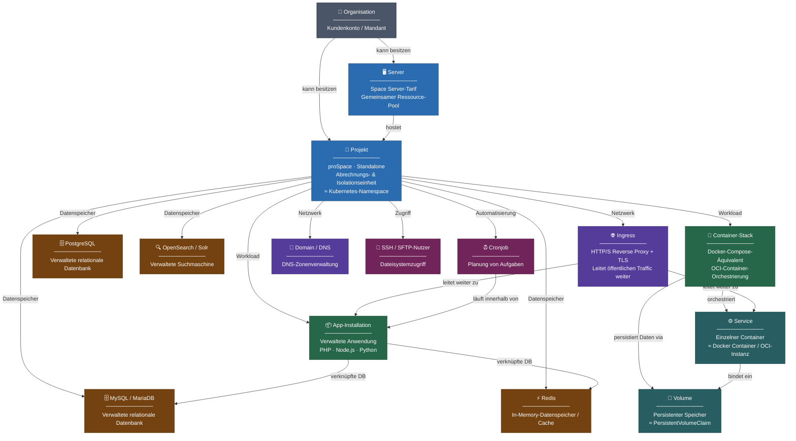

# Plattform-Übersicht: Entitätshierarchie

Diese Seite gibt dir einen Überblick über die mittwald-Hosting-Plattform auf einen Blick. Sie zeigt die wichtigsten Entitäten – wie Server, Projekte, Workloads und Datenbanken – und ordnet ihnen ihre technischen Entsprechungen zu.

## Entitätshierarchie {#entity-hierarchy}

Das folgende Diagramm zeigt alle wichtigen Plattformentitäten, wie sie ineinander verschachtelt sind und welche Technologie jeweils dahintersteckt:

## Beschreibung der Entitäten {#entity-descriptions}

### Organisation {#organization}

Die **Organisation** (auch _Kundenkonto_ oder _Mandant_) ist die übergeordnete Entität. Sie besitzt Server und Projekte und ist das Subjekt der Abrechnung für alle Ressourcen.

### Server {#server}

Ein **Server** (Space Server-Tarif) ist ein gemeinsamer Ressource-Pool, der mehrere Projekte hosten kann. Er stellt eine feste Menge an CPU, Arbeitsspeicher und Speicherplatz bereit, die von allen Projekten auf diesem Server gemeinsam genutzt wird. Dieser Tarif eignet sich, wenn du mehrere kleinere Projekte kosteneffizient betreiben möchtest.

### Projekt {#project}

Ein **Projekt** ist die primäre Einheit für Isolation und Abrechnung. Jeder Workload, jede Datenbank, jede Domain und jeder Nutzer gehört zu einem Projekt. Projekte im Standalone-Tarif (proSpace) haben dedizierte, garantierte Ressourcen; Projekte auf einem Server teilen den Ressource-Pool des Servers.

Technisch entspricht ein Projekt ungefähr einem **Kubernetes-Namespace** – es bietet Netzwerkisolation und separate Ressourcenquoten.

### App-Installation {#app-installation}

Eine **App-Installation** (auch _verwaltete Anwendung_) ist eine vorkonfigurierte Laufzeitumgebung für einen bestimmten Technologie-Stack wie PHP, Node.js oder Python. mittwald verwaltet das zugrundeliegende Framework und die Systemsoftware; du lieferst nur deinen Anwendungscode.

App-Installationen können mit MySQL/MariaDB- oder Redis-Datenbanken verknüpft werden und können eigene Cronjobs und SSH/SFTP-Nutzer für das Deployment haben.

### Container-Stack {#container-stack}

Ein **Container-Stack** ist eine Docker-Compose-kompatible Deployment-Einheit. Er fasst einen oder mehrere _Services_ (Container) zusammen, stellt gemeinsam genutzte _Volumes_ für persistente Daten bereit und macht Ports intern innerhalb des Projekts verfügbar.

### Service {#service}

Ein **Service** ist ein einzelner Container, der innerhalb eines Container-Stacks läuft. Er entspricht direkt einem Docker-Container / OCI-Runtime-Instanz und kann mit CPU- und Speicherlimits konfiguriert werden.

### Volume {#volume}

Ein **Volume** ist persistenter Speicher, der an einen Container-Stack angehängt ist. Volumes überleben Container-Neustarts und können in einen oder mehrere Services eingebunden werden. Sie sind analog zu Kubernetes-`PersistentVolumeClaim`-Objekten.

### Verwaltete Datenbanken {#managed-databases}

| Entität           | Technologie        | Typischer Einsatz                          |
| ----------------- | ------------------ | ------------------------------------------ |
| MySQL / MariaDB   | Relational (SQL)   | Webanwendungen, CMS                        |
| PostgreSQL        | Relational (SQL)   | Anwendungen mit erweiterten SQL-Funktionen |
| Redis             | In-Memory-Speicher | Caching, Sessions, Queues                  |
| OpenSearch / Solr | Suchmaschine       | Volltextsuche, Log-Analyse                 |

Datenbanken sind projektweit verwaltete Dienste. Ihre Verbindungsdaten können direkt mit App-Installationen verknüpft werden.

### Ingress {#ingress}

Ein **Ingress** ordnet einen öffentlichen Hostnamen (Domain + Pfad) einem Workload zu, der innerhalb eines Projekts läuft. Er fungiert als HTTP/S Reverse Proxy, übernimmt die TLS-Terminierung (via Let's Encrypt oder ein benutzerdefiniertes Zertifikat) und leitet Traffic entweder zu einer App-Installation oder einem Container-Service weiter.

### Domain / DNS {#domain}

Mit **Domains** kannst du DNS-Zonen und -Records direkt innerhalb eines Projekts verwalten. Ein Domain-Eintrag repräsentiert den Besitz und die DNS-Verwaltung eines registrierten Domainnamens.

### SSH / SFTP-Nutzer {#ssh-sftp-user}

**SSH/SFTP-Nutzer** gewähren Dateisystemzugriff auf den Dateispeicher eines Projekts. Sie werden hauptsächlich für den Datei-Deployment oder ältere FTP-ähnliche Workflows verwendet.

### Cronjob {#cronjob}

Ein **Cronjob** ist eine geplante Aufgabe, die einen Befehl innerhalb einer App-Installation nach einem konfigurierbaren Zeitplan (Cron-Syntax) ausführt. Cronjobs sind projektbezogen und an eine bestimmte App-Installation gebunden.

## Workload-Typen auf einen Blick {#workload-types}

| Workload         | Geeignet für                                       | Technische Basis              |
| ---------------- | -------------------------------------------------- | ----------------------------- |
| App-Installation | Vorkonfigurierte Laufzeiten (PHP, Node.js, Python) | Verwaltetes Runtime-Framework |
| Container-Stack  | Eigene Container, Microservices                    | OCI / Docker Compose          |
